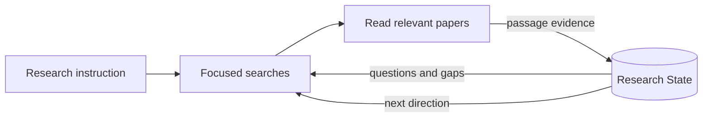
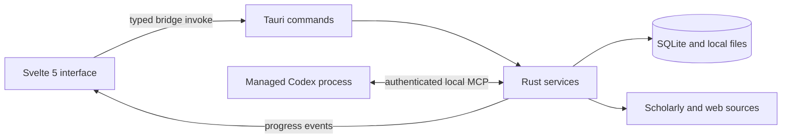

<div align="center">
  
  <h1>i0i</h1>
  <p><strong>A local-first knowledge IDE for research that builds on what it learns.</strong></p>
  <p>
    Read papers, keep evidence-linked notes, discover relevant work, and let an
    autonomous research loop grow a durable understanding of your project.
  </p>

  <p>
    <a href="#project-status"></a>
    <a href="#installation"></a>
    <a href="https://v2.tauri.app/"></a>
    <a href="https://svelte.dev/"></a>
    <a href="https://www.rust-lang.org/"></a>
  </p>
  <p>
    <a href="#why-i0i">Why i0i</a> ·
    <a href="#what-works-today">Features</a> ·
    <a href="#installation">Install</a> ·
    <a href="#development">Develop</a> ·
    <a href="#architecture">Architecture</a>
  </p>
</div>

> [!IMPORTANT]
> i0i is experimental alpha software under active development. The first
> supported target is Apple Silicon macOS 11 or newer. Keep backups of research
> you cannot afford to lose.

## Why i0i

Research tools are good at storing papers and AI tools are good at answering a
question once. i0i joins those two loops. Your papers, annotations, questions,
findings, gaps, and hypotheses live together in a native workspace. Each
research run can inspect what the project already knows, gather and read new
evidence, update Research State with traceable citations, and use that improved
state to guide the next run.



The long-term idea is a knowledge IDE that understands the edge of your current
knowledge and helps you decide what to learn next. Academic research is the
first serious use case.

## What Works Today

### Read and annotate

- Import local PDFs or save papers from Discover into a Vault.
- Read cached PDFs and recovered HTML without leaving the app.
- Select passages, highlight them, attach notes, and return to the exact source.
- Chat with a paper using bounded, cited document context.

### Find useful work

- Search across scholarly providers and browser-based discovery.
- Run quick searches, deeper query expansion, or Vault-based similar-paper searches.
- Review candidates before retaining them and fall back to the source website when automatic acquisition fails.

### Build a research project

- Keep papers, Markdown documents, and a typed Research State in one Project.
- Track findings, questions, gaps, hypotheses, evidence, and relationships across runs.
- Launch a bounded autonomous research run that searches, reads, cites, and proposes validated State updates.
- Inspect progress, retained papers, evidence links, and the next research direction.

### Stay local-first

- Store Vaults, papers, notes, projects, and run history in local SQLite and app data.
- Cache acquired documents locally.
- Keep API credentials on the machine; values saved in Settings override environment variables.

## Installation

### macOS app

A signed and notarized public DMG is not published yet. The release pipeline is
implemented, but the current alpha should be run from source. When a public
build is available, installation will be the usual macOS flow: open the DMG and
drag `i0i.app` into `Applications`.

### Run from source

You need:

- Apple Silicon Mac running macOS 11 or newer
- [Node.js](https://nodejs.org/) and [pnpm](https://pnpm.io/installation)
- [Rust](https://www.rust-lang.org/tools/install)
- Apple's Xcode Command Line Tools
- The remaining [Tauri v2 prerequisites](https://v2.tauri.app/start/prerequisites/)

```bash
git clone https://github.com/pzdkn/i0i.git
cd i0i
pnpm install
pnpm runtime:prepare
pnpm runtime:verify
pnpm tauri dev
```

`runtime:prepare` downloads the pinned Apple Silicon builds of Pdfium and
Obscura declared in `src-tauri/runtime-dependencies.toml`. These binaries are
required for PDF text extraction and browser-backed source acquisition. The
downloads are checksum-verified and remain untracked build resources.

## AI Setup

The Reader and local library work without autonomous Project Research. Configure
only the integrations for the capabilities you intend to use:

| Integration | Unlocks | Setup |
| --- | --- | --- |
| OpenRouter | Paper chat, deep research, and query expansion | Add an OpenRouter key in **Settings / API Keys**, or set `OPENROUTER_API_KEY` in `.env`. |
| OpenAlex | Scholarly discovery | Add a key in **Settings / API Keys**, or set `OPENALEX_API_KEY` in `.env`. |
| CORE | Additional open-access discovery | Optionally add `CORE_API_KEY` in **Settings / API Keys**. |
| Unpaywall | Better open-access source resolution | Optionally add a contact email in **Settings / API Keys**. |
| Codex CLI | Autonomous Project Research | Install Codex, sign in once, then verify it under **Settings / System**. |

Install the Codex CLI using the current command from the
[official Codex CLI documentation](https://learn.chatgpt.com/docs/codex/cli):

```bash
curl -fsSL https://chatgpt.com/codex/install.sh | sh
codex
```

The first `codex` invocation opens its sign-in flow. i0i requires Codex CLI
`0.153.4` or newer for autonomous research. If `codex` is not on `PATH`, set its
executable path under **Settings / Models**.

For environment-based development setup, create an untracked `.env` at the
repository root:

```dotenv
OPENROUTER_API_KEY=your_openrouter_key
OPENALEX_API_KEY=your_openalex_key
CORE_API_KEY=your_optional_core_key
```

Never commit `.env`; it is ignored by Git.

## Development

```bash
pnpm tauri dev       # full desktop app: Svelte + Rust + SQLite
pnpm dev             # frontend only; Tauri commands are unavailable
pnpm check           # Svelte and TypeScript checks
pnpm test:ui         # deterministic frontend tests
pnpm test:runtime    # runtime preparation tests
cargo test --manifest-path src-tauri/Cargo.toml --no-default-features --lib
```

The frontend-only server is useful for isolated layout work. Reader, storage,
native dialogs, source acquisition, and research runs must be exercised through
Tauri.

### Build the app

```bash
pnpm tauri build
```

The build prepares the pinned runtime resources automatically and emits a macOS
application bundle and DMG under `src-tauri/target/release/bundle/`.

For a signed and notarized release, configure `I0I_SIGNING_IDENTITY` and an
`I0I_NOTARY_PROFILE` created with Apple's `notarytool`, then run:

```bash
bash scripts/release_macos.sh
```

The protected **Release macOS ARM64** GitHub Actions workflow uses the same
release path.

## Architecture

i0i is a Tauri v2 desktop application: Svelte owns the interface, Rust owns the
domain operations and native integrations, and SQLite owns durable local state.



```text
src/
  lib/
    bridge/       Typed Svelte-to-Tauri command wrappers
    domain/       Frontend domain types
    features/     Vault, Discover, Reader, Projects, and Settings
    state/        Frontend state and cache modules

src-tauri/
  src/
    commands/     Tauri command boundary
    domain/       Rust domain models
    services/     Reader, discovery, research, MCP, and runtime services
    storage/      SQLite persistence
```

UI components should call Rust through the small bridge functions in
`src/lib/bridge/`, rather than scattering raw `invoke(...)` calls across the
frontend.

## Project Status

i0i is a working research prototype, not a stable release. Milestone 00, the
evidence-linked literature research loop, is implemented. Packaging for an
Apple Silicon macOS release is implemented and locally verified; Developer ID
signing, notarization, and clean-machine acceptance remain before public distribution.

The design history is intentionally public:

- [Milestone 00: Research That Builds on What It Learns](milestones/milestone_00.md)
- [Product pitch](docs/pitch.md)
- [RFC index](docs/rfcs/)
- [Current work list](docs/todays-list.md)

## Contributing

The repository uses an RFC-first workflow. New research features begin as a
focused RFC under `docs/rfcs/`; implementation starts only after that RFC is
approved. Please read [AGENTS.md](AGENTS.md) before making a substantial change.

## Changelog

- [x] RFC 0153 - Search rotates free browser providers, preserves partial results, and reports exhausted providers honestly without depending on model-native web search.
- [x] RFC 0151 - Vault papers recover remote HTML into durable Reader snapshots and promote it over metadata-only sources.
- [x] RFC 0150 - Research reports show readable citations that open and temporarily highlight their exact source passages.
- [x] RFC 0148 - Existing databases upgrade passage anchors safely, and failed evidence delivery no longer counts as a successful read.
- [x] RFC 0146 - Research agents see only granted tools, and an optional missing State link no longer discards a completed Run.
- [x] RFC 0145 - Concurrent Research Activity writers receive unique, ordered event sequences without failing healthy Runs.
- [x] RFC 0144 - Research Runs use a provider-compatible synthesis schema and retain actionable failed-turn errors.
- [x] RFC 0142 - Managed research reads and assesses every new paper, retains actionable source links, and removes irrelevant additions before completion.
- [x] RFC 0141 - Research outcomes are structured and evidence opens at its exact Reader passage when geometry is available.
- [x] RFC 0140 - Agents can generate bounded Vault summaries with explicit source coverage, validated citations, and membership freshness.
- [x] RFC 0139 - Agents can ask scoped questions of papers and Vaults with bounded source context, validated passage citations, and no implicit notes or State writes.
- [x] RFC 0137 - Research cancellation, process interruption, and restart recovery preserve committed work and close further run-scoped writes.
- [x] RFC 0136 - Research Runs adapt after evidence and carry bounded validated outcomes into fresh agent threads.
- [x] RFC 0135 - The production Run action now drives real Codex search, reading, collection, and cited Research State updates through scoped i0i tools.
- [x] RFC 0134 - Agents can save scoped Search candidates once, queue durable PDF acquisition, and read acquired text without opening a tab.
- [x] RFC 0133 - Agents can run bounded project-scoped searches with shared budgets, incremental candidates, stable polling, and idempotent cancellation.
- [x] RFC 0132 - Agents can atomically update revisioned Research State with typed evidence, source validation, conflicts, and restart-safe retries.
- [x] RFC 0131 - Agents can read a scoped, revision-consistent Research State projection without losing evidence or provenance.
- [x] RFC 0130 - Agents can create and list scoped Reader notes with exact passage anchors, authorship, navigation, and idempotent retries.
- [x] RFC 0129 - Agents can inspect saved-paper availability and read bounded, exact PDF or HTML passages with resolvable references.
- [x] RFC 0128 - i0i now owns an authenticated loopback MCP endpoint with project-scoped Vault and paper listing.
- [x] RFC 0127 - i0i manages an installed Codex app-server with scoped configuration, structured events, bounded interruption, and clean shutdown.
- [x] RFC 0126 - The explicit research-loop evaluation passes one iteration, multi-iteration adaptation, new-run continuation, and live discovery with deterministic checks and an independent judge.
- [x] RFC 0138 - Native Project Research now shows real progress, supports one-shot cancellation and restart recovery, and opens cited evidence in the Reader.
- [x] RFC 0124 - Project Research now uses one instruction, one bounded paper count, automatic validated enrichment, and progressively disclosed Run Activity.
- [x] RFC 0123 - Research Runs now handle nullable planner responses, retry once, report the failed stage, and have deterministic pipeline and live smoke tests.
- [x] RFC 0122 - Harness Runs now remain active through reconciliation and finalize atomically only after Change Set, usage, reflection, and checkpoint facts are durable.
- [x] RFC 0121 - Production reconciliation now records validated operational reflections from actual telemetry and can create recurring, reviewable Harness improvements.
- [x] RFC 0120 - Each Harness search is now oriented by its immutable Research State, prior next direction, and bounded same-Project operational observations.
- [x] RFC 0108 - Projects now provide the complete autonomous research harness: one Vault, typed Research State, bounded recurring Runs, reviewable reconciliation, durable checkpoints, and ordinary generated Documents.
- [x] RFC 0119 - The Project Research workspace now exposes goal and cycle status, counted/sortable Run-filtered State, keyboard focus restoration, grouped Run Activity, checkpoint controls, and document citation provenance.
- [x] RFC 0118 - Terminal Research Runs now retain structured Activity, actual usage, monotonic State/Vault/document revisions, complete checkpoints, and append-only same-Project State restoration.
- [x] RFC 0117 - Completed Harness searches now produce bounded, reviewable Change Sets that can atomically add accepted Papers, exact abstract evidence, and typed Research State entries.
- [x] RFC 0116 - Research Harnesses now have explicit bounded authority, immutable configuration history, and inspectable effective instructions for every Run.
- [x] RFC 0115 - Selected entries from an immutable Research State revision can now create provenance-preserving Markdown documents in six transparent output shapes.
- [x] RFC 0114 - Completed Runs now record bounded operational reflections and can produce typed, researcher-reviewed Harness improvements without self-modifying policy.
- [x] RFC 0113 - Research Harnesses now support DST-aware local schedules, bounded startup catch-up, lifecycle controls, and durable stop limits.
- [x] RFC 0112 - Projects now have revisioned typed Research State with validated evidence, separate working context, immutable history, and an interactive inspector.
- [x] RFC 0111 - Projects now have a persisted Research Harness with versioned settings, immutable manual Runs, cancellation, and append-only Activity.
- [x] RFC 0110 - Projects now contain durable Markdown documents with an editor and explicit Harness write consent.
- [x] RFC 0109 - Projects now atomically own one Vault, and existing Vaults migrate without changing identity or Paper membership.
- [x] RFC 0070 - Vault papers can now be exported as a BibTeX (`.bib`) file for LaTeX.
- [x] RFC 0071 - The reader now has a Zotero-style tool panel and a collapsible Info/Notes/Chat sidebar.
- [x] RFC 0072 - Reader titles no longer clip, notes attach reliably, and un-extracted imports are visible to the AI.
- [x] RFC 0073 - Marks can be opened from the list to jump the document, Note and Ask are explicit intents, and PDF render cost is bounded.
- [x] RFC 0074 - Sticky notes can be placed anywhere on a page, with Zotero-style annotation tools.
- [x] RFC 0075 - PDFs now extract into sub-page blocks and spans, chunk structurally, and embed locally.
- [x] RFC 0076 - Papers can be searched by wording and by meaning at once, from the title bar or any scope.
- [x] RFC 0077 - Chat has a ContextManager: passages can be added, compacted, and cited back to the page they came from.
- [x] RFC 0078 - The AI now decides for itself when to search the paper, keeps what it needs, and lists only the passages it actually used.
- [x] RFC 0079 - Annotations can be deleted from the list with their conversations, focus mode clears the desk, notes stack, and every answer about an indexed paper cites passages.
- [ ] RFC 0080 - Right-clicking an annotation opens a menu instead of deleting it, and the delete control is a corner icon rather than a bar. (implemented; awaiting manual verification)
- [ ] RFC 0081 - Focus mode hides every bar and panel, and each one comes back by pointing at the edge it hides behind. (implemented; awaiting manual verification)
- [ ] RFC 0082 - Each hidden bar has a visible handle you can aim at, overshoot, and pin open. (implemented; awaiting manual verification)
- [ ] RFC 0083 - HTML cross-references read as their figure number, and no link in an article can navigate the app away. (implemented; awaiting manual verification)
- [ ] RFC 0084 - Opening a paper adds a tab instead of closing the one you were reading. (implemented; awaiting manual verification)
- [ ] RFC 0085 - Notes and Chat each list only their own kind, and a mark can be deleted from the page it lives on. (implemented; awaiting manual verification)
- [ ] RFC 0088 - Deep research reflects once per round, narrows query breadth, retires dry providers, and reports convergence separately. (partially implemented: tasks 1 and 3; evaluation and browsing remain)
- [x] RFC 0091 - Vaults now suggest up to five missing papers using Deep Research, citation neighbours, local similarity, and durable Add or Dismiss decisions.
- [x] RFC 0094 - Vault suggestions now prepare reviewable query paths, run only selected searches concurrently, persist controls, and stream progress in the contextual inspector.
- [x] RFC 0095 - Vault suggestions now preserve query evidence, rank against the closest vault paper, suppress reviews by default, and omit weak results.
- [ ] RFC 0100 - Obscura now starts eagerly through one shared lifecycle, and Discover gates Find on visible browser readiness. (implemented; awaiting manual UI verification)
- [ ] RFC 0101 - Explicit web requests now route deterministically, with honest typed success, empty, and unavailable outcomes. (implemented; awaiting live model verification)
- [x] RFC 0103 - Browser discovery now logs bounded Obscura page evidence and reports Google Scholar challenges honestly.
- [x] RFC 0104 - Quick Find now merges concurrent browser and scholarly API results, preserving partial successes.
- [x] RFC 0105 - Obscura setup now installs rendering-enabled stealth releases and launches them in stealth mode.
- [x] RFC 0106 - Browser discovery now uses Brave Search by default and parses only primary web results.
