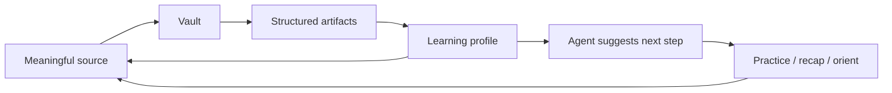

# i0i Learning Journeys

This folder collects narrative scenarios of people using i0i. Each is a "day/week/month in the life" of a different kind of learner, written to test one claim: that i0i's core thesis — an IDE for knowledge curation — is not specific to research papers.

`academic-research.md` is the founding case: the research vertical i0i is actually being built as today. It is the wedge, the foot in the door. The other four journeys generalize the same loop to other kinds of source material:

- `academic-research.md` — the anchor: literature → reading → anchored notes → AI synthesis → durable research memory
- `portuguese-through-brazilian-songs.md` — language learned from personally meaningful songs
- `investment-research-ide.md` — market signals turned into tested theses and better judgment
- `dance-and-movement-practice.md` — embodied practice built from recorded attempts and anchored feedback
- `chinese-tea-tasting.md` — sensory learning that grows a personal tasting vocabulary

This README distills what the five journeys share: the common loop, why that loop is the moat, the one primitive at the center of all of them, the way they differ, the primitives that recur, the architectural requirements that fall out, and the discipline needed to build them without sprawling.

## The Shared Spine

Strip away the domain and all five journeys follow the identical skeleton:

```text
start from what you already care about
  -> curate it into a vault
  -> turn raw experience into structured, inspectable artifacts
  -> build a correctable model of what YOU know (the learning profile)
  -> agents operate over that model to suggest the next reachable step
  -> adapt to the person, recap over time, orient against an external map
```



This is not a coincidence of templating. It is a discovered invariant: the same machine, fed different source material, serves all five.

## Why The Loop Is The Moat

Two reasons the loop is defensible where any single feature is not.

**The loop runs on vault-private data.** A competitor can copy any single beat — search, read, chat, recap. None can copy the loop, because the loop compounds on data that only exists inside the user's vault: their notes, their questions, their saved insights, their activity history. The switching cost is the accumulated memory, not the feature set.

**It changes what "relevance" means.** Every other tool computes relevance as a property of the *query and the corpus* — citation count, semantic similarity, recency. Everyone gets the same ranking. With a learning profile, i0i can compute relevance as a property of the *reader*:

```text
relevance = marginal value to what you do not yet know
```

A highly-cited, on-topic paper you have already mastered is low value to you; a modest paper that fills a gap you have circled for weeks is high value. No competitor can compute "marginal value to this specific mind," because they do not model the mind.

## The Core Primitive: The Learning Profile

One component appears in every journey: the sensory profile (tea), the embodied learning profile (dance), the learning profile (language, research), the learning-state model the investment assistant must not get wrong. The plugins differ. The profile is constant.

**The learning profile is the product. Everything else is an input adapter.** If it is real — a correctable, inspectable, evidence-linked model of what the user knows, struggles with, is practicing, and wants — then the movement, sound, and numeric plugins are just sensors feeding it, and the breadth thesis holds. If it stays vapor, every journey collapses into "a vault + chat + a scheduled search," which is not defensible.

Two properties matter most:

- **Inspectable and correctable.** Not a hidden score. "You have annotated 12 attention papers, so I assume you understand attention — correct me if not." The glass box is simultaneously the personalization and the trust mechanism.
- **Derived, not entered.** Its v0 is a read-model over data already captured — notes, parked questions, chat history, the activity log. Counting before embeddings. It accretes while other features are built; the first place to expose it is the Ask/chat system prompt.

## The Epistemic-Posture Spectrum

The five journeys differ in the product's relationship to *truth*, and that sets how hard the agent should push back:

| Journey | Evidence type | External ground truth | Required agent posture |
|---|---|---|---|
| Tea | Subjective self-report | None | Never impose objective truth; preserve the user's words |
| Dance | Embodied + video | Partial (reference clip) | Diagnose, but admit uncertainty; respect fear |
| Language | Text + audio | Soft (CEFR, a native speaker) | Correct gently; orient against a map |
| Research | Textual | Contested (peer review, reproducibility, citations) | Ground every claim in sources; surface uncertainty; never fabricate |
| Investment | Numeric + provenance | Brutal and financial | Aggressively impose truth; warn about bias |

Tea says "don't overwrite the user's words." Investment says "warn about look-ahead and survivorship bias." Those are nearly opposite stances — yet the spine survives both. The implication: the learning profile needs a per-domain **epistemic posture** knob — how hard the agent defers to the user's perception versus external reality. The same engine then serves the snob-averse tea coach and the bias-hunting investment analyst without forking.

## Recurring Primitives

The abstraction layer the journeys keep reinventing under different names:

- **Vault** — a collection organized around a learning project or research question.
- **Source workspace** — a reader-like view for whatever the source is: text, audio, video, a paper, a dataset.
- **Anchored explanation** — an AI or user-authored note linked to an exact source span or timestamp.
- **Learning profile** — the durable, inspectable model of the user's knowledge.
- **Practice / insight artifact** — durable AI output tied back to evidence: a recap, a test, a drill, a comparison, a backtest, a tasting.
- **Source scout** — an agent that proposes new material from the vault, the profile, and the user's interests.
- **External map** — a curriculum, CEFR level, or standard syllabus used for orientation, never as a rigid path.
- **Provenance graph** — source, lineage, and the chain of what produced each artifact.

## Architectural Implications

Two requirements fall out of *every* journey and should shape the schema early, even before any feature reads them:

**Structured activity log from day one.** The weekly recap and the learning profile are both read-models over a history of events — source opened, note created, question parked, ask performed, artifact saved. This is cheap to capture from the start and impossible to retrofit.

**Provenance on every artifact.** Every note, insight, briefer entry, recap claim, backtest, and diagnosis links back to what produced it. Every trust moment in every journey — the briefer's rationale, the recap's claims, the graph's edges — depends on it.

## Sequencing Discipline (The One Real Risk)

The journeys are coherent enough to be dangerous. Each casually requires a plugin that is, on its own, a startup: pose analysis (dance), speech alignment (language audio), a numeric/backtest engine (investment). The failure mode is building four 70%-done verticals and zero lovable ones — a fragmented product about de-fragmentation.

The discipline the journeys imply but do not state:

```text
The learning profile is the only thing built horizontally.
Verticals are built one at a time.
Do not start vertical N+1 until vertical N is lovable.
```

A defensible order:

1. **Research** — in progress; nail the full loop including a minimal real profile.
2. **Language (text-first)** — maximum reuse of the research reader, notes, scout, and recap; the sound plugin is a fast-follow, not a prerequisite.
3. **Tea** — the cheapest possible proof that the engine is not research-specific; build it to convince yourself, not for a market.
4. **Investment** — highest willingness-to-pay and the harshest honesty loop, but heavy data-licensing and liability surface; a resourced, deliberate bet.
5. **Dance** — coolest demo, worst feasibility, real physical-injury liability; a someday-moonshot.

The breadth is the reward for depth, not a substitute for it.

## A Reframe Worth Sitting With

"Learning" undersells two of the journeys. Investment is not really about learning — it is about deciding under uncertainty with skin in the game, where learning is a byproduct. The decision journal is its real primitive, and it generalizes backward: a researcher bets on which paper to pursue, a dancer bets on which skill to risk. The truer frame might be:

> an IDE for growing judgment — turn experience into inspectable memory, and memory into better decisions.

Offered as a provocation, not a rename. The word you choose for the product shapes everything downstream from it.
