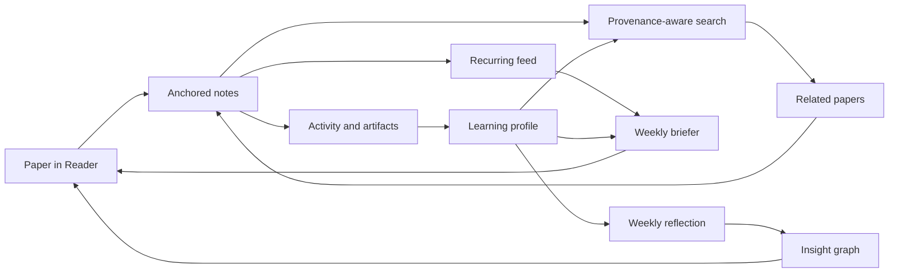

# Learning Journey: Academic Literature Research

This document captures the founding use of i0i: curating and learning from academic literature. Unlike the other journeys in this folder, this is not a use *beyond* research — it is the anchor case, the "foot in the door" that the other journeys generalize from. It is a narrative scenario, not an implementation plan. It follows one week in the life of a researcher and shows why that week's loop is the product's moat.

The cross-cutting analysis that all journeys share — the common spine, the moat argument, the learning profile, the architectural implications, and the build sequence — lives in this folder's `README.md`. This document stays close to the researcher's week.

## Product Thesis

i0i is an IDE for knowledge curation.

For researchers, the pain is not storage. Zotero holds the papers, Obsidian holds the notes. The pain is that the most valuable thinking — the AI-assisted exploration of those papers — evaporates into chat history the moment the session ends.

> i0i turns reading and AI exploration into durable research memory: AI work becomes inspectable, stays connected to the curated literature, and can be found again later.

The center is not "chat with papers." The center is that the *output* of AI work accumulates into a research memory instead of disappearing.

## The Learning Profile

Running quietly underneath the whole week is the **learning profile**: i0i's inspectable, correctable model of what this researcher already understands, what they keep asking about, and what they are currently pursuing. It is never filled in by hand. It is *derived* from the researcher's own activity — the papers they annotate deeply versus skim, the questions they park, the answers they save, the notes that revise earlier ones.

The researcher does not "use" the profile directly. It works by making the surfaces they already use — search, the briefer, Ask, the weekly recap — about *them* rather than about everyone. Its concrete payoffs surface as the week unfolds and are gathered in [What The Learning Profile Adds](#what-the-learning-profile-adds).

## Day 1: Read, Annotate, And Pull On Threads

The researcher opens a paper in the Reader and starts taking anchored notes.

While reading, they ask i0i to collect more papers around the current one. Because i0i keeps paper provenance — sources, identifiers, citations, metadata — the search is not a generic keyword query. The researcher can ask structured, lineage-aware questions:

```text
Who else uses this method?
Who else uses this dataset?
What papers extend this approach?
What came before this idea?
```

The results are candidates with provenance and a rationale, not just a list of links — and they come back ranked by relevance to what this researcher does not yet know, the first quiet read-out of the learning profile.

## Day 2: Notes That Lead Somewhere

Auto-generated and AI-assisted notes link to related papers automatically. Clicking a linked paper opens it inside i0i — metadata resolved, abstract visible, one click away from being added to a vault.

The researcher never leaves the app to follow a reference. Reading becomes traversal:

```text
note
  -> linked paper
  -> open in i0i
  -> inspect / ask / annotate
  -> add to vault
  -> more notes
```

This depends on the reference-prefetch and reference-resolution work described in `future-vision.md`.

## Day 3: Set Up The Inflow

The researcher configures a recurring feed: keywords, sources, venues, a weekly schedule. New matching papers flow into i0i automatically.

i0i agents prioritize and digest the inflow — not in isolation, but relative to the vault. The output is a weekly briefer:

- what arrived
- why each paper might matter to this researcher
- how each paper relates to papers and notes already in the vault
- short digests with provenance

## Morning Coffee: The Briefer

The researcher wakes up, opens i0i with coffee, and reads the briefer.

One paper catches their eye — it matches a current project. One click opens it in the Reader. They skim, take a few notes, maybe park a question. The paper is now part of the vault, connected to the notes that will accumulate around it.

The briefer is a durable artifact, not a notification. Last week's briefers remain inspectable, and the papers they surfaced keep their provenance trail back to the briefer that introduced them.

## End Of Week: Reflection

The researcher wonders what they actually learned this week. They ask i0i to summarize their activity.

The agent reconstructs the week from logged activity and saved artifacts:

```text
On Monday you read three papers on sparse attention.
You parked a question about whether the scaling claim holds for long contexts.
On Wednesday the briefer surfaced a paper that partially answers it.
Your notes on it contradict an assumption you noted last month.
```

The agent does not read minds. "You were surprised by X" is inferred from artifacts — questions parked, highlights made, notes that revise earlier notes. Every claim in the recap should be traceable to the artifact that supports it.

The recap is the learning profile made visible for a week. Resolving the parked question updates the profile, and next week's search and briefer feel the change.

## The Graph

After the recap, the researcher opens the graph view. High-level insights are nodes, each connected to the papers and notes that produced it.

They browse, notice an insight resting on a paper they only skimmed, revisit that paper, and add notes. The week ends where it began: reading and annotating, but now with a richer memory behind every question they will ask next.

## What The Learning Profile Adds

The profile earns its place by making four things better for the researcher. None of them ask the researcher to do extra work; they fall out of the activity they are already producing.

**Sharper inflow — what reaches you.** Discovery and the briefer stop ranking by citation count alone and start ranking by marginal value to *you*. A famous, on-topic paper you have already annotated to death drops; a quieter paper that fills a gap you have circled for weeks rises. The briefer can prioritize what advances your active project, and can flag a new paper precisely *because* it challenges an assumption you wrote down last month. Less noise, and the noise that remains was chosen for you.

**Calibrated explanations — how things are explained to you.** When you ask about a passage or a term, the answer is pitched to your level: it defines the jargon you have not met and skips the background you clearly have. It ties new material to your prior notes ("this is the same trick as in your note on the LLaMA paper"). When you open an unfamiliar paper, i0i can generate a short *bridge* — what here is familiar, what is new, which of your open questions it might touch — so you enter oriented rather than cold.

**Memory of your thinking — what you have learned and believed.** The weekly recap is the profile read out over time: not a log dump, but "here is how your understanding moved." It can surface contradictions — a new paper that undercuts an assumption in an earlier note — and it can close loops, telling you when this week's inflow answered a question you parked three weeks ago.

**Direction — where to go next.** With a model of what you know and a corpus of what you have saved, i0i can find gaps: "you have read deeply on X but never engaged the adjacent Y," or "across your interpretability vault, here is a common unaddressed assumption that could become a research question." It can propose a reading order toward a goal, prerequisites first, and it can generate review prompts from your own uncertain concepts and parked questions — the seed of the future Study module.

### What Is Deferred, And Why

The most obvious application — an adaptive reader that collapses familiar sections, expands the new ones, and simplifies background in place — is *not* available yet, and this journey deliberately does not lean on it. The Reader is PDF-first; there is no text or markdown view of the paper to reshape, so the document itself cannot be re-rendered to the reader's level.

That matters less than it seems, and the reason is the useful insight: almost all of the profile's value lives in *generated text and ranking* — explanations, bridges, rationales, briefers, recaps, gap memos — none of which require re-rendering the source. The customization moves off the document and onto everything around it. An adaptive reader becomes a nice-to-have for the day a text view exists, not a precondition for the profile to pay off.

### How It Starts

The profile needs no model-training project to begin. Its first version is a derived read-model over data the product already captures — anchored notes, parked questions, saved answers, the activity log — aggregated into concepts seen, depth of engagement, and open questions. Counting before embeddings. It accretes quietly while the Reader, notes, and Ask features are built, and the first place it surfaces to the researcher is the Ask system prompt: the same chat, now pitched at them.

For why this same profile is the core primitive across *every* i0i journey, not only this one, see this folder's `README.md`.

## Clean Flow



## Reusable Product Primitives

This journey suggests product primitives that generalize beyond research:

- Research vault: a vault organized around papers, notes, questions, and the links between them.
- Anchored note: a note attached to an exact source span, traceable back to the paper that produced it.
- Provenance-rich candidate: a discovery result carrying its source, identifiers, citations, and a rationale for why it surfaced.
- Source scout / briefer: a scheduled agent that watches sources and digests the inflow relative to the vault.
- Activity log: a structured record of what the researcher did — read, annotated, asked, saved.
- Insight artifact: durable, inspectable AI output — a comparison, a literature brief, a research-gap memo — linked to the sources that produced it.
- Learning profile: an inspectable model of what the researcher already understands, has asked about, and is currently pursuing.
- Insight graph: insights as nodes, connected to the papers and notes that produced them.

## Design Warnings

The recap must be honest. The agent infers from artifacts, not from the researcher's mind. Every claim — "you were surprised," "this contradicts your earlier note" — has to point at the parked question, highlight, or revised note that supports it.

The learning profile must be inspectable and correctable. It infers from behavior, and inference is fallible: it may decide the researcher knows something they do not, or hold back an explanation on a wrong guess. The researcher has to be able to see what the profile believes and overrule it. A confident, wrong model of the reader is worse than no model at all.

The briefer is an artifact, not a notification. It should never nag or interrupt. It persists, stays inspectable, and is read on the researcher's schedule.

Provenance is non-negotiable. Every candidate, insight, and recap claim links back to its source. Researchers will not trust unverifiable AI output, and trust is the whole product.

The agent should ground claims in sources and say so when the literature does not answer. A confident fabrication is worse than an honest gap.

Automation is not the center. Agents are valuable because they operate inside curated memory, not because they are agents in the abstract.

## Why This Belongs In i0i

This is the founding journey — the foot in the door.

The core loop:

```text
curated literature
  -> reading
  -> anchored notes and questions
  -> AI-assisted discovery and synthesis
  -> durable, inspectable insight artifacts
  -> research memory that compounds
```

The other journeys in this folder — language through songs, investment research, movement practice, sensory tasting — generalize this same loop to other kinds of source material. For researchers it produces durable research memory; for learners, a personal curriculum; for analysts, inspectable judgment. The shared spine those journeys have in common is the subject of this folder's `README.md`.
