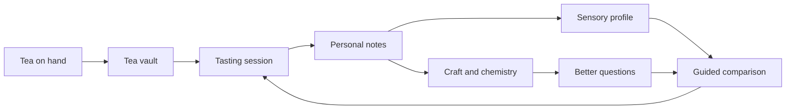

# Learning Journey: Chinese Tea Tasting

This document captures a fourth possible future use of i0i beyond academic literature work. It is a narrative scenario, not an implementation plan or health advice.

The scenario: a user wants to learn Chinese tea tasting. They enjoy tea but do not yet know how to taste carefully, describe what they notice, connect flavor to processing, or understand tea provenance. i0i helps turn casual drinking into a personal sensory learning practice.

## Product Thesis

i0i should support sensory learning.

In this journey, knowledge is not only textual, numeric, or embodied. It is also sensory. The user learns through smell, taste, memory, comparison, ritual, and repeated attention.

The important product claim is:

> i0i helps a user build a personal sensory vocabulary from real tasting experiences, while connecting those experiences to culture, chemistry, geography, and craft.

The product should not replace the user's perception with expert language. It should help the user notice more, remember more, and gradually connect personal descriptions to established tasting concepts.

## Day 1: Start From Teas On The Table

The user tells i0i they want to learn tea tasting.

They import or log a few teas they already own:

- a young sheng puer
- a roasted oolong
- a longjing
- a black tea
- any tea they drink often but cannot yet describe well

i0i creates a tea vault.

The agent explains what matters without overwhelming the user:

- tea type
- cultivar
- region
- harvest date
- processing method
- oxidation
- roasting
- brewing vessel
- water temperature
- leaf-to-water ratio
- steeping time
- aroma, body, aftertaste, bitterness, sweetness, and astringency

The user logs a first tasting in plain language. They might write:

> smells like wet wood  
> bitter but nice  
> kind of sweet after swallowing  
> reminds me of old books

i0i does not overwrite this with polished expert vocabulary. It preserves the user's own words and starts building a personal sensory profile.

## Week 1: Learn Through Comparison

The agent suggests a simple tasting protocol:

> Taste the same tea three times with different brewing parameters.

The user changes one variable at a time:

- water temperature
- steeping time
- leaf amount
- vessel

Each tasting becomes a structured artifact:

- tea
- date
- brewing parameters
- number of infusions
- aroma notes
- taste notes
- body
- aftertaste
- bitterness
- astringency
- sweetness
- user confidence
- photos, if useful

i0i helps the user notice patterns. A hotter brew may produce more bitterness. A shorter steep may reveal sweetness. A later infusion may change body or aroma.

The learning comes from repeated comparison, not from memorizing tasting terms.

## Personal Sensory Vocabulary

Over time, i0i maps the user's own descriptions to broader tasting language.

If the user repeatedly writes "wet wood," "old books," or "forest floor," the agent may suggest links to established descriptors such as woody, earthy, aged, humid, or camphor, depending on context.

The mapping should be tentative and inspectable:

- original user phrase
- possible expert descriptor
- tea sessions where it appeared
- confidence
- examples for comparison

This matters because taste language is personal. i0i should teach vocabulary without flattening perception.

## Month 1: Connect Taste To Craft

After a month, the user starts asking deeper questions.

They ask why roasted oolong can taste nutty. i0i explains roasting, oxidation, heat, Maillard reactions, volatile aromatics, and how processing shapes flavor.

They ask why green tea can become bitter. i0i explains brewing temperature, catechins, extraction, leaf quality, and steeping time.

They ask why puer changes over time. i0i explains fermentation, storage, humidity, microbial activity, aging, and regional traditions.

The user can move between:

- tasting notes
- chemistry explanations
- cultural history
- geography
- processing methods
- producer or region profiles

The tea vault becomes a place where sensory experience and knowledge connect.

## Guided Tasting Practice

i0i can generate tasting exercises based on the user's sensory profile.

If the user reliably detects bitterness and body but struggles to distinguish floral from fruity aromatics, the agent can suggest a contrast set:

- one tea known for floral aroma
- one tea known for fruity aroma
- one neutral or familiar tea as a baseline

The user tastes them side by side and records impressions. i0i updates the sensory profile from the user's notes, confidence, and repeated patterns.

The agent can also recommend revisiting older teas. The point is not only to add more sources. The point is to sharpen perception through deliberate comparison.

## Clean Flow



## Reusable Product Primitives

This journey suggests product primitives that generalize beyond tea:

- Sensory vault: a vault organized around repeated sensory experience.
- Tasting artifact: one session with source, protocol, notes, ratings, and context.
- Protocol: a repeatable setup for comparing experiences fairly.
- Sensory profile: an inspectable model of what the user notices, misses, and can distinguish.
- Personal vocabulary map: user language connected to expert descriptors without erasing the original words.
- Provenance graph: source, region, cultivar, producer, harvest, processing, and storage.
- Craft bridge: explanations connecting sensory experience to technique, chemistry, history, and culture.

## Design Warnings

The product should not become snobbish. The user's raw language is valuable. "Old books" may be a better learning anchor than a forced expert term.

The system should avoid pretending taste is objective. It can suggest patterns, comparisons, and vocabulary, but the user's perception remains central.

Health-related claims around tea should be handled carefully. This journey is about tasting, culture, craft, and sensory learning, not medical benefits.

## Why This Belongs In i0i

This scenario adds sensory learning to i0i's broader knowledge IDE thesis.

The core loop becomes:

```text
sensory source
  -> structured tasting
  -> personal notes
  -> vocabulary mapping
  -> guided comparison
  -> updated sensory profile
  -> deeper cultural and technical understanding
```

For researchers, i0i helps papers become durable research memory. For language learners, it turns songs into a personal curriculum. For movement learners, it turns practice attempts into inspectable feedback. For sensory learners, it turns repeated perception into a growing map of taste, craft, and culture.
