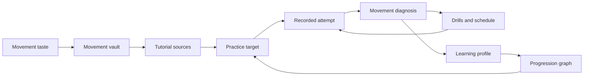

# Learning Journey: Dance And Movement Practice

This document captures a third possible future use of i0i beyond academic literature work. It is a narrative scenario, not an implementation plan, medical advice, or coaching certification.

The scenario: a user wants to learn dancing. They are interested in modern dance, traditional Georgian dance, hip hop, and Capoeira. They do not yet know which path to follow, but they know what feels exciting. i0i helps turn that taste into a personal movement practice.

## Product Thesis

i0i should support embodied learning, not only textual learning.

In this journey, knowledge is not only something the user reads. It is something the user practices, records, feels, fails at, and slowly learns to perform. The source material includes tutorials, dance videos, recorded attempts, movement critiques, drills, schedules, and reflections.

The important product claim is:

> i0i helps a user build a personal movement practice from inspirations, tutorials, recorded attempts, body feedback, and adaptive progressions.

The product should feel like a patient training companion inside a research IDE: it curates sources, explains progressions, tracks practice, notices gaps, and adapts the path.

## Day 1: Start From Taste

The user starts by telling i0i what they like:

- modern dance
- traditional Georgian dance
- hip hop
- Capoeira

The agent suggests a collection of videos, explainers, performances, tutorials, and beginner resources. The user decides to import many of them into a movement vault.

The vault is not a playlist. It is a structured practice space. The agent knows the user is a total beginner and explains what is needed to begin safely:

- basic mobility
- stretching
- core work
- warmups
- beginner coordination drills
- safe practice space
- realistic expectations

The agent proposes a weekly stretching and core schedule. It checks in with the user, asks whether the work was done, and makes the program progressively harder when the user is consistent.

## Week 1: First Target Move

The agent suggests a first movement target: the Capoeira macaco.

The macaco is useful because it connects to many other movements. It can lead toward back handsprings, backflips, floorwork, and modern dance reinterpretations. It is not only one trick. It is a node in a movement graph.

i0i shows the user a video tutorial. The user watches, reads a breakdown, and sees the movement decomposed into parts:

- starting position
- hand placement
- hip opening
- push through the legs
- core engagement
- head and gaze
- landing

The user tries it during the first week and fails badly.

Instead of treating failure as a dead end, i0i turns it into data. The agent asks what felt wrong and invites the user to record an attempt.

## Movement Plugin

This journey requires a future movement plugin.

The movement plugin could support:

- video playback
- user-recorded attempt uploads
- side-by-side comparison with a reference video
- pose or motion analysis
- timestamped movement annotations
- movement decomposition
- progression planning
- practice reminders
- safety notes

The plugin analyzes the user's macaco attempt and identifies likely blockers. For example, the user's core may be stiff, the hips may not open enough, or the user may hesitate before committing to the movement.

The feedback should be anchored to the video:

- timestamp
- body position
- observed issue
- suggested drill
- confidence level
- safety warning if relevant

The agent suggests relaxation beforehand and asks the user to mentally rehearse the movement before trying again.

## End Of Week 1: First Breakthrough

After a week, the user lands the macaco.

i0i updates the learning profile:

- the user practiced consistently
- the user improved core relaxation
- the user learned the basic macaco pattern
- the user still needs safer control and cleaner landing
- the user responds well to visual explanation and mental rehearsal

The obvious next move might be a backflip, but the user is afraid.

The agent does not simply push the harder skill. It recognizes fear and safety as part of the learning state. It suggests a safer branch: combine the macaco with modern dance and explore a tutorial where the movement is reinterpreted as expressive floorwork.

This is an important product behavior. i0i adapts the path without abandoning progression.

## Progression Graph

The movement vault can represent movement knowledge as a graph.

Macaco might connect to:

- Capoeira transitions
- bridge and kickover drills
- cartwheel variations
- modern floorwork
- back handspring progressions
- backflip prerequisites
- hip mobility
- core control
- fear and commitment drills

The graph helps the user see that there is not only one next step. The user can progress technically, artistically, or physically depending on readiness and motivation.

## Clean Flow



## Reusable Product Primitives

This journey suggests product primitives that generalize beyond dance:

- Movement vault: a vault organized around movement styles, tutorials, attempts, and drills.
- Movement source: a video, tutorial, performance, or clip with timestamped annotations.
- Attempt artifact: a user-recorded practice attempt stored as evidence of progress.
- Movement diagnosis: feedback linked to exact moments, body positions, and suggested drills.
- Progression graph: a map of prerequisite skills, related movements, and alternative paths.
- Practice schedule: recurring drills, stretching, mobility, strength, and recovery work.
- Embodied learning profile: a model of consistency, physical readiness, confidence, fear, and skill progress.
- Movement plugin: video playback, pose analysis, comparison, and movement annotation.

## Design Warnings

This journey involves physical risk.

i0i should not encourage dangerous skills too quickly. For movements like backflips, the system should surface safety constraints, recommend mats or spotters, and encourage human coaching where appropriate.

The learning profile should track fear and hesitation without treating them as failure. Fear may be useful information. It can indicate missing strength, missing progression steps, unsafe practice conditions, or a need for an alternate creative route.

The product should avoid pretending that video analysis is perfect. Movement feedback should include uncertainty and should invite the user to confirm how the movement felt.

## Why This Belongs In i0i

This scenario stretches i0i from knowledge curation into embodied practice.

The core loop becomes:

```text
inspiration
  -> curated source
  -> practice target
  -> recorded attempt
  -> anchored feedback
  -> adaptive drills
  -> updated learning profile
  -> better next movement
```

For researchers, i0i helps papers become durable research memory. For language learners, it turns songs into a personal curriculum. For movement learners, it turns practice attempts into inspectable feedback and adaptive progression. In all cases, i0i is the native workspace where the user grows knowledge over time.
