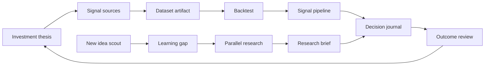

# Learning Journey: Investment Research IDE

This document captures a second possible future use of i0i beyond academic literature work. It is a narrative scenario, not an implementation plan or financial advice.

The scenario: a user is interested in stock investments and financial markets. Signals arrive from everywhere: tickers, charts, financial reports, 13F filings, congressional trading disclosures, central bank decisions, news, Reddit, social media, and public posts from political figures. The problem is not only access to information. The problem is turning scattered signals into inspectable research, tested theses, durable knowledge, and better future judgment.

## Product Thesis

i0i is a native research IDE.

The user should stay inside the IDE while they collect, curate, manipulate, digest, and grow their knowledge. The IDE is not only a library. It is also an assistant and teacher. It knows what the user has read, what they have asked, where their reasoning is thin, and what concepts they still lack. It filters the vast ocean of knowledge through the user's learning profile and research goals.

For researchers, this currently means papers, notes, PDFs, and discovery. For investment research, it means theses, signals, datasets, charts, filings, reports, notes, backtests, and outcomes.

The important product claim is:

> i0i helps a user turn market signals into evidence-backed research workflows, while preserving the reasoning path that led to each decision.

The product should feel like an analyst workbench, not an AI stock picker.

## Day 1: Form A Thesis And Backtest It

The user starts with an investment thesis:

> When Donald Trump posts positively about a company, that company's stock tends to rise over the following 7 days.

Before setting up a live monitoring workflow, the user asks i0i to test the thesis historically.

The agent collects historical public posts from the relevant period, extracts posts that mention companies, maps company names to tickers, and collects stock price movement for the next 30 days after each mention.

This introduces a new kind of i0i artifact: structured numeric data.

The output is not just text. It is a dataset with provenance:

- original post source
- timestamp
- extracted company mention
- ticker mapping
- confidence in the mapping
- stock price at event time
- stock price after 1, 7, and 30 days
- market benchmark over the same period
- cleaning rules
- missing data notes
- dataset version

The user then asks the agent to analyze the dataset. i0i plots the results, calculates average percentage changes, compares them with a benchmark, and shows dispersion, outliers, and uncertainty.

The conclusion should be careful. It should not simply say "this strategy works." It should say something closer to:

> In this dataset, company mentions with positive language had an average X percent move over Y days, with Z variance and these confounders.

The backtest becomes a durable research artifact in the vault.

## Day 2: Turn The Thesis Into A Signal Pipeline

If the backtest looks interesting, the user creates an automated signal pipeline.

The agent checks selected public sources daily and notifies the user when a company is mentioned. The notification is not only a raw alert. It includes the research context:

- which thesis the signal belongs to
- what company was mentioned
- why the mention was classified as positive, negative, or neutral
- how confident the entity mapping is
- what the historical backtest suggested
- what caveats apply
- whether the company is already in the user's portfolio or watchlist

The user can open the signal inside i0i, inspect the evidence, ask follow-up questions, and save a decision note.

## End Of Month 1: Strategy Report And Outcome Review

At the end of the month, the user reviews the strategy.

i0i compiles:

- signals detected
- actions taken
- positions opened or ignored
- realized and unrealized outcomes
- notes written at decision time
- places where the thesis matched reality
- places where it failed
- data quality issues
- revised assumptions

The user can produce a report for themselves or friends. The report should include charts and references, but also the decision journal: what the user believed at the time, not only what happened later.

This matters because the goal is not only to make a prediction. The goal is to improve judgment.

## Month 2: Discover New Ideas

After the first strategy has been explored, the user runs out of ideas.

They ask i0i to collect the top stock-related Reddit posts and evaluate them. The agent does not treat all posts equally. It grades or summarizes signals such as:

- source reliability
- depth of due diligence
- evidence quality
- missing assumptions
- market mechanism
- time horizon
- disagreement in the comments
- whether the idea overlaps with the user's existing knowledge

The agent returns a short list of candidate ideas. One idea stands out:

> Cacao prices may rise sharply next year because of El Nino effects on growing regions.

The user is interested but does not know meteorology. i0i shifts from investment assistant to teacher.

The user asks for a compressed learning report on El Nino. The agent gathers scientific papers, reports, and explainers. The user asks basic questions. i0i tracks those questions and updates the learning profile: the user has started learning weather patterns, agricultural risk, and commodity supply chains.

## Parallel Research Agents

The cacao thesis crosses several knowledge areas. i0i starts parallel research agents:

- meteorology agent: what El Nino is and how it affects heat and rainfall
- agriculture agent: where cacao is grown and which regions are vulnerable
- demand agent: which industries use cacao and how demand is changing
- market agent: cacao futures, historical prices, liquidity, and volatility
- supply-chain agent: producers, exporters, processors, and downstream companies

Each agent returns a condensed artifact with citations and uncertainty notes. i0i then combines the results into a research brief with charts, source links, and open questions.

The user can drill down into any claim and see the source material behind it.

## Numeric Data Plugin

This journey requires i0i to support data artifacts, not only text artifacts.

A future numeric data plugin could handle:

- time series
- event datasets
- price charts
- backtest tables
- correlation matrices
- portfolio exposure
- risk charts
- forecast scenarios
- generated plots

The key requirement is provenance. A chart should not be a detached image. It should link back to the dataset, query, code or calculation, source timestamps, and assumptions that produced it.

Good candidate storage formats could include CSV for simple tables, SQLite for local relational data, and columnar formats like Parquet or Arrow for larger datasets. The exact format matters less than preserving structure, provenance, and reproducibility.

## Portfolio And Risk Plugin

By the end of the cacao investigation, the user considers investing in cacao futures.

They install a financial plugin that tracks positions, available risk budget, allocation, and scenario outcomes. The plugin helps model:

- current portfolio exposure
- expendable budget
- position size
- downside scenarios
- expected return ranges
- volatility
- correlation with existing holdings
- maximum loss under selected assumptions

The plugin should not make the decision for the user. It should help the user understand risk.

The output should be framed as scenario analysis, not personalized financial advice.

## Clean Flow



## Reusable Product Primitives

This journey suggests product primitives that generalize beyond finance:

- Thesis vault: a vault organized around a claim, strategy, or research question.
- Signal pipeline: a scheduled workflow that watches sources and creates alerts tied to a thesis.
- Dataset artifact: structured numeric data with provenance, versioning, and source links.
- Backtest artifact: analysis output tied to a dataset, assumptions, charts, and limitations.
- Decision journal: a durable record of what the user believed when they acted.
- Source reliability model: an inspectable assessment of source quality and uncertainty.
- Parallel research agents: multiple agents exploring different knowledge areas and merging findings.
- Learning profile: a model of what the user understands and where they need teaching.
- Risk workspace: a plugin-driven view for scenario modeling and allocation reasoning.

## Design Warnings

This journey is higher risk than language learning because money is involved.

i0i should not become a stock-picking oracle. It should support research, testing, critique, and reflection. Claims should be traceable to sources, datasets, and assumptions.

Backtests should be treated carefully. The product should surface common risks:

- look-ahead bias
- survivorship bias
- entity-mapping errors
- small sample sizes
- overfitting
- market regime changes
- transaction costs and slippage
- missing benchmark comparison

The learning profile must also remain visible and correctable. If i0i assumes the user understands futures, weather science, or risk sizing when they do not, the assistant will become dangerous.

## Why This Belongs In i0i

This scenario shows i0i as a research IDE for mixed evidence.

The core loop becomes:

```text
thesis
  -> source collection
  -> structured evidence
  -> analysis and backtesting
  -> decision journal
  -> outcome review
  -> better future research
```

For academic users, i0i helps literature become durable research memory. For investment researchers, it helps market signals become inspectable evidence and improved judgment. In both cases, i0i is the native workspace where the user grows knowledge over time.
