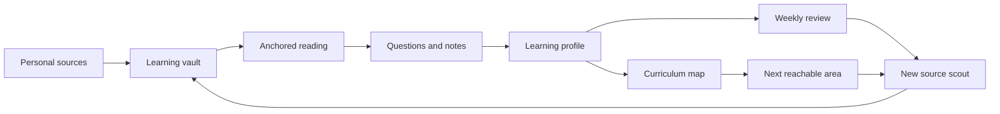

# Learning Journey: Portuguese Through Brazilian Songs

This document captures one possible future use of i0i beyond academic research. It is a narrative scenario, not an implementation plan. The goal is to test whether i0i's core thesis, an IDE for knowledge curation, also works for deeply personal learning projects.

The scenario: a user wants to learn Portuguese through Brazilian songs. Their first contact with Portuguese culture is not a textbook chapter or a vocabulary list, but songs they already care about and can partly sing. i0i helps turn that personal starting point into a structured learning path without replacing it with a generic curriculum.

## Product Thesis

i0i should support individual learning journeys built from meaningful source material.

For researchers, the source material is usually papers. For this learner, the source material is songs, lyrics, pronunciation attempts, cultural notes, and questions asked along the way. The same primitives still apply:

- vaults collect source material
- reader views support anchored understanding
- notes preserve personal interpretations and questions
- agents operate over curated memory
- durable artifacts turn transient AI help into reusable knowledge

The important product claim is:

> i0i lets a user build a personal curriculum from personally meaningful sources, while agents relate that journey back to a wider map of knowledge.

The standard curriculum is not the main path. It is a coordinate system. The user's curiosity remains the path.

## Day 1: Start From Songs

The user creates a learning vault for Portuguese.

They collect a small set of Brazilian songs they already care about, for example bossa nova standards or songs they can already partly sing. The lyrics are user-provided, imported from a permitted source, or linked with clear provenance.

The user opens one song in the reader. Instead of treating it like a flat text file, i0i treats it as an active source:

- words can have vocabulary explanations
- phrases can have grammar explanations
- lines can have cultural or idiomatic notes
- user questions can become durable notes
- AI explanations remain linked to the exact words or lines that produced them

The user hovers over a word or phrase and sees a local explanation that was generated from the current song and the user's learning profile. They can ask follow-up questions and save useful answers back into the vault.

## Week 1: Learn Through Active Reading And Listening

The user works through three songs.

For each song, i0i helps produce a report that connects the lyrics to:

- important vocabulary
- recurring grammar patterns
- idioms and cultural references
- literal and natural translations
- pronunciation notes
- concepts the user already knows
- concepts the user appears to struggle with

The user does not only read explanations. They interact with the source. They ask why a phrase is formed a certain way, why a word sounds different in singing than in speech, or what cultural context a line carries.

These questions become part of the learning memory. The important unit is not "the AI answered a question." The important unit is:

> The user encountered a concrete phrase, asked a concrete question, and saved an explanation anchored to the source.

## Sound Plugin

A future sound plugin could make pronunciation and listening part of the same source workspace.

The plugin could let a Portuguese-speaking AI read or sing through the lyrics line by line. The user speaks along. i0i follows the lyrics, aligns the user's speech to the text, and marks words or phonetic patterns that seem mispronounced.

The output should not be a vague score. It should be inspectable:

- which word was hard
- which sound was likely wrong
- where in the lyric it happened
- whether the same issue appeared in other songs
- what short practice item could help

These pronunciation observations become anchored artifacts in the vault, just like notes on a paper.

## Day 2: Agentic Expansion

Once the user has worked through the first material, they can set up an agent to find new songs over time.

The agent should not simply fetch popular songs. It should search for songs that fit the user's current learning state and interests:

- similar cultural style
- new but reachable vocabulary
- recurring grammar patterns worth reinforcing
- pronunciation features the user needs to practice
- connections to artists, regions, genres, or themes the user already likes

The agent produces candidate songs with explanations for why each one fits. The user remains in control: they choose what to add to the vault.

## End Of Week 1: Weekly Review

At the end of the week, the agent compiles a learning recap from traceable artifacts:

- songs read
- words looked up
- phrases annotated
- questions asked
- notes saved
- pronunciation issues observed
- practice items completed

The recap should be careful. It should not claim to know the user's mind. It should infer from evidence inside the vault.

The agent can generate a weekly test from the user's actual learning history:

- vocabulary from the songs
- grammar patterns the user asked about
- listening or pronunciation items from the sound plugin
- translation questions using lines the user has studied
- short writing prompts based on known material

After the test, i0i updates the learning profile.

## Learning Profile

The learning profile is an inspectable model of the user's current knowledge. It should not be a hidden black box.

It may track:

- known vocabulary
- uncertain vocabulary
- grammar patterns recognized in context
- grammar patterns the user cannot yet produce
- pronunciation strengths and weaknesses
- cultural topics encountered
- songs mastered
- recent questions and repeated confusions
- evidence supporting each claim

The user should be able to correct it. If the model says the user knows a verb form but the user does not feel confident, that should become part of the learning state.

## Month 1: Relate Personal Learning To A Standard Map

After a month, the user asks where they are compared to a standard Portuguese curriculum.

i0i compares the user's vault activity and learning profile against an external learning map, such as CEFR levels or a textbook table of contents. The answer is not a grade for its own sake. It is orientation.

The agent might say that the user is still around early A1, but has unusually strong familiarity with song-related pronunciation, common lyric vocabulary, and a few culturally rich expressions. It can then suggest what the next 10 percent of progress could look like.

Crucially, the next step should still connect to the user's interests. If the user chooses the culture of Sao Paulo, the agent can retrieve more songs, texts, interviews, or cultural notes connected to that theme.

The learning path expands from the user's existing curiosity.

## Clean Flow



## Reusable Product Primitives

This journey suggests product primitives that are not language-specific:

- Learning vault: a vault organized around a personal learning project.
- Source workspace: a reader-like view for text, audio, video transcripts, papers, or other study material.
- Anchored explanation: an AI or user-authored explanation linked to a specific source span or timestamp.
- Learning profile: a durable, inspectable model of what the user knows, struggles with, and is currently practicing.
- Practice artifact: a generated test, drill, flashcard set, pronunciation review, or recap tied back to source evidence.
- Source scout: an agent that proposes new material based on the vault, learning profile, and user interests.
- Curriculum map: an external coordinate system used for orientation, not a rigid path.

## Design Warnings

The journey should not turn i0i into a generic language app. The distinctive value is not that i0i can generate exercises. The distinctive value is that exercises and explanations come from the user's own sources, questions, mistakes, and taste.

The learning profile must be visible and correctable. If the system silently decides what the user knows, it will feel brittle and patronizing.

The product should be careful with copyrighted lyrics. The safest future design is to support user-provided text, links, excerpts, licensed sources, or integrations that respect source rights.

## Why This Belongs In i0i

This scenario proves that i0i's deeper product is broader than research papers.

The core loop remains the same:

```text
meaningful source
  -> active reading/listening
  -> anchored notes and questions
  -> durable AI artifacts
  -> personal knowledge model
  -> better future discovery
```

For researchers, this loop produces research memory. For learners, it produces a personal curriculum. In both cases, i0i is the place where source material, AI assistance, and durable self-knowledge compound over time.
