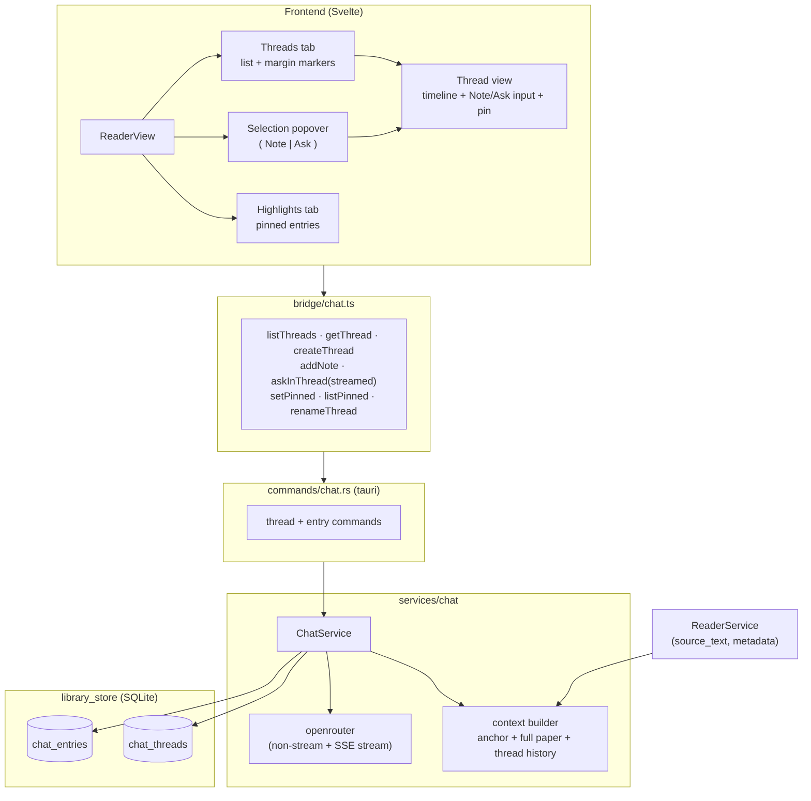
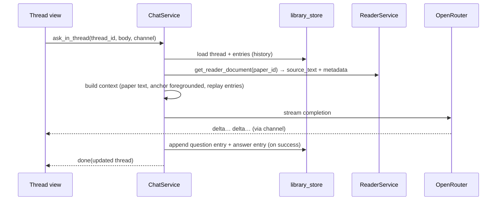

# RFC 0033: Anchored Chat Threads and Pinned Highlights

Status: Stale
Date: 2026-06-14
Product: i0i
Target: Tauri v2 + Svelte, macOS first
Supersedes: parts of RFC 0032 (paper-level transcript, "save answer as note")

## Summary

Restructure chat from a single paper-level transcript into **anchored threads**.
A thread is attached to an *anchor* — a text selection in the Reader, or the
whole paper — and holds a single timeline of **entries**. An entry is either a
**note** you write yourself or a **question/answer** exchange with the AI. Both
are produced from the same place: select an anchor, then either write a note or
ask.

This collapses two features (Notes and Ask) that RFC 0032 built separately into
one model. "Note vs. chat" stops being a distinction in the data; both are
entries in a thread, differing only in whether the AI replied. The durable,
revisitable layer is not a whole conversation but a **pinned entry** — pin the
one note or answer that mattered, and review all pins for a paper in a
**Highlights** view.

Anchored asks send the **full paper text** as grounding (per RFC 0032) with the
anchor **foregrounded** in the system prompt, so a passage-scoped question still
sees the rest of the paper.

## Context

RFC 0032 shipped paper-scoped chat: a single `chat_messages` transcript per
paper, plus a separate `paper_notes` table, plus a "save answer as note" bridge
(`anchor_kind = "chat"`). Two observations from using it motivated this RFC:

- You can only ask about the **whole paper**. There is no way to scope a
  question to a passage, or to keep distinct conversations about distinct parts
  of the paper.
- "Save answer as note" is awkward: every chat turn is already durable, so
  re-saving it duplicates it; and a whole conversation is too large to be a
  useful "note."

The fix is to unify the primitives. RFC 0032's `ChatScope` was already designed
to extend; this RFC generalizes it from *paper* scope to *anchored* scope and
folds notes into the same store. The whole-paper chat becomes one special
thread (anchor = the document). Existing notes become note-entries.

## Goals

- One model: **anchor → thread → entries**, where an entry is a note or an
  AI question/answer, produced from a single Reader affordance.
- Anchored (selection-scoped) threads alongside a whole-paper thread.
- Anchored asks keep full-paper grounding with the anchor foregrounded.
- **Pin** any entry; a **Highlights** view aggregates a paper's pins.
- Preserve streaming replies (RFC 0032 M2).
- Migrate existing transcripts and notes into the new model.

## Non-Goals

- AI thread distillation ("summarize this thread into a takeaway") — the
  architecture leaves the door open, but it is not built here.
- Paragraph- or section-level auto-anchors; v1 anchors are an explicit text
  selection or the whole document.
- Vault-scope threads (the schema keeps `scope_kind`/`scope_id` for it, as in
  RFC 0032, but it is not implemented).
- De-duplicating near-identical selections into one thread (see Open Questions).
- Chat for transient (unsaved) discovery papers — still gated behind "add to a
  Vault," as in RFC 0032.

## Core Model

```
Anchor               a text selection (text_offset / pdf_rect) OR the whole document
  │
  └─ Thread          one timeline per anchor; has a title (defaults to the quote)
        │
        └─ Entries   ordered; each entry is one of:
             • note      — author=you,  no AI reply           (you producing)
             • question  — author=you,  expects an AI reply    (you asking)
             • answer    — author=AI,   reply to a question    (AI producing)

        Notes start ★ pinned; questions/answers start unpinned. Any pin toggles.
```

- The thread input has **two actions**: **Note** (save your text only) and
  **Ask** (save your text as a *question* and stream an *answer*). Both append
  to the same thread.
- A **pin** is a flag on a single entry. Pinned entries — yours or the AI's —
  surface in the paper's **Highlights** view. Pins are the curated, scannable
  layer; threads are the working surface beneath.
- **Notes are pinned by default; answers are not.** Writing a note is itself an
  act of curation, so it auto-appears in Highlights. An AI answer is mostly
  exploration, so you ★ star the keepers. Both are toggleable — unpin a scratch
  note, pin a great answer. As a result, Highlights reads as *"all my notes +
  the answers I starred."*
- "Save answer as note" (RFC 0032 M3) is **removed**. Its job is now done by
  pinning, which is small by construction.

## Architecture



Ask-in-thread data flow:



## Data Model

Two new tables replace `chat_messages` and absorb `paper_notes`' annotation role.

```sql
CREATE TABLE IF NOT EXISTS chat_threads (
    id            TEXT PRIMARY KEY,
    scope_kind    TEXT NOT NULL,        -- 'paper'  (later: 'vault')
    scope_id      TEXT NOT NULL,        -- paper_id for paper scope
    anchor_kind   TEXT NOT NULL,        -- 'document' | 'text_offset' | 'pdf_rect'
    source_id     TEXT,                 -- reader source id for selection anchors
    start_offset  INTEGER,              -- text_offset anchors
    end_offset    INTEGER,
    selected_text TEXT,                 -- the quoted passage (anchor label)
    page_index    INTEGER,              -- pdf_rect anchors
    rects_json    TEXT,                 -- pdf_rect anchors
    title         TEXT,                 -- defaults to selected_text / "Whole paper"
    created_at    TEXT NOT NULL,
    updated_at    TEXT NOT NULL
);

CREATE INDEX IF NOT EXISTS idx_chat_threads_scope
    ON chat_threads (scope_kind, scope_id, updated_at);

CREATE TABLE IF NOT EXISTS chat_entries (
    id            TEXT PRIMARY KEY,
    thread_id     TEXT NOT NULL,
    kind          TEXT NOT NULL,        -- 'note' | 'question' | 'answer'
    body          TEXT NOT NULL,
    model         TEXT,                 -- 'answer' entries only
    context_json  TEXT,                 -- 'answer' entries only (ChatContextSummary)
    pinned        INTEGER NOT NULL DEFAULT 0,
    created_at    TEXT NOT NULL,
    FOREIGN KEY (thread_id) REFERENCES chat_threads(id) ON DELETE CASCADE
);

CREATE INDEX IF NOT EXISTS idx_chat_entries_thread
    ON chat_entries (thread_id, created_at);

CREATE INDEX IF NOT EXISTS idx_chat_entries_pinned
    ON chat_entries (thread_id, pinned);
```

Notes on the shape:

- **Author is derived from `kind`**: `note`/`question` → you; `answer` → AI. No
  separate author column.
- **`pinned` default is per-kind, set by the store on insert**: `note` entries
  are inserted `pinned = 1`, `question`/`answer` entries `pinned = 0`. The column
  `DEFAULT 0` is only a fallback; the store decides from `kind`.
- The anchor columns reuse the exact shape already validated for `paper_notes`
  (`source_id`, offsets, `selected_text`, `page_index`, `rects_json`), so the
  Reader's existing selection/highlight plumbing carries over unchanged.
- `anchor_kind = 'document'` is the whole-paper thread; its anchor columns are
  null. There is at most one document thread per paper.
- Deleting a paper cascades through `chat_threads` (paper-scoped) and then
  `chat_entries`. `delete_paper_globally` deletes the paper's threads (no FK
  from threads to papers, since `scope_id` is polymorphic — same pattern as RFC
  0032's chat cleanup), and entries cascade via the FK.

## Context Management

A thread Ask assembles context the same way regardless of anchor, with the
anchor foregrounded:

```
system message:
  You are a research assistant inside i0i. Answer questions about the paper
  below. Ground every claim in the paper text. If the paper does not contain
  the answer, say so explicitly.

  Title / Authors / Venue / Year

  [ when the thread is anchored to a passage: ]
  The reader is focused on this passage; weight it heavily but you may use the
  rest of the paper:
  > {anchor selected_text}

  Paper text{truncation note}:
  {full source_text, truncated to max_context_chars}

then replay this thread's entries in order:
  note      → role "user"     (your own thinking is visible to the model)
  question  → role "user"
  answer    → role "assistant"

then the new question (role "user").
```

Decisions and guarantees:

- **Full-paper grounding (option b).** Same token budget and `max_context_chars`
  as RFC 0032; the anchor is foregrounded, not substituted, so a passage-scoped
  question can still reach the rest of the paper.
- **The anchor text is never truncated away.** Even if the paper body is cut to
  the budget, the foregrounded `selected_text` is always included.
- **Per-thread history.** Each thread replays only its own entries, so threads
  about different passages stay independent. The paper text is shared context,
  inlined once per turn (in the system message), never per entry — preserving
  RFC 0032's "paper text once" rule.
- **Notes are context.** Your note entries are replayed as user turns, so your
  own synthesis informs later answers in that thread.
- **Inspectability.** Each `answer` entry stores its `ChatContextSummary`
  (`included_chars`, `truncated`) exactly as in RFC 0032, rendered under the
  answer.
- **History growth.** Full thread history is sent until it visibly hurts; a
  sliding window is a later, localized change (unchanged stance from RFC 0032).

## UI (ASCII)

The Reader Inspector's `Notes` and `Ask` tabs become **Threads** and
**Highlights**.

**A. Reader — start from a selection**

```
┌ Reader main pane ───────────────────────────────┐
│ … attention re-weights tokens by                 │
│ [▓▓ scaled dot-product attention ▓▓]  ◀ selected │
│     ┌───────────────────────────┐                │
│     │  ✎ Note      💬 Ask        │  ← popover     │
│     └───────────────────────────┘                │
└──────────────────────────────────────────────────┘
```

**B. Inspector — Threads tab (list)**

```
┌ Threads ────────────────────────────────────────┐
│ ● Whole paper                         12 ▸       │  ← document thread (always present)
│ ● "scaled dot-product attention"       4 ▸       │  ← anchored, has a pin
│ ○ "multi-head"                         2 ▸       │
│ ○ "positional encoding"                1 ▸       │
└──────────────────────────────────────────────────┘
   ● = has pinned entries   ○ = none   N = entry count
   The Whole paper thread is created on first use; anchored threads
   are created from the selection popover and show a Reader margin marker.
```

**C. Inspector — an open thread**

```
┌ "scaled dot-product attention"            ✎ ⌫  ┐
│ ┌ you · note ─────────────────────────────────┐ │
│ │ revisit why we scale by √dk            ★     │ │ ← pinned by default
│ └─────────────────────────────────────────────┘ │
│ ┌ you · ask ──────────────────────────────────┐ │
│ │ why scale by √dk?                      ☆     │ │
│ └─────────────────────────────────────────────┘ │
│ ┌ ai ─────────────────────────────────────────┐ │
│ │ To keep softmax gradients stable as dk grows…│ │
│ │ Context: 48,210 chars · truncated      ★     │ │ ← you starred it
│ └─────────────────────────────────────────────┘ │
│ ────────────────────────────────────────────────│
│ [ type here…                                   ] │
│                              ( ✎ Note )( 💬 Ask )│
└──────────────────────────────────────────────────┘
   ★ = pinned (→ Highlights)   ☆ = unpinned   notes start ★
   ✎ = rename thread   ⌫ = delete thread
```

**D. Inspector — Highlights tab (pins across the paper)**

```
┌ Highlights ────────────────────────────────────┐
│ ★ To keep softmax gradients stable as dk grows… │
│      from "scaled dot-product attention"   ▸    │
│ ★ connect this to temperature in softmax        │
│      from "scaled dot-product attention"   ▸    │
│ ★ MoE routing behaves like learned attention    │
│      from "Whole paper"                    ▸    │
└──────────────────────────────────────────────────┘
   ▸ opens the source thread at that entry
```

For a paper not yet in a Vault, both tabs show the existing hint: "Add this
paper to a Vault to take notes and chat."

## User Journey

1. **Read and mark up.** While reading, you select a passage. The popover
   offers **Note** or **Ask**.
2. **Produce or ask — same starting point.** Choosing **Note** opens (or
   creates) the thread for that passage and drops you into a note entry.
   Choosing **Ask** does the same but streams an AI answer grounded in the full
   paper with your passage foregrounded.
3. **Work the passage.** Within the thread you interleave your own notes and
   follow-up questions. The conversation and your thinking live in one place,
   anchored to the text that prompted them.
4. **Keep the keepers.** Your notes are pinned automatically (writing one is
   already curation); you ★ star the AI answer that nailed it, and unpin any
   scratch note you don't want surfacing. The rest stays as working history.
5. **Ask about the whole paper.** The **Whole paper** thread is always present
   (the old Ask tab) for cross-cutting questions.
6. **Review later.** Re-opening the paper, you go to **Highlights** to see just
   your pinned takeaways, each linking back to the thread (and passage) it came
   from. Margin markers in the Reader show which passages have threads.

## Backend Changes

- `domain/chat.rs`: replace `ChatMessage`/`ChatStreamEvent` message shapes with
  `ChatThread`, `ChatEntry` (`kind`, `pinned`, `model`, `contextSummary`), a
  `ThreadAnchor` (kind + selection fields), and keep a streaming event enum for
  answers. `ChatScope` is retained for `scope_kind`/`scope_id`.
- `storage/library_store.rs`: new `chat_threads` + `chat_entries` tables and
  methods — `list_threads(scope)`, `create_thread(scope, anchor)`,
  `get_thread(thread_id)` (thread + entries), `append_entry(thread_id, draft)`,
  `set_entry_pinned(entry_id, pinned)`, `list_pinned(scope)`,
  `rename_thread` / `delete_thread`. `delete_paper_globally` deletes the
  paper's threads. Migration (below) runs in `create_schema`.
- `services/chat/`:
  - `context.rs`: extend `build_context` to foreground an optional anchor
    passage (always-included) on top of the truncated paper text.
  - `service.rs`: orchestrate per-thread — load thread + entries, build context,
    stream, then persist `question` + `answer` entries on success (the RFC 0032
    "persist the whole turn only on success" rule carries over). Add note and
    pin operations.
  - `openrouter.rs`: unchanged (SSE decoder + completion).
- `commands/chat.rs`: thread/entry/pin commands replacing the message commands;
  streaming still over a `tauri::ipc::Channel`.

## Frontend Changes

- `domain/chat.ts` + `bridge/chat.ts`: thread/entry/pin types and bridge calls.
- `ReaderInspector.svelte`: replace the `Notes` and `Ask` tabs with **Threads**
  and **Highlights**; add the thread view (timeline + dual Note/Ask input + pin
  controls).
- Reader selection popover: a single popover with **Note** and **Ask** actions
  that open/create the anchored thread (reuses the existing selection plumbing
  that today produces note drafts).
- Margin markers: anchored threads reuse the existing note-anchor highlight
  mechanism in `PdfPage`.

## Migration

Run once in `create_schema` after the new tables exist:

- **`chat_messages` → document threads.** For each paper that has messages,
  create one `anchor_kind = 'document'` thread (title "Whole paper") and copy
  messages in order as entries: `user → question`, `assistant → answer`
  (carrying `model`, `context_json`, `created_at`). Drop `chat_messages` after.
- **`paper_notes` (text_offset / pdf_rect) → anchored threads.** Each note
  becomes a thread carrying its anchor columns, with a single `note` entry
  (`body` = note body). Per the default rule it is `pinned`, so prior notes
  appear in both the Threads list and Highlights.
- **`paper_notes` (anchor_kind = 'chat', from RFC 0032 M3) → pinned note
  entries** in the paper's document thread (low-fidelity; this feature is new
  and holds little real data, and these were answers the user chose to keep).

Because the project is early and most data is dev/seed data, a clean rebuild of
the chat/notes tables is an acceptable alternative to a faithful migration if
the migration proves fiddly; this is called out so the implementer can choose.

## Risks

- **Scope creep into the Reader.** This depends on reliable text selection in
  the PDF Reader, which already exists for notes. Anchored asks reuse it; if
  selection fidelity is poor for some PDFs, anchored threads degrade but the
  whole-paper thread always works.
- **Migration fidelity.** Mapping two tables into two new ones has edge cases
  (chat-anchored notes especially). Mitigated by the early-stage rebuild escape
  hatch and by keeping the anchor shape identical to `paper_notes`.
- **Thread sprawl.** Many small threads per paper could clutter the list.
  Mitigated by thread titles, the entry-count/▶ affordances, and Highlights as
  the curated layer. De-dup of near-identical anchors is deferred.
- **Cost.** Unchanged from RFC 0032 — full paper text per turn. Per-thread
  history is typically shorter than one giant transcript, so anchored threads
  are often *cheaper* per turn than the old single transcript.
- **"All my notes" list.** The old Notes tab listed every note. Because notes
  are pinned by default, **Highlights** now *is* that list ("all my notes + the
  answers I starred"), and the Threads list additionally groups them by passage.
  No data or browsing surface is lost.

## Validation Plan

```bash
cargo fmt --check
cargo clippy
cargo test
pnpm check
pnpm build
```

Unit tests (TDD, mirroring RFC 0032):

- `library_store`: thread create/list, entry append ordered oldest-first,
  pin/unpin, `list_pinned` returns only pinned across a paper's threads,
  `delete_paper_globally` removes the paper's threads + entries, migration maps
  a sample `chat_messages` + `paper_notes` set correctly.
- `context.rs`: anchor passage is always included even when the paper body is
  truncated; document-anchor (no passage) matches RFC 0032 output; summary char
  counts accurate.
- `openrouter.rs`: unchanged SSE/decoder tests still pass.

Integration (manual):

- Select a passage → Ask → grounded answer that clearly used the passage;
  restart → thread persists.
- Interleave a note and a follow-up in the same thread; the follow-up answer
  reflects the note.
- Pin an answer and a note → both appear in Highlights, each linking back.
- Ask in the Whole-paper thread (parity with RFC 0032).
- Delete the paper → its threads, entries, and pins are gone.

## Open Questions

- **Multiple threads per anchor.** v1 creates a new thread per selection and a
  singular document thread. Should an exact-duplicate selection re-open the
  existing thread? Proposal: no de-dup in v1; revisit if it annoys.
- **Auto-titling.** Titles default to the quoted text. Worth an AI auto-title
  for long selections, or is the quote enough? Proposal: quote is enough for v1.
- **AI thread distillation.** Add a "distill thread → pinned takeaway" action?
  Deferred; the working-surface vs. distilled-layer split makes it additive.
- **Migration vs. rebuild.** Faithful migration or clean rebuild given the early
  stage? Implementer's call, noted in Migration.
