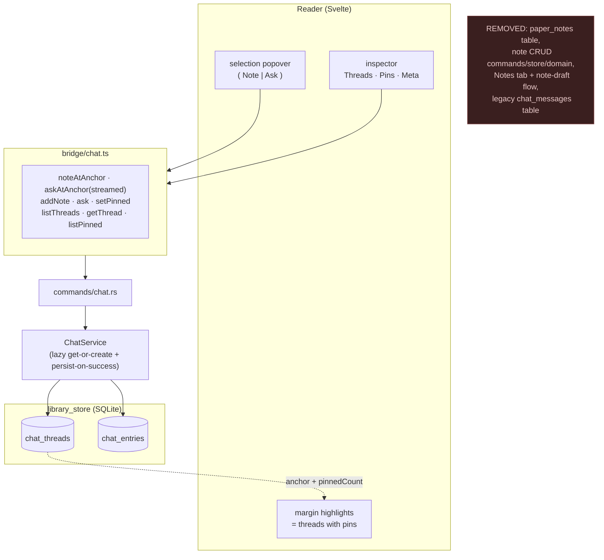

# RFC 0034: Unify Notes Into Threads

Status: Implemented
Date: 2026-06-14
Product: i0i
Target: Tauri v2 + Svelte, macOS first
Builds on: RFC 0033 (anchored threads + pins)
Supersedes / removes: the standalone `paper_notes` annotation subsystem

## Summary

RFC 0033 introduced anchored chat threads and pins **additively**: the mature
in-PDF `paper_notes` annotation system was left running alongside the new
threads. That leaves two note surfaces — the **Notes** tab (in-PDF annotations,
`paper_notes`) and **note-entries inside threads**. This RFC finishes the
unification: a note becomes a note-entry in an anchored thread, the **Notes tab
disappears** (folded into Threads), reader highlights are driven by pinned
thread entries, and the `paper_notes` table is migrated away and dropped.

After this RFC there is one model — *anchor → thread → entries, with pins* — and
one place to produce knowledge (Note) or interrogate it (Ask), from the same
selection.

## Context

Today, selecting text in the Reader produces a `paper_notes` draft (Notes tab,
Save) and, separately, an "Ask" that starts a thread (RFC 0033). `PdfPage`
renders `pdf_rect` `paper_notes` as in-page highlights; `papers.note_count`
drives the library "Notes" badge. RFC 0033 deliberately did not touch any of
this, to avoid destabilizing the reader in one pass.

The thread model already reuses the exact anchor shape of `paper_notes`
(`source_id`, offsets, `selected_text`, `page_index`, `rects_json`), so a note
is now just a thread with a single `note` entry. This RFC makes that the only
representation.

## Decisions (settled before drafting)

1. **Reader highlight = a thread with at least one pinned entry.** The margin
   mark means "there's a keeper here." Because notes are pinned by default
   (RFC 0033), taking a note still marks the passage — preserving today's
   note→highlight behavior — while ask-only threads stay mark-free until you
   star an answer. Reader highlights and the **Pins** tab become the same
   concept: the marks are the on-page locations of your pinned highlights.

2. **The library badge counts pinned entries, relabeled "Highlights."** One
   number that means the same as the margin marks and the Pins tab — "keepers on
   this paper" (your notes, plus answers you starred). Computed on read, not a
   denormalized counter.

3. **Lazy thread creation.** A thread is born together with its first entry.
   "Note" creates thread + note atomically; "Ask" persists thread + Q&A only on
   success; the "Whole paper" thread is created on first message. Read-only
   selections and failed asks persist nothing — no empty threads, ever.

## Goals

- One note model: a note is a note-entry in an anchored thread.
- Remove the Notes tab; the inspector is **Threads · Pins · Meta**.
- Reader margin highlights render from threads with pinned entries (decision 1),
  clicking a mark opens that thread.
- Library "Highlights" badge counts pinned entries (decision 2).
- Lazy thread creation everywhere (decision 3).
- Migrate `paper_notes` → threads, then drop the table and the legacy chat
  table; remove the dead note CRUD code.

## Non-Goals

- No change to the chat/thread/pin model itself (RFC 0033 stands).
- No de-duplication of near-identical anchors into one thread (still deferred).
- No AI thread distillation (still deferred).
- No vault-scope threads.
- The separate "Annotations" count/concept is untouched.

## Design

### One selection, one popover

Selecting text shows a single popover with **Note** and **Ask**. Both target the
same anchored thread for that passage:

- **Note** → get-or-create the passage's thread and append a `note` entry
  (pinned by default). Atomic.
- **Ask** → get-or-create the passage's thread and stream a question/answer,
  persisting the turn only on success.

The old note-draft round-trip (draft → Notes tab → Save) is gone; a note is
written in the thread, the same place answers live.

### Lazy threads (decision 3)

A thread row exists only once it has content:

- New anchored thread: the **first** Note/Ask carries the anchor and creates the
  thread as part of persisting that entry. Selection anchors always create a new
  thread (no dedup). The **document** anchor is get-or-create-singular (one
  whole-paper thread per paper).
- Existing thread: continue with thread-id Note/Ask (RFC 0033 commands).
- The frontend opens a **virtual** thread (anchor, no id yet) so you can type
  before the first send; the first send returns the real thread id.

This removes RFC 0033's eager `create_chat_thread` / eager `open_document_thread`
paths.

### Reader highlights from pinned threads (decision 1)

`PdfPage` (and any text-reader highlight layer) renders a mark per **thread with
`pinnedCount > 0`** whose anchor matches the surface (`pdf_rect` for the PDF,
`text_offset` for text). The data is already available: `list_chat_threads`
returns each thread's `anchor` and `pinnedCount`, so the reader filters
`pinnedCount > 0` and draws the anchors. Clicking a mark opens that thread in the
inspector. This replaces `PdfPage`'s current `paper_notes`-driven highlight
filter.

### Counts (decision 2)

`papers.note_count` is replaced by a computed **highlight count** = number of
pinned entries across the paper's threads, surfaced on the (renamed)
"Highlights" badge. Computed via a subquery in the library snapshot read, so it
never drifts. The legacy `note_count` column is no longer maintained.

### Inspector

Tabs become **Threads · Pins · Meta** (Notes removed). Threads and Pins are as in
RFC 0033. The selection popover lives in the reading surface, not a tab.

## Architecture



## Data Model & Migration

No new tables. Migration runs once (guarded), then drops legacy tables.

```text
paper_notes → threads (one thread per note, pinned single note entry):
  text_offset → thread{anchor: text_offset(source_id,start,end,selected)}
                + entry{kind: note, body, pinned: 1, created_at}
  pdf_rect    → thread{anchor: pdf_rect(source_id,page,rects,selected)}
                + entry{kind: note, body, pinned: 1, created_at}
  chat (0032) → pinned note entry appended to the paper's document thread

then:
  drop table paper_notes
  drop table chat_messages   (legacy, already migrated by RFC 0033)
  papers.note_count          left in place but unused (column drop optional)
```

Migrated notes are **pinned** (they were deliberate), so they appear in Pins and
as reader marks immediately — preserving today's "my notes are highlighted"
behavior. Given the early stage, a clean rebuild remains an acceptable
alternative to faithful migration (implementer's call), as in RFC 0033.

## Backend Changes

- `library_store.rs`:
  - Add anchored first-entry operations: `add_note_at_anchor(scope, anchor,
    body)` and the ask path create-or-get the thread then persist. `document`
    anchor reuses `ensure_document_thread`; selection anchors create new.
  - Library snapshot read: compute `highlight_count` (pinned entries per paper)
    in place of `note_count`.
  - Migration `migrate_paper_notes_into_threads`; drop `paper_notes` +
    `chat_messages` after migration.
  - Remove `paper_notes` table, the note CRUD methods (`get_paper_notes`,
    `create_paper_note`, `delete_paper_note`, `update_paper_note`) and their
    tests.
- `domain`: remove `PaperNote` / `PaperNoteDraft`; replace `Paper.note_count`
  with `highlight_count` (or repurpose the field — see Open Questions).
- `services/chat/service.rs`: lazy create-or-get in the anchored note/ask paths
  (drop eager `create_thread` / `open_document_thread`).
- `commands`: remove note commands (`get_paper_notes`, `create_paper_note`,
  `delete_paper_note`, `update_paper_note`); add `add_note_at_anchor` /
  `ask_at_anchor_streamed`; drop eager thread-create commands. Update `lib.rs`.

## Frontend Changes

- Remove the **Notes** tab and the note-draft state/flow from
  `ReaderInspector.svelte`; keep Threads + Pins + Meta.
- `ReaderView.svelte`: selection no longer makes a `paper_notes` draft; it opens
  a virtual anchored thread (Note/Ask) in the Threads tab. Remove `createPaperNote`
  and the note callbacks.
- `PdfPage.svelte`: render highlights from threads with `pinnedCount > 0`
  (filter by `pdf_rect` anchor) instead of `paper_notes`; clicking opens the
  thread.
- `bridge/library.ts` / `domain/library.ts`: remove note APIs/types; library
  badge reads `highlightCount`, relabeled "Highlights".
- `state/library-cache.svelte.ts`: drop note-count plumbing; use highlight count.

## UI (ASCII)

```
Reader — one popover for a selection
  …[▓▓ scaled dot-product ▓▓]
      ┌───────────────────────┐
      │  ✎ Note     💬 Ask    │
      └───────────────────────┘
  margin marks appear only where a thread has a pin
  (a note pins by default; a starred answer pins too)

Inspector tabs:  Threads · Pins · Meta      (no Notes tab)

Library / vault explorer badge:
  "Attention Is All You Need        ★ Highlights 6"
```

## User Journey

1. Select a passage → **Note** (jot a thought) or **Ask** (grounded answer).
   Either way you land in that passage's thread; nothing was persisted until
   this first entry (lazy).
2. Keep working the passage — interleave notes and follow-up questions.
3. Your notes are pinned automatically; you ★ star the answers worth keeping.
4. The passage now shows a margin mark (it has a pin). Ask-only passages you
   never starred stay unmarked.
5. **Pins** lists every keeper across the paper; the library badge shows the
   same count as "Highlights."
6. There is no separate Notes tab to reconcile — one surface, one model.

## Risks

- **Destructive drop.** Removing `paper_notes` is irreversible. Mitigated by the
  tested migration and the early-stage rebuild escape hatch; migration copies
  before dropping, in one transaction.
- **Reader highlight rendering.** Re-pointing `PdfPage` from `paper_notes` to
  threads-with-pins is the largest UI change; it must keep selection,
  highlight, and click-to-open working. Anchor shape is identical, which lowers
  risk.
- **Count semantics shift.** The badge now moves when answers are pinned/unpinned
  and is relabeled; computed-on-read avoids drift.
- **Lazy wiring.** The virtual-thread-before-first-entry flow must not lose the
  user's typed text if the first send fails (keep it in the input, as RFC 0033
  does for asks).

## Validation Plan

```bash
cargo fmt --check
cargo clippy
cargo test
pnpm check
pnpm build
```

Unit tests (TDD):
- migration maps text_offset/pdf_rect/chat `paper_notes` into pinned note
  threads; document-anchored chat notes land in the doc thread.
- `add_note_at_anchor` creates the thread lazily with one pinned note; a second
  note on a new selection makes a second thread; document anchor stays singular.
- highlight count = pinned entries per paper; updates on pin/unpin.
- failed first ask persists no thread (lazy).

Integration (manual):
- Select → Note → margin mark appears; select → Ask, don't star → no mark; star
  the answer → mark appears.
- Pre-existing notes survive migration as pinned, marked, and listed in Pins.
- Library badge shows the highlight count and tracks pinning.
- Delete a paper → its threads, entries, pins, and marks are gone.

## Open Questions

- **`note_count` field.** Rename `Paper.note_count` → `highlight_count`, or keep
  the field name and repurpose it? Proposal: rename for clarity.
- **Drop the `note_count` column?** SQLite ≥ 3.35 supports `DROP COLUMN`, but it
  is optional; leaving it unused is harmless. Proposal: leave it.
- **Text-surface highlights.** The PDF surface is primary; if/when a text reader
  surface renders `text_offset` marks, it uses the same threads-with-pins source.
- **Migration vs rebuild.** Faithful migration or clean rebuild given the early
  stage? Implementer's call.
