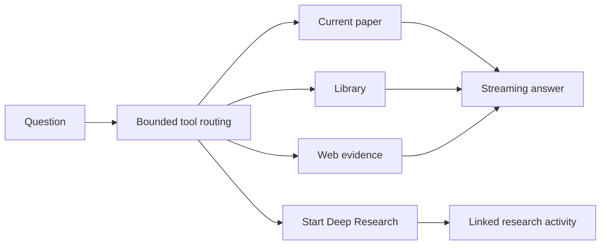

# RFC 0097: Research-Connected Chat With Epistemic Boundaries

Status: Partially Implemented - production paths landed; live prompt evaluation pending
Date: 2026-08-24
Product: i0i
Target: Tauri v2 + SvelteKit (Svelte 5), macOS first
Builds on: RFC 0076 (search service), RFC 0077 (context manager), RFC 0078
(agentic context), RFC 0079 (honest grounding), RFC 0088 (Deep Research)
Depends on: RFC 0052 (session-backed Obscura), RFC 0098 (browser-first
scholarly discovery)

## Summary

Chat is agentic today, but only inside the current paper. Its tools search local
paper chunks, and its prompt explicitly requires every claim to stay within the
paper. That combination explains both reported failures: it cannot consult the
web or Deep Research, and even a strong model is instructed not to extrapolate.

Extend the existing bounded two-phase turn with local-library search, bounded
web evidence, and an asynchronous Deep Research launch. Permit inference,
hypothesis, and cross-field synthesis while making their epistemic status
visible and keeping factual claims cited.



## Current Constraint

The existing architecture is worth preserving:

1. Retrieve local evidence and run one bounded tool-routing round.
2. Assemble cited context.
3. Stream the final prose with tools disabled.

The current router offers paper-context tools only. `ContextCitation` also
assumes local PDF/page geometry, so it cannot honestly represent an external
web source.

Deep Research is already a persisted background run. It must remain that way;
a minute-long search should not block a chat answer or silently mutate a reply
after it has finished.

## Decision

### 1. Extend the tool vocabulary

The bounded routing phase may use:

| Tool | Contract |
|---|---|
| `search_paper` | Search indexed chunks in the current paper. |
| `search_library` | Search indexed chunks across the user's library. |
| `search_web` | Run one bounded lookup, read at most three sources, and return concise evidence. |
| `start_deep_research` | Start a persisted search and immediately return its search and run ids. |

`search_web` is a composite tool because the one-round router cannot reliably
search first and read returned URLs in a second round. It shares the browser
and evidence path established by RFCs 0052 and 0098 rather than inventing a
chat-specific scraper.

Ordinary paper questions remain local. Web lookup is appropriate for current
facts, comparisons, broader context, or an explicit request for outside
evidence.

### 2. Keep Deep Research asynchronous and explicit

The agent may start Deep Research when the user explicitly requests broad
research. If it merely appears useful, chat suggests the action and asks for
confirmation.

The turn persists a linked activity rather than treating unfinished research
as evidence:

```text
Deep Research started
Comparative methods for sparse attention
RUNNING · Open Search
```

Results do not enter an already completed answer. The user can open the Search
window and ask a later question against completed results.

### 3. Use typed external evidence

Local and external citations have different anchors. Add a durable external
citation shape containing at least:

```text
handle, url, title, publisher, retrieved_at, excerpt
```

Local evidence keeps `[C1]`; external evidence uses `[W1]`. Unknown or unused
handles are rejected before persistence. Existing stored answers remain
readable through additive defaults.

### 4. Permit reasoning without disguising it as evidence

Replace “every claim must be in the paper” with this contract:

- Claims about the paper cite local evidence.
- External factual claims cite web evidence.
- **Inference** may go beyond the sources, but cites its premises.
- **Hypothesis** states uncertainty, why it might follow, and how it could be
  tested or disproved.
- Cross-field connections are inference unless external evidence supports
  them.
- The assistant never attributes its inference to the paper's authors.

Labels appear when crossing an epistemic boundary, not as decoration on every
paragraph.

### 5. Make progress attributable

Progress names the actual stage: `Searching paper`, `Searching library`,
`Searching web`, `Reading source`, or `Starting Deep Research`.

Every event carries its owning turn or thread id. Concurrent chat and research
activity must not update the wrong panel.

### 6. Evaluate prompts before replacing the model

Use the configured chat model for final reasoning and synthesis, the planner
model for routing and research planning, and the annotation model only for
lightweight extraction or marking.

A fixed prompt suite measures citation accuracy, tool routing, inference
quality, hypothesis quality, latency, and unsupported claims. Prompt and tool
contracts land before a model change is blamed or credited.

## RFC Relationships

- RFC 0078's two-phase loop and bounds remain; its paper-only tool vocabulary
  is superseded by this RFC.
- RFC 0079's requirement for honest grounding remains, but explicitly labelled
  inference and hypotheses are now legal.
- RFC 0088 owns the background research run; this RFC only launches and links
  it.
- RFC 0098 owns browser-first discovery and web candidate resolution. Chat
  consumes its evidence boundary rather than duplicating it.

### Web integration contract

The bounded `search_web(query, limit)` tool obtains candidates through RFC
0098's browser-first discovery boundary, then reads the selected pages through
the shared source-acquisition service. Chat owns neither discovery parsing nor
Obscura transport. Only successfully read, non-empty pages become typed web
evidence, and the tool returns no more than the requested limit.

## Non-Goals

- A hidden long-running crawl inside a chat turn.
- A generated literature-review report.
- Unsupported claims disguised as citations.
- Automatically adding research results to a vault.
- Persisting arbitrary web pages as thread context in the first version.
- A new multi-agent framework.

## Acceptance Criteria

- [x] A paper-local question uses no external tool and cites local passages.
- [x] A current comparison can search the web and persist clickable sources.
- [x] “What might follow?” can produce a labelled inference with cited
  premises.
- [x] A hypothesis states uncertainty and a possible test or falsifier.
- [x] A broad research request starts one visible background run without
  blocking chat.
- [x] Restarting preserves web citations and linked research activities.
- [x] Failed web lookup produces a clear limitation and no invented source.
- [x] Old chat entries still deserialize and render.
- [x] Progress events update only their owning turn or thread.
- [ ] The fixed prompt suite improves synthesis without reducing paper-grounded
  citation accuracy.

The fixed prompt fixture and routing assertions are implemented. The remaining
unchecked criterion requires a live comparative model evaluation; it is not
simulated by unit tests.

## Implementation Verification

Verified on 2026-08-24:

- `cargo check`
- `cargo test services::chat --lib` (66 passed)
- `pnpm check` (zero diagnostics)
- focused Markdown, citation, and PDF geometry tests (38 passed)
- `git diff --check`

The production web adapter is wired through browser-first discovery and the
shared source-acquisition service. A fixed live model comparison remains open.
