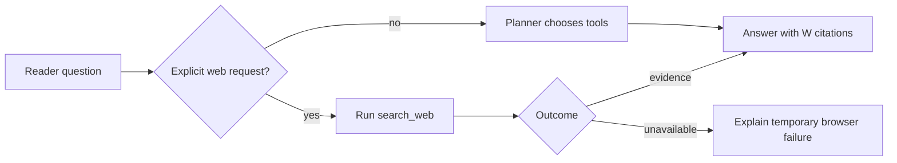

# RFC 0101: Honest Chat Web-Search Routing

- Status: Implemented (automated verification passes; live model verification pending)
- Date: 2026-08-24
- Area: Chat / Research tools
- Builds on: RFC 0097, RFC 0098
- Depends on: RFC 0100 for browser readiness

## Summary

When the reader explicitly asks chat to search the web, i0i must invoke its
bounded web-search tool. If that lookup is temporarily unavailable, the final
answer must report the real operational state instead of claiming that i0i has
no internet capability or asking the reader to retrieve sources manually.



## Diagnosis

Chat uses two phases:

1. A routing model receives typed function schemas and may call tools.
2. A final model streams an answer after retrieval has finished.

The routing request already exposes `search_web`, `search_library`,
`search_paper`, and `start_deep_research` through the LLM API and names them in
its system prompt. Merely listing the functions again does not close the bug.

The observed answer instead follows from three gaps:

### 1. Explicit web requests still use optional tool choice

The router receives `tool_choice: None`. It may return no tool call even when
the reader explicitly says to search online. Existing tests verify that the
tool schema and evaluation examples exist; they do not execute the configured
planner model or guarantee its routing decision.

### 2. Tool failure disappears before final synthesis

`search_web()` returns a failure string to the routing model, but
`RetrievalOutcome` retains only successful external citations. The final
system prompt cannot distinguish:

```text
No web search was requested.
A web search was attempted but Obscura was unavailable.
A web search succeeded but found no usable evidence.
```

### 3. The final model invents a capability explanation

With local `[C1-C4]` evidence and no typed web outcome, the final model may say
that it cannot access the internet. That is false: i0i owns the capability even
when its browser is currently starting or failed.

## Decision

### 1. Route explicit web requests deterministically

Before asking the planner model, recognize a small, conservative set of direct
user commands, including:

```text
search the web
search online
look this up online
find current sources
check the internet
```

An explicit request invokes one bounded `search_web` call directly. The
planner remains responsible for implicit needs such as current comparisons or
broader context.

This is command recognition, not general natural-language classification. Keep
the phrases small, tested, and easy to understand.

### 2. Carry a typed web lookup outcome

Extend the retrieval result with one state:

```text
not_requested
succeeded { source_count }
no_evidence
unavailable { user_message }
```

Technical process diagnostics stay in backend logs. The user-facing failure is
bounded and actionable, for example:

```text
Web search is temporarily unavailable because the browser could not start.
Retry after the browser is ready.
```

RFC 0100 should normally make chat await the shared startup attempt. This state
still matters for process crashes, timeouts, and later restarts.

### 3. Tell the final model what actually happened

The final system prompt receives the typed lookup outcome:

- On success, include the existing `[W…]` evidence contract.
- On no evidence, say that a lookup ran but found no usable source.
- On unavailable, say that i0i has web-search capability but it failed for this
  turn; require a concise temporary-limitation response.
- When not requested, add nothing.

The final model must never claim that i0i categorically lacks internet access,
ask the reader to copy web text manually, or imply that successful external
evidence exists when it does not.

Do not expose function schemas to the final answer phase: it cannot call them,
and pretending otherwise would invite invalid tool calls after streaming has
begun.

### 4. Keep implicit routing agentic

Questions such as “How does this compare with the current state of the art?”
remain planner decisions. Improve the routing prompt to make the capability
clear, but do not force every comparison onto the web.

Deep Research remains separate. An explicit broad literature request launches
the existing background run; a bounded current lookup uses `search_web`.

### 5. Make progress and persistence honest

The inspector shows `Searching web` while the tool runs. A failed lookup ends
with a visible temporary limitation, not a fake citation. Successful `[W…]`
sources remain clickable and persist exactly as RFC 0097 specifies.

Persist the lookup outcome only if needed to reproduce the completed answer's
audit state. Do not retain raw process errors in chat history.

## Scope

### In scope

- Deterministic handling of explicit web-search commands.
- Typed web lookup outcomes across routing and final synthesis.
- Honest unavailable/no-evidence prompts and UI responses.
- Focused routing, failure-propagation, and persistence tests.

### Out of scope

- Giving the final streaming phase callable tools.
- Running an unbounded browsing agent inside chat.
- Replacing the configured planner or answer model.
- Completing Deep Research inside the current answer.
- Solving Obscura process startup; RFC 0100 owns that lifecycle.

## Acceptance Criteria

- [x] “Search the web for X” invokes `search_web` even if the planner would
  otherwise decline tools.
- [x] Implicit questions still use the bounded planner decision.
- [x] Successful web lookup produces clickable `[W…]` citations.
- [x] Browser startup failure reaches the final prompt as `unavailable`.
- [x] A completed answer never claims that i0i lacks internet capability when
  lookup was requested.
- [x] A failed lookup creates no external citation.
- [x] A no-evidence result is distinguishable from a browser failure.
- [x] Existing paper-only questions make no external call.
- [x] Existing stored chat entries still deserialize and render.
- [x] Tests cover explicit routing, planner routing, success, no evidence,
  browser unavailable, and forbidden capability-denial wording.

## Verification Plan

1. Add a failing test where an explicit web request is paired with a planner
   response containing no tool calls.
2. Add a failing test proving a browser error currently disappears before final
   prompt assembly.
3. Implement deterministic explicit routing and typed lookup outcomes.
4. Run focused chat tests, the full Rust suite, and frontend checks.
5. In the app, test one successful lookup and one forced Obscura startup
   failure; inspect the saved answer and reference drawer after restart.

## Implementation Notes

Implemented on 2026-08-24. A conservative explicit-command recognizer now
routes direct web requests before the optional planner. Retrieval carries a
typed `not_requested`, `succeeded`, `no_evidence`, or `unavailable` outcome
into final synthesis and persisted context summaries. Final prompts describe
temporary browser failures honestly and never manufacture external citations.

Focused chat tests cover direct routing, success, empty results, browser
failure, prompt propagation, and backward-compatible deserialization. The full
Rust library suite, frontend type checks, and production build pass. A live
answer-model smoke test remains pending because the existing dev instance owns
port `1420` and a second instance could not be launched.
