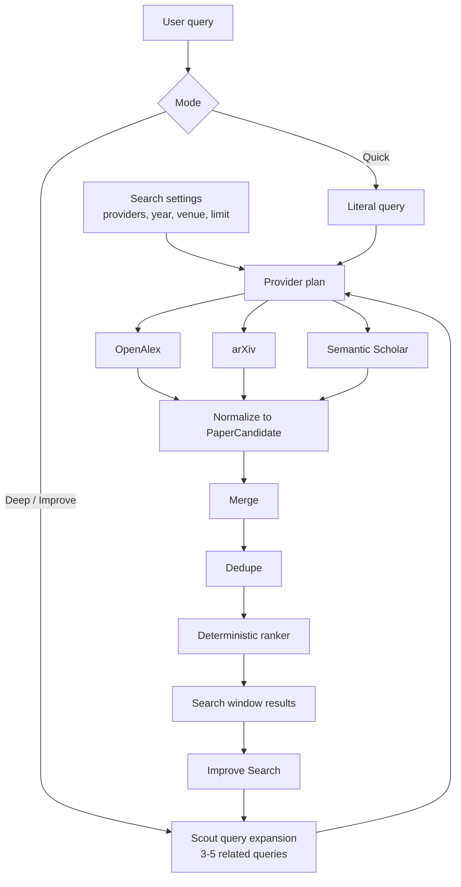

# RFC 0043: Multi-Provider Scout Search Quality

Status: Implemented
Date: 2026-07-08
Product: i0i
Target: Tauri v2 + Svelte, macOS first
Builds on: RFC 0030 (arXiv provider), RFC 0031 (Semantic Scholar provider), RFC 0037 (Deep-Research Agentic Search), RFC 0038 (Discover Search Windows), RFC 0039 (Discover Settings)

## Summary

Improve Discover search quality by making quick search and deep search share one
multi-provider orchestration pipeline.

The decision is:

- Quick search and deep search both use the same provider orchestration layer.
- The initial provider set is OpenAlex, arXiv, and Semantic Scholar.
- Results from all providers are normalized, merged, deduped, and ranked
  together.
- Search settings contain provider toggles plus year and venue filters.
- Deep search and Improve Search can expand one user query into 3-5 related
  provider queries.
- Improve Search appends new candidates to the existing search window, then
  dedupes and reranks the full result set.
- Ranking v1 is deterministic and transparent. No embeddings or LLM result
  reranking yet.

Plain English version: Scout should search more places, ask better follow-up
queries, merge duplicates, and put the best candidates near the top.

## Decisions

1. **Use multi-provider search for both Quick and Deep.** OpenAlex, arXiv, and
   Semantic Scholar should be available from the same Discover panel and should
   feed the same merge/dedupe/rank path.
2. **Keep Quick literal.** Quick search runs the user's exact query across the
   selected providers. It does not expand the query.
3. **Let Deep expand.** Deep search may generate 3-5 related provider queries,
   run them across the selected providers, then merge and rank the combined
   results.
4. **Improve appends.** Improve Search is not a new tab/window. It uses the
   current search as context, finds more candidates, appends them, dedupes, and
   reranks the full list.
5. **Ranking v1 is deterministic.** Use transparent signals first. Embeddings
   and LLM reranking are future work, not the first implementation.
6. **Filters stay tucked away.** Provider toggles, year, venue, limit, and open
   access preference live in settings, not in the main command row.
7. **Partial provider failure is acceptable.** One blocked/down/rate-limited
   provider should not kill the search if another provider returns results.

## Problem

Single-provider search misses too much.

OpenAlex, arXiv, and Semantic Scholar have overlapping but different strengths:

- OpenAlex has broad metadata coverage, citation counts, concepts, venues, and
  open-access locations.
- arXiv is strong for fresh preprints and precise arXiv categories.
- Semantic Scholar can be useful for AI-heavy literature and citation signals.

Today, provider logic is split between shallow search and deep research. That
risks two separate quality systems:

```text
quick search quality
deep search quality
```

That is the wrong abstraction. The product wants one Scout search brain that can
run shallow or deep.

## Goals

- Improve recall by searching multiple providers.
- Improve result quality through merge, dedupe, and deterministic ranking.
- Make multi-provider search available to both quick and deep search.
- Keep the main Discover command surface lean.
- Put provider selection, year filters, and venue filters in settings.
- Add query expansion for deep and improve flows.
- Make Improve Search append to the existing search window and rerank all
  candidates.
- Preserve provider/query provenance for debugging and future ranking.

## Non-Goals

- No embedding reranker in this RFC.
- No LLM reranking of every result in this RFC.
- No result clustering yet.
- No fancy "why matched" result UI yet.
- No full citation-graph snowballing yet.
- No Google Scholar scraping.
- No source acquisition or PDF download behavior changes.

## Product Shape

The Discover header stays lean:

```text
Discover
> [ query input                              ] [ Deep ] [ Run ] [ settings ]
```

Settings contain:

```text
Providers: OpenAlex, arXiv, Semantic Scholar
Year from
Year to
Venue
Limit
Open access only
```

The user should not have to think about provider mechanics for normal searches.
The default should be:

```text
providers: all available
sort: relevance
limit: 25
year: any
venue: any
```

## Key Decision: One Orchestration Layer

Quick search and deep search must not call providers differently.

Use one shared backend layer:

```text
SearchOrchestrator
  -> ProviderPlan
  -> ProviderRunner
  -> merge
  -> dedupe
  -> rank
  -> persist / return
```

Quick search uses the layer once:

```text
user query
  -> selected providers
  -> merge/dedupe/rank
  -> search window results
```

Deep search uses the same layer repeatedly:

```text
goal
  -> query expansion
  -> selected providers
  -> merge/dedupe/rank
  -> assess gaps
  -> maybe expand/refine again
```

Improve Search uses the same layer on an existing search:

```text
existing search window
  -> inspect original query + current top results
  -> generate follow-up queries
  -> selected providers
  -> append candidates
  -> dedupe and rerank all candidates
```

## Flow



## Provider Set

Initial providers:

```text
OpenAlex
arXiv
Semantic Scholar
```

Defaults:

```text
OpenAlex: enabled
arXiv: enabled
Semantic Scholar: enabled when available
```

Provider credentials:

| Provider | API key required? | Notes |
|---|---:|---|
| OpenAlex | no, but configured key/email is useful | Broad metadata and OA locations. |
| arXiv | no | Best for preprints; all results are effectively open access. |
| Semantic Scholar | no, optional key | Anonymous mode works but has tighter rate limits. |

If a provider has aggressive rate limits, is not configured, or returns an
error, it should degrade cleanly:

```text
provider skipped with reason
results from other providers still appear
```

Provider errors should not fail the whole search unless every selected provider
fails.

## Query Expansion

Query expansion is used by:

```text
Deep search
Improve Search
```

Quick search should start with the literal query only. This keeps quick search
fast and predictable.

Expansion input:

```text
original query or goal
year/venue filters
current top results for Improve Search
saved/selected candidates later
```

Expansion output:

```text
3-5 provider query strings
```

Example:

```text
Original query:
diffusion models for protein design

Expanded queries:
- protein design diffusion model
- generative models protein structure diffusion
- RFdiffusion protein binder design
- score based generative models proteins
- de novo protein design diffusion
```

Important rule:

```text
The LLM may generate search queries, but it may not invent papers.
```

Candidates only come from providers.

The expanded queries should be visible in backend logs and persisted run
metadata. This matters because Scout search quality needs to be debuggable:

```text
user asked "diffusion models for protein design"
Scout searched:
  - diffusion models protein design
  - RFdiffusion binder design
  - score based generative models proteins
```

## Filters

Filters live in settings, not the main command row.

Initial filters:

```text
providers
year_from
year_to
venue
open_access preference
limit
```

Provider support differs:

| Filter | OpenAlex | arXiv | Semantic Scholar | Fallback |
|---|---|---|---|---|
| year | yes | yes | yes | post-filter if needed |
| venue | yes | no/weak | yes/weak | post-filter |
| open access | yes | implicit yes | weak | post-filter |
| limit | yes | yes | yes | truncate |
| provider | n/a | n/a | n/a | runner selection |

Rule:

```text
Apply filters at provider-query time when supported.
Apply post-fetch filters when not supported.
Record unsupported/provider-filter behavior in provenance.
```

Venue filtering should be tucked away and not over-promised. If a provider
cannot honor venue precisely, the UI should not pretend it can.

The request shape should stay close to the current `DiscoverySearchRequest`:

```rust
pub struct DiscoverySearchRequest {
    pub query: String,
    pub providers: Vec<DiscoveryProviderChoice>,
    pub year_from: Option<i32>,
    pub year_to: Option<i32>,
    pub venues: Vec<String>,
    pub result_limit: i32,
    pub sort_by: DiscoverySort,
    pub open_access: bool,
}
```

Keep the existing single `provider` field temporarily if it helps compatibility,
but the orchestration layer should treat `providers` as the real v1 input.

## Merge And Dedupe

All provider results normalize to the existing `PaperCandidate` shape.

Dedupe keys, in order:

```text
DOI
arXiv id
OpenAlex id
Semantic Scholar id
normalized title fallback
```

When duplicates merge:

- keep the richest metadata,
- combine provider provenance,
- keep all source ids,
- prefer a usable PDF URL when available,
- preserve citation and year data when one provider has it and another does not.

Suggested provenance shape:

```rust
pub struct CandidateProviderHit {
    pub provider: String,
    pub provider_query: String,
    pub provider_candidate_id: Option<String>,
    pub provider_score: Option<f64>,
    pub iteration: i32,
}
```

This can be stored as JSON first if that is simpler.

The merge result should prefer richer data without hiding provenance. Example:

```text
OpenAlex result has citations and OA URL.
arXiv result has better PDF URL and abstract.
Merged candidate keeps both provider hits and the best display metadata.
```

## Deterministic Ranking V1

Do not use an LLM as the primary ranker in this RFC.

Use deterministic ranking first because it is:

- cheaper,
- faster,
- reproducible,
- easier to debug,
- easier to test.

Suggested signals:

```text
provider relevance score
keyword/title/abstract match
citation count
recency
open access / PDF URL available
found by multiple providers
deep-search agent score if already present
```

Sketch:

```text
rank_score =
  provider_relevance
  + keyword_match
  + citation_boost
  + recency_boost
  + availability_boost
  + multi_provider_boost
```

Keep the weights simple and configurable in Rust constants at first.

Example weights:

```text
provider relevance: 0.35
keyword/title/abstract match: 0.25
citations: 0.15
recency: 0.10
PDF/open access: 0.10
multi-provider: 0.05
```

The exact values should be treated as defaults, not truth. The point of v1 is to
create one transparent ranker that can be improved later.

Why not LLM or embeddings yet?

```text
LLM reranking: useful later for top-N judgment, but expensive and less stable.
Embedding reranking: attractive later, but needs a model/runtime/index decision.
Deterministic ranking: enough to unify providers and make behavior testable now.
```

This does not close the door on smarter ranking. It creates the baseline that a
smarter ranker must beat.

## Improve Search

Improve Search is a user-triggered action on an existing search window.

Behavior:

```text
1. User clicks Improve.
2. Scout inspects:
   - original query,
   - filters/settings,
   - current top candidates,
   - saved/opened candidates later.
3. Scout generates 3-5 follow-up queries.
4. Selected providers run those queries.
5. New candidates append to the existing search window.
6. Existing + new candidates dedupe together.
7. The full candidate list is reranked.
```

This changes RFC 0038's earlier default of "new run creates a new window" for
this explicit action only:

```text
Run new query: new search window.
Improve current search: append to current search window.
```

That distinction should stay visible in the UI.

Improve Search should use a compact context:

```text
original query
current filters
top N current candidates: title, year, abstract snippet, providers
```

Do not send the full result list to the LLM. The goal is to generate better
follow-up searches, not to summarize the whole window.

## Persistence

Searches should store enough to debug result quality.

Minimum additions or equivalent JSON fields:

```text
search_runs
  mode: quick | deep | improve
  provider_set
  query_expansions

search_candidates
  rank_score
  rank_signals_json
  provider_hits_json
  first_seen_run_id
```

If schema churn feels too large, start with JSON columns:

```text
rank_signals_json
provider_hits_json
```

The important part is not the exact table shape. The important part is that a
future debugger can answer:

```text
Why did this paper appear?
Which provider found it?
Which query found it?
Why is it ranked above another paper?
```

For quick search, transient UI results may return directly without creating a
durable Search. For Deep and Improve, run metadata should be durable because the
agent's choices are otherwise impossible to inspect later.

## UI Changes

Keep the main header lean.

Settings panel:

```text
Providers
Year from
Year to
Venue
Limit
Open access preference
```

Search result list:

- No elaborate "why matched" UI in this RFC.
- Existing cards/list rows stay mostly unchanged.
- At most, show compact provider/source chips if already available.

Search actions:

```text
Run
Improve
```

`Improve` should appear only when a search window already has results or a
completed run. It is not a second primary action on an empty query row.

Deep is a mode toggle, not a separate panel. Turning Deep off means:

```text
literal query -> selected providers -> merged/ranked results
```

Turning Deep on means:

```text
goal/query -> query expansion -> selected providers -> merged/ranked results
```

The user should feel that these are two depths of the same search tool, not two
different products.

## Validation

Backend tests:

```text
multi-provider quick search calls all selected providers
provider failure does not fail whole search when another provider succeeds
merge combines duplicate DOI results
dedupe falls back to normalized title
year filter is passed to supporting providers
venue filter is passed or post-filtered according to provider support
ranker prefers stronger title/abstract match
ranker boosts PDF/open-access availability
Improve Search appends new candidates and reranks full list
```

Deep search tests:

```text
deep search uses the same provider orchestration layer
query expansion produces multiple provider queries
budget limits cap provider calls across all providers and expansions
```

Manual validation:

```text
1. Run a quick search with all providers enabled.
2. Confirm results include OpenAlex, arXiv, and Semantic Scholar provenance.
3. Confirm duplicates collapse.
4. Toggle providers off and confirm only selected providers run.
5. Run deep search and confirm it uses the same provider set.
6. Click Improve and confirm results append to the same search window.
7. Confirm the full list is reranked after Improve.
```

Commands:

```bash
cargo test discovery
cargo test research
cargo test
pnpm check
```

## Implementation Order

1. Add the multi-provider request fields and provider toggles in settings.
2. Define the shared provider orchestration layer.
3. Route quick search through the orchestrator.
4. Merge and dedupe across provider results.
5. Add deterministic rank signals and reranking.
6. Persist provider hits and rank signals for durable searches.
7. Route deep search through the same orchestrator.
8. Ensure deep query expansion uses the selected provider set.
9. Add Improve Search: append, dedupe, rerank current window.
10. Add validation tests and manual smoke checks.

## Future Work

- Embedding rerank over title + abstract.
- LLM top-N rerank and explanation.
- Result clustering into themes.
- Citation graph expansion and snowballing.
- Seed-paper similarity.
- Profile-relative ranking based on the user's learning/research profile.
- Better UI for provenance and rank explanations.

## Implementation Notes

Implemented in the RFC 0043 pass:

- quick search routes through the multi-provider discovery orchestrator,
- deep search uses the same orchestrator through the research candidate source,
- Discover settings expose provider toggles, year, venue, limit/target, and
  open-access preference,
- deterministic ranking is shared by quick and deep search,
- Improve Search appends preview/final candidates into the current search
  window, then dedupes and reranks,
- durable deep/improve runs store mode, provider set, query expansions,
  provider hits, and rank signals.

Validation passed:

```bash
cargo fmt --check
cargo test discovery
cargo test research
cargo test
cargo check
pnpm check
git diff --check
```
