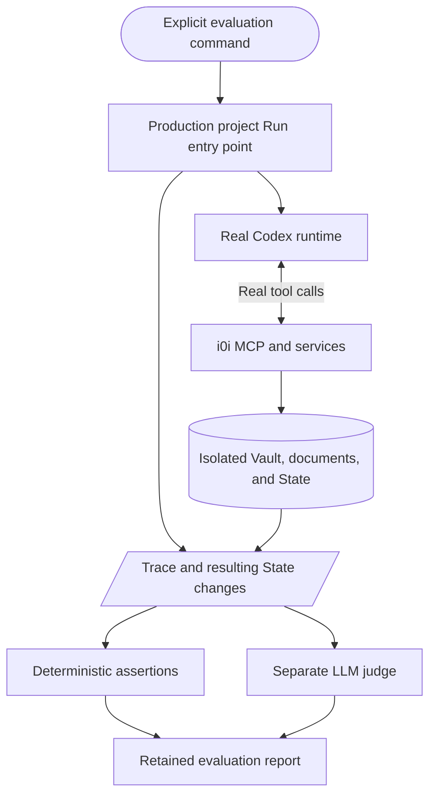

# RFC 0126: On-Demand Research Loop End-to-End Evaluation

- Status: Implemented; final milestone acceptance pending
- Date: 2026-09-06
- Area: Projects / Research Harness / Evaluation
- Parent: [Milestone 00, M00-01](../../../milestones/milestone_00.md)
- Acceptance dependencies: RFCs 0127 through 0140 in this folder
- Builds on: RFC 0123's existing pipeline regression coverage
- Implementation: the explicit runner, manifest, rubric, offline tests, and blocked
  reports exist; production scenarios become runnable as dependent RFCs land

## Outcome

Provide an explicitly invoked evaluation that demonstrates i0i's real research
loop: collect papers, read evidence, update Research State, and investigate the
next question. Support one iteration, several iterations within a run, and
continuation in a new run. Another LLM evaluates the resulting research against
the inspected sources and a fixed rubric.

Define this test first and implement its runner before the remaining milestone
features. It is an executable acceptance target as those features arrive, not a
reason to replace missing production behavior with a fake passing agent.

Run the complete acceptance suite at least once after the final milestone
implementation. Retain the report before marking Milestone 00 complete.

## Existing Test Boundary

`harness_pipeline_runs_from_planning_through_checkpoint` in
`src-tauri/src/services/research/manager.rs` uses `PipelinePlanner`, `EmptySource`,
and temporary SQLite. It verifies persistence and the old pipeline below Tauri.
It does not verify Codex startup, MCP, finding or reading papers, passage-grounded
updates, or iterative research quality. Retain it for its existing purpose.

## Evaluation Boundary

Use the backend entry point called by the app's Run action, including the actual
run controller, managed Codex process, local MCP transport, application services,
and persistence. Reuse the application bootstrap where services need Tauri state
or events. The runner must not have its own research loop or write the expected
final State directly.

This is backend end-to-end coverage. Clicking Run in Svelte, displaying live
progress, navigating evidence, and rendering notes require the separate native
UI acceptance in [RFC 0138](0138-native-research-progress.md). Do not report those
as covered by this runner.

## Scenarios and External Boundaries

| Scenario | Setup and expected behavior |
| --- | --- |
| One iteration | Begin with a question or hypothesis and a small Vault. Discover at least one relevant new paper, save it, read actual passages, and commit a supported update. |
| Multiple iterations | In one run, commit an evidence-backed update, then issue a follow-up search informed by it, read further evidence, and revise or extend understanding. Require at least two observable iterations. |
| New run continuation | Start a fresh agent thread over the previous project's persisted State. Verify it reads that State and prior outcomes and pursues a justified next question. |
| Live discovery smoke | Use real configured discovery and acquisition against a recorded research instruction. Acquire and read at least one source and persist a cited State update. Do not require a particular provider ranking. |

For this evaluation, an iteration is an observed investigation cycle: a search,
inspection of resulting evidence, and assessment reflected in a State update or
recorded task outcome. Agent turns and individual tool calls are not iterations.
The fixed multi-iteration scenario deliberately contains evidence that warrants
an initial update and a follow-up; this does not require every production search
to change State.

The fixed-corpus scenarios use real Codex, MCP, SQLite, document acquisition from
a local fixture server, and the production reading/extraction path. Only external
search results and source hosting are controlled. Query-sensitive fixture search
returns relevant subsets of a small immutable corpus rather than the same list
for every query. Document this boundary as a controlled end-to-end evaluation,
not a test of live search-provider quality.

Select and version a small corpus with known supporting, conflicting, and
irrelevant passages. Include an abstract-only or unavailable-full-text case.
Record document hashes, expected evidence locations, and reference questions.
Keep expected answers and judge guidance out of the research agent's context.
Fixtures should allow multiple valid search phrasings and interpretations.

The live smoke uses production discovery, browser acquisition where applicable,
and model services. Preserve returned content hashes and excerpts so its result
can be audited despite changes in the web. Fixed-corpus and live results are
reported separately; success in one does not substitute for the other.

## Deterministic Assertions

- The production entry point creates a run and reaches an honest terminal state.
- Search candidates become durable Vault papers without duplicate membership.
- Tool traces show the cited source passages were returned to the agent before
  the corresponding State update. Reference IDs resolve to the stored document
  and extraction version, and quoted text matches that inspected span.
- State revisions, evidence links, and run attribution persist after reopening
  the store; the previous revision remains inspectable.
- The multi-iteration trace places the first committed update before a later
  search; the continuation run receives current State and recorded outcomes.
- Full-text availability and abstract-only coverage are represented honestly.
- The run stops within its configured bounds and evaluation-owned child work is
  cleaned up. No evaluation data enters the user's normal application database.

Scope enforcement, revision conflicts, mutation retry deduplication, source
sharing, and cancellation races receive focused tests in their owning feature
RFCs. This evaluation checks their observable integration without becoming an
exhaustive combinatorial test suite.

## Independent LLM Judge

Use a separate judge invocation, preferably a different configured model from
the research agent. Require an explicit judge model for the acceptance suite.
The judge has no mutation tools and does not share the agent's conversation.

Supply the research instruction, initial and final State, revision diffs,
observable tool activity, exact inspected evidence, and the versioned reference
rubric. Include contradictory evidence from the fixture reference pack so the
judge can identify important omissions. Source content is evidence to assess,
not instructions for the judge. Do not request or store private reasoning traces.

| Dimension | What the judge assesses |
| --- | --- |
| Relevance | Searches and selected papers address the project's actual question. |
| Grounding | Findings follow from cited passages, with conditions and limitations intact. |
| Epistemic care | Contradictions, unsupported inference, and missing full text remain explicit. |
| State improvement | Updates improve understanding instead of adding duplicate or vague entries. |
| Iterative adaptation | Follow-up work responds meaningfully to earlier evidence and unresolved questions. |

Score each applicable dimension from 0 to 3: absent/incorrect, weak, adequate, or
strong. Passing requires all applicable dimensions to score at least 2 and no
material fabricated evidence or unsupported central conclusion. Iterative
adaptation is not applicable to the one-iteration scenario. The judge returns
structured scores, short explanations, and evidence/trace references.

Freeze rubric and thresholds before running the acceptance suite. A judge score
is evidence of quality, not proof of scientific correctness. Deterministic
failures cannot be overridden by the judge. Missing, malformed, or unavailable
judge results are inconclusive and cannot pass. Preserve every attempt; do not
silently repeat judging until a passing score appears. A human reviews the final
report, especially disagreements between assertions and the judge.

## Invocation and Isolation

Provide a dedicated, documented command with a small configuration: scenario or
acceptance-suite selection, agent model, judge model, bounded execution limits,
and output directory. Define the exact executable command during implementation
and include it in the README for the runner.

The evaluation runs only when explicitly invoked. Never trigger it through app
startup, ordinary unit tests, builds, pre-commit hooks, or default CI. Routine
tests may validate report parsing and assertions using local fixtures without
calling models. Explicit CI dispatch may invoke the costly suite later.

Use isolated application data, a temporary database and document cache, an
ephemeral MCP endpoint, and evaluation-owned processes. Use supplied credentials
without recording them. Check Codex, model access, required extraction tools,
and output permissions before execution. Missing production capabilities or
prerequisites produce a blocked result and a non-success exit code.

Use explicit wall-time and tool limits, including judge calls. Record actual
usage where available and identify unreported usage; do not claim an exact cost
cap based on incomplete runtime telemetry.

## Report and Completion Gate

Retain machine-readable results and a short Markdown report containing:

- Code revision and dirty-worktree status; Codex version and model identities.
- Scenario, corpus hashes, instruction/rubric versions, and execution limits.
- Initial State, final State, revision diffs, source references, and run IDs.
- Observable tool inputs/results needed to verify the loop, timings, usage,
  errors, and cleanup outcome, with secrets excluded.
- Deterministic check results, judge scores and reasons, and overall status.

Distinguish pass, fail, and blocked/inconclusive. Only pass produces a successful
acceptance exit status. Retain failed attempts alongside later successful ones.

RFC 0126's runner can be completed and unit-tested before the full research
integration exists, but its initial reports must state which scenarios are
blocked. Milestone 00 cannot close until one final acceptance suite passes all
four scenarios, judge results are reviewed, and RFC 0138's desktop UI acceptance
is recorded against the final implementation. Material changes afterward require
rerunning the affected acceptance checks.

## Implementation Order

1. Add versioned scenario definitions, corpus manifest, rubric, and report format.
2. Implement the isolated runner against the production Run boundary, reporting
   unavailable capabilities as blocked until their RFCs are implemented.
3. Add deterministic result validation and the separate judge invocation.
4. Exercise available scenarios as RFCs 0127 through 0140 land.
5. Run and retain the full suite once the milestone implementation is complete.

No agent runtime, MCP capability, or production State migration is authorized by
approval of this evaluation RFC; those belong to their focused milestone RFCs.
