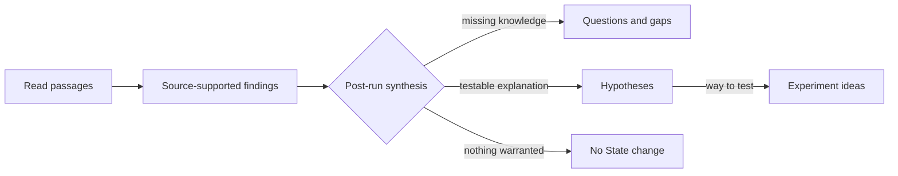

# RFC 0143: Post-Run Research State Synthesis

- Status: Implemented; model-backed acceptance pending
- Date: 2026-09-08
- Depends on: RFCs 0112, 0124, 0141, and 0142

## Problem

The managed Research Run can currently call `state_update` while it is still
searching and reading. This makes State growth opportunistic: the agent may save
several evidence-backed Findings but never perform the final comparison needed
to identify Questions, Gaps, Hypotheses, or Experiment Ideas.

The latest observed Run illustrates the mismatch. Its outcome described four
claims as research gaps, while its committed Research State contained only
Findings. Starting another Run does not reliably promote or reinterpret those
entries because no required synthesis phase exists.

## Decision

Every Run that finishes its evidence-gathering work enters an explicit
**Research State synthesis** phase before it can become `ready`.

Synthesis always executes, but it may produce no State mutation. It must not
populate categories merely to make the State look complete. Failed and
cancelled Runs do not synthesize or advance Research State.

Findings are not promoted into other kinds. A source-supported Finding remains
the durable statement of what a source says. Higher-level entries are derived
from one or more existing or newly created entries:



This preserves provenance. A Gap does not pretend to be directly quoted from a
paper; it links back to the Findings from which the bounded-search inference was
derived.

## Run Lifecycle

The successful path becomes:

1. **Orient:** load instructions, starting State, recent outcomes, and Vault.
2. **Investigate:** search, acquire, and read papers.
3. **Assess:** decide which papers and passages are relevant.
4. **Synthesize:** compare new evidence with active State and prepare one typed
   synthesis result.
5. **Commit:** validate and atomically publish at most one State revision.
6. **Report:** persist the Run outcome and mark the Run `ready`.

The Run UI and Activity stream expose `synthesizing` as a real phase so a user
can distinguish it from a stalled search.

The State commit and ready Run finalization remain one safe boundary: either the
validated synthesis is published with the completed Run, or neither is. A
synthesis that finds no warranted change records its reason and completes the
Run without incrementing the State revision.

## Synthesis Input

The synthesis step receives a bounded, persisted snapshot rather than the full
free-form agent transcript:

- the Run instructions;
- the starting Research State and active entry ids;
- passages read during this Run, with canonical evidence locators;
- dispositions for papers investigated during this Run;
- the Run's search coverage and failures;
- recent Run outcomes and prior next direction; and
- the applicable limits.

Only passages actually read by the Run may support new source-supported
Findings. Search snippets, titles, model memory, and unread abstracts are not
evidence.

## Synthesis Result

The synthesizer returns one validated `ResearchStateSynthesis` containing:

- proposed new or revised typed entries;
- relations to existing entries or other entries proposed in the same result;
- exact evidence references for source-supported Findings;
- entries to contest or supersede when new evidence warrants it;
- unresolved entry ids;
- an optional next research direction tied to those unresolved entries; and
- a concise no-change reason when no mutation is proposed.

Proposed entries use local handles inside the synthesis result so several new
entries can refer to one another before durable ids are assigned. The backend
resolves those handles and validates the complete graph in one transaction.

The result is bounded by entry count and text length. It is structured data, not
Markdown parsed back into domain objects.

## Category Rules

The existing RFC 0112 epistemic invariants remain authoritative. Synthesis adds
the following semantic guidance:

- **Finding:** a concise factual claim supported by one or more exact passages.
- **Question:** a consequential uncertainty exposed by the evidence or needed
  to pursue the Run instructions.
- **Gap:** knowledge absent from the bounded corpus or a concrete mismatch
  between existing Findings; its text must state that bounded qualification.
- **Hypothesis:** a testable speculative explanation derived from Findings,
  Questions, or Gaps.
- **Experiment Idea:** a concrete way to test a named Hypothesis or answer a
  named Question.

Questions, Gaps, Hypotheses, and Experiment Ideas carry relations to their
premises. Their source provenance is reached through those relations rather
than copied into invalid direct evidence links.

Synthesis should revise or relate to an existing active entry when it expresses
the same idea. It must not create duplicates simply because a later Run found
another supporting paper.

## Guidance For The Next Run

The user does not need to rewrite Research Instructions after each iteration.
The next Run receives:

- the newly synthesized State;
- unresolved Questions and Gaps;
- active Hypotheses lacking tests or evidence;
- the prior Run's source and coverage failures; and
- the optional next direction.

`nextDirection` is therefore a short operational recommendation, not a second
research goal. When present, it references the State entry ids that motivate
it. Current user instructions always outrank this recommendation.

## Interaction

The latest Run report described by RFC 0141 adds a compact synthesis section:

```text
STATE SYNTHESIS · REVISION 2
+ 3 findings   + 1 gap   + 1 hypothesis

Still open
- Does the reported effect persist outside the two evaluated benchmarks?

Next
- Search for cross-benchmark intervention studies.          GAP-07
```

For a no-op synthesis, show `State unchanged` and its concise reason. Do not
show empty category headings.

## Implementation Boundary

Run-originated State changes occur only through final synthesis. Manual State
editing remains unchanged. The managed agent may collect candidate entry drafts
during investigation, but it cannot commit them directly with `state_update`.

Reuse the existing Research State validation and atomic revision machinery.
Do not introduce a graph database, vector database, background promotion job,
or a second Research State representation.

## Failure And Recovery

- A cancelled Run stops before synthesis commit and leaves State unchanged.
- An invalid synthesis may be corrected through the existing bounded retry
  policy; exhausted retries fail the Run with a readable validation reason.
- A process interruption before commit resumes or restarts synthesis from the
  persisted input snapshot.
- A process interruption after the atomic commit observes the existing receipt
  and does not create another revision.
- Provider failure does not automatically prevent synthesis when the Run still
  has enough newly read or existing evidence to produce an honest result.

## Non-Goals

- Guaranteeing at least one entry of every kind per Run.
- Automatically proving that a research gap is globally absent from literature.
- Running experiments or validating Hypotheses.
- Replacing the user's Research Instructions with model-generated goals.
- Periodically promoting entries outside an explicit Research Run.

## Acceptance

- Every Run that becomes `ready` records a completed synthesis result.
- Failed and cancelled Runs never publish a synthesis revision.
- A valid no-change synthesis completes without incrementing State revision.
- Source-supported Findings cite only passages read during the Run.
- A derived Gap, Question, Hypothesis, or Experiment Idea retains traversable
  relations to its premises and obeys RFC 0112's epistemic invariants.
- One synthesis can atomically create related entries using local handles.
- Repeated Runs update or extend related ideas without duplicating equivalent
  active entries.
- `nextDirection`, when present, names its motivating State entry ids and is
  included in the next Run context.
- Activity and the inspector expose the `synthesizing` phase, committed changes,
  and an honest no-change result.
- Focused tests cover mutation, no-op, invalid evidence, duplicate prevention,
  cancellation, retry, interruption, and idempotent commit.
- The on-demand research-loop evaluation runs at least two iterations and
  verifies that the second Run derives a higher-level entry from persisted
  Findings without deleting or relabeling those Findings.

## Implementation Notes

- Managed Research Runs no longer receive the `state_update` MCP tool. Their
  final structured outcome must include exactly one `stateSynthesis` proposal.
- Rust verifies entry ids, same-result local handles, statement bounds,
  category invariants, duplicate active statements, and evidence passage
  delivery before applying a mutation.
- A non-empty synthesis is committed as one Research State revision. An empty
  synthesis records `agent_state_unchanged` and leaves the revision unchanged.
- The inspector shows the resulting revision and compact per-kind change counts,
  or the explicit reason State remained unchanged.
- The explicit `multiple_iterations` evaluation now launches two separate Runs.
  Its deterministic checks require Run 2 to start from Run 1's committed State
  and derive a higher-level entry related to a preserved Finding.

## Verification

- Rust library suite: 615 passed, 11 ignored. The two process-sensitive Obscura
  tests were run separately and passed.
- Svelte validation: `pnpm check` completed with no errors or warnings.
- Rust compile validation: `cargo check --no-default-features` passed.
- Research evaluator unit tests: 8 passed.
- The on-demand `multiple_iterations` model scenario was attempted, but the
  nested Codex process was denied by the current execution sandbox with
  `Operation not permitted`. RFC completion and the repository Changelog remain
  pending until that scenario is run successfully outside this sandbox.
