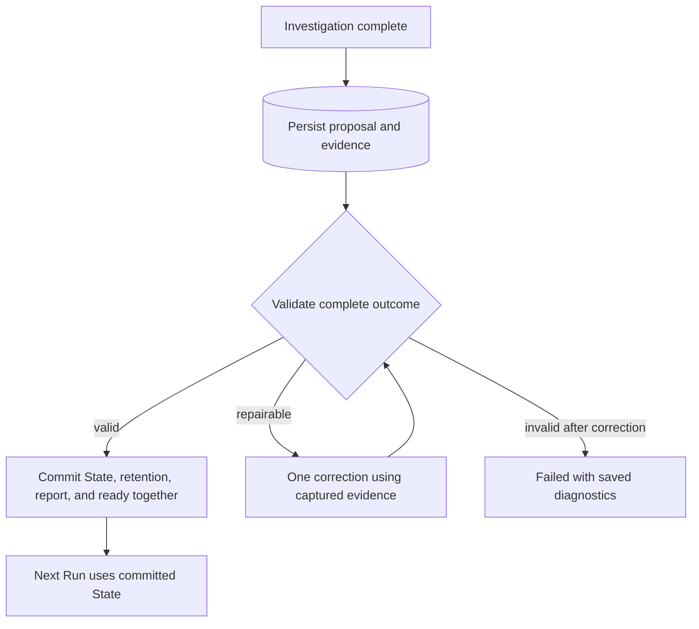

# RFC 0147: Reliable Research Synthesis and Finalization

- Status: Implemented; live acceptance not passed, further paid evaluation deferred
- Date: 2026-09-09
- Depends on: RFCs 0129, 0141, 0142, 0143, and 0146
- Supersedes: incomplete finalization and recovery behavior from RFC 0143
- Scope: the production boundary from completed investigation to persisted outcome

## Problem

Recent fixes addressed individual errors without establishing that the complete
agent-output contract agrees with Reader, Research State, and storage. Passing
unit tests were presented with more confidence than their coverage justified.

This RFC closes that boundary as one feature. It does not promise that model,
network, or process failures disappear. It requires predictable validation,
bounded correction, durable diagnostics, and no partial finalization.

## Audit Evidence

Read-only inspection of the application database confirmed:

| Run started, database time | Observed failure | Confirmed implication |
| --- | --- | --- |
| 2026-09-09 08:15:01 | Duplicate harness event sequence | Concurrent event writers collided; addressed by RFC 0145. |
| 2026-09-09 08:28:50 and 08:43:14 | Next direction requires a motivating entry | Output and continuation contracts disagreed; addressed narrowly by RFC 0146. |
| 2026-09-09 08:56:10 | Direct source evidence belongs only to source-supported Findings | A proposed create or revision had evidence with a non-source-supported status. Ten papers were inspected before failure. |
| 2026-09-09 09:00:12 | State synthesis passage is not citable | A delivered passage could not be converted to chunk-backed State evidence. |

The last failure names `passage_68e9d4d4d4a64e2094a01ba372f2ad12`, which the
delivery ledger associates with `web:271834f8cfe9`. The HTML Reader path creates
anchors with `chunk_id: None`; synthesis explicitly rejects such anchors.

The rejected final JSON is not persisted by i0i. Codex threads are ephemeral.
Consequently the exact offending entry kind and complete proposal from the
08:56 Run cannot be recovered from the inspected records. The error proves the
invalid status/evidence combination; it does not prove that the entry was a Gap.
No real failed payload was replayed during this audit.

### Implementation Findings

| Priority | Finding | Code evidence |
| --- | --- | --- |
| High | The output schema permits invalid kind/status/evidence combinations. | `controller.rs::research_outcome_schema` uses independent enums and the same evidence array for all creates/revisions; `library_store.rs::validate_research_entry_draft_with_pending` enforces conditional rules. |
| High | HTML is readable but cannot support final State evidence through this path. | `mcp.rs::passages_from_flow_text` omits chunk ids; `controller.rs::prepare_synthesis_evidence` requires them. |
| High | There is no semantic correction turn. | `execute_inner` propagates the first finalization error with `?`; the retry promise in RFC 0143 is unimplemented. |
| High | Finalization spans independent commits. | `execute_inner` applies retention, State updates, reflection persistence, then terminal status separately. |
| High | Full outcome validation happens after State mutation. | `persist_agent_run_outcome` checks lengths, references, and the 12,000-character envelope after `apply_state_synthesis`. |
| Medium | Limits disagree across representations. | Schema permits twenty 4,000-character entries plus evidence; storage caps the entire serialized outcome, including backend-added facts, at 12,000 characters. Several string bounds exist only in storage. |
| Medium | Graph validation is incomplete. | Pending relation targets are checked for existence, but derivation cycles/self-links and multiple operations on the same existing entry are not rejected before insertion. Duplicate statements are checked on creates, not revisions. |
| Medium | Local handles are resolved inconsistently. | Synthesis relation/direction lists are resolved, but `taskOutcomes.motivatingEntryIds` is not; storage expects durable ids there. |
| Medium | Run evidence cannot survive process restart. | `agent_reader_passages` stores ids and paper membership; canonical anchors and delivered text live in the MCP server's memory. |
| Medium | Restart recovery does not resume synthesis. | `recover_interrupted_harness_runs` fails managed reconciling Runs; RFC 0143 promises persisted synthesis recovery. |
| Medium | Terminal event loss is silent. | `wait_for_turn` ignores broadcast lag; losing a final message can turn completed model work into a timeout or missing-outcome error. |

These are boundary findings, not a claim that every listed path caused the
reported failure. In particular, partial commit and graph conflicts are
code-established risks, not observed corruption in the two inspected Runs.

### Assessment Of Recent RFCs

- RFC 0144 repaired schema syntax and preserved provider error messages. It did
  not validate semantic agreement between the schema and storage.
- RFC 0145 addressed a real concurrency bug with a concurrent-writer regression.
- RFC 0146 fixed tool configuration and one optional relationship, but its
  tests inspect configuration and shape validators. They do not prove a full
  research Run succeeds or that a live model sees the intended tool catalog.
- RFC 0143 is materially incomplete beyond its documented pending live check:
  correction, atomic finalization, and durable synthesis recovery are missing.
  The existing test `missing_synthesis_prevents_a_ready_run` even expects State
  writes to survive a later failure, contrary to RFC 0143's finalization promise.

The existing `cargo test --no-default-features synthesis --lib` selection passed
all eight selected tests during this audit. Its positive storage tests construct
valid internal drafts directly, bypassing the failing conversion boundary.
The latest local passing full evaluation report is dated September 7, revision
`d192b69211a6db6ec7c812c9106a090a9fa0e9a3`, before RFC 0143. It cannot validate the
current implementation. No new model-backed Run was launched for this audit.

## Decision

Use one finalization procedure with explicit preparation, validation, correction,
and atomic commit. Reuse the existing controller, SQLite store, and evaluation
runner. Keep implementation changes incremental and close to this procedure.

The correction edge is available once per Run, not repeatedly around the loop.

## Contract

### Valid State Entries

Keep the established domain distinctions. Direct evidence supports a Finding;
derived ideas refer to their premises. Do not delete citations or relabel a Gap
as a Finding merely to satisfy validation.

| Entry/status | Direct evidence | Required relation |
| --- | --- | --- |
| Finding / source_supported | At least one delivered, citable source passage | None |
| Finding, Question, or Gap / agent_synthesis | Empty | At least one `derived_from` premise |
| Finding, Question, or Gap / speculative | Empty | Optional under the existing domain rules |
| Hypothesis or Experiment Idea / speculative | Empty | Require a premise for managed synthesis, as specified in RFC 0143 |
| Finding or Question / researcher_context | Empty | Preserve existing manual records; managed synthesis must not invent researcher-authored context |

The agent-facing create schema uses closed variants for permitted combinations.
For revisions, the existing entry kind remains authoritative and cannot change.
Static constraints belong in the schema; constraints requiring project data
belong in shared semantic validation. Examples in the prompt cover a cited
Finding, a derived Gap, a speculative Hypothesis, and a no-change result.

Move duplicated synthesis policy into one concrete validation module shared by
preparation and commit. Keep database ownership and transaction checks in the
store. Avoid a general validation framework or separate copies of the rules.

Validate the complete proposed result before any finalization mutation:

- all required fields, enums, trimmed text bounds, and array limits;
- conditional evidence/status/kind rules and no-change reason;
- unique create handles, with no collisions with existing ids;
- one operation per existing entry per batch; no revision/lifecycle collision;
- project ownership, valid relation targets, and immutable revision kinds;
- no self-reference or cycles in `derived_from`/`motivated_by` dependencies;
  do not impose a DAG on unrelated relation types such as `contests`;
- equivalent active statements on both creates and revisions;
- every reference list, including task motivations and next directions;
- exhaustive dispositions for precisely the papers newly added by this Run;
- delivered evidence and consistency between citations and retained papers;
- expected State and Vault versions at commit.

Use the same local-handle resolution map in relations, unresolved ids, next
directions, and task motivations. Keep RFC 0146's optional direction linkage.
Reject a proposal that cites a paper it also removes, with an actionable issue.

### Bounds

Separate the full synthesis proposal from the brief continuation history.
Use a named 128 KiB UTF-8 proposal limit, with existing per-entry/item limits;
reject oversized data explicitly without silent truncation. This is an outer
storage/transport bound, not a target model output size.

Retain a 12,000-character budget for the compact continuation projection, not
the serialized graph and backend receipt. Backend-generated ids and commit
metadata must not invalidate an already accepted model proposal. Publish all
model-relevant field limits consistently in schema and instructions. Use a
bounded projection of recent reports so one large report does not hide history.

### Citable Reader Evidence

Make cached HTML text use the existing document extraction/chunk machinery, or
reuse matching stored chunks where already available. Preserve the exact
sanitized text and character offsets shown by Reader; do not invent PDF pages.
PDF and materialized abstract passages retain their actual coverage labels.
An abstract may support only a claim about what the abstract reports.

Reader, reader_ask, and vault_ask must expose consistent State-citation
eligibility per passage. The returned reference must resolve to the original
source passage, never to an LLM's paraphrased answer. Content without a durable
source anchor remains readable context and is explicitly ineligible for a
source-supported Finding.

Persist delivered passage anchors, exact excerpts, source/extraction versions,
and run ownership alongside the delivery ledger, bounded by the existing Run
read budget. Repeated references to the same chunk must not unexpectedly trip
the one-link-per-chunk rule: validate this as a proposal issue and ask for one
supporting link, rather than silently dropping a passage.

### Correction And Diagnostics

Persist the final structured proposal before parsing/semantic validation, with
schema version, attempt number, model/turn ids, and bounded validation issues.
Store only the final artifact and relevant delivered evidence, not hidden
reasoning, credentials, or the whole agent transcript.

Return issues with an operation handle or JSON path, stable code, and concrete
explanation. Collect independent validation issues in one bounded response so
the model can correct them together. Do not report a downstream issue when its
prerequisite failed and the diagnosis would be misleading.

Allow one correction attempt, using a synthesis-only context containing the
proposal, issues, allowed entries, additions, and captured evidence. It has no
mutating MCP grant and cannot restart search or paper acquisition. It may repair
the graph or return an honest no-change result; it must not manufacture evidence.

Both attempts share the Run deadline and budget. Record the correction call and
show `Correcting research summary` in existing Activity. Do not restart the
deadline, reuse `attach_codex_turn` to move a reconciling Run back to searching,
or retry schema rejection, database faults, cancellation, and missing runtime as
if they were model-content problems. Source/version conflicts are explicit
conflicts, not permission to silently rebase onto user edits.

For event-stream lag, recover the terminal result from the runtime where its
supported API permits; otherwise fail explicitly at the transport boundary.
Do not silently continue after losing required terminal events.

### Atomic Completion And Recovery

Within one SQLite transaction, recheck cancellation, child-search settlement,
source/project versions, and the prepared proposal, then write:

1. paper retention decisions and membership changes;
2. at most one State revision and resolved evidence/relations;
3. the complete outcome and compact continuation report;
4. commit receipt, terminal Activity, Run status, and harness bookkeeping.

Any failure rolls back all these finalization changes. Papers/downloads/notes
already produced during investigation remain available; they are not silently
deleted to simulate rollback of the entire investigation. Emit success events
only after commit. A ready Run must always have its persisted outcome.

Reuse store transaction bodies through connection-taking helpers where needed.
Do not emulate atomicity with compensating deletes or a sequence of public
methods that each commit independently.

Persist enough preparation to finish an interrupted, valid proposal without
rerunning searches. Recovery after commit observes the same receipt and performs
no additional mutation. Before commit, revalidate captured source versions and
project scope. If model correction is still needed after restart, retain the
artifact and mark the attempt interrupted with an explicit reason; do not make
an unrequested model call on startup. Old failures without saved proposals are
not reconstructable and require a new Run.

## Verification Plan

Use a deterministic fake runtime at the existing runtime boundary, real MCP
Reader responses, isolated SQLite, and the production finalization procedure.
Do not make the main regression test call only `apply_agent_state_update` with
hand-corrected internal drafts.

| Case | Required result |
| --- | --- |
| Empty State; valid cited Finding | One ready Run, one revision, resolvable evidence |
| Finding plus derived Gap/Hypothesis/Experiment Idea | Relations resolve, classifications remain honest |
| Non-source-supported entry with evidence | Schema/preflight rejection; one valid correction can complete |
| Missing evidence, missing premises, invalid kind/status | Path-specific issues before mutation |
| Invalid JSON, wrong enum, whitespace-only fields, over-limit data | Classified failure/correction within bounds |
| Valid HTML, PDF, and abstract Reader passages | Citable anchors persist with truthful coverage |
| Readable but ineligible passage; unread or invented reference | Explicit rejection; no fabricated citation |
| Multiple passages from one chunk | Clear duplicate-link issue, no late generic failure |
| Stale extraction, removed source, other-project evidence | Conflict or scope rejection, no partial commit |
| Local handles in relations, directions, and task motivations | Consistent durable-id resolution |
| Unknown handles, self-reference, dependency cycles | Reject before writing |
| Duplicate existing-entry operations; duplicate revised statement | Reject before a SQL constraint or duplicate knowledge |
| Missing/extra dispositions; unread addition; cited-and-removed paper | Complete preflight diagnoses the inconsistency |
| Text-only next direction; ids without text | Preserve RFC 0146 behavior |
| No-change outcome | Ready with report, no State increment |
| Large valid synthesis with compact report | Full artifact persists; continuation remains bounded |
| Failure injected at each transaction write | No partial State, retention, or ready status |
| Cancellation during correction or before commit | No new finalization writes or unbounded retry |
| Crash before commit, after commit, or during correction | Defined recovery and exactly one committed receipt |
| Repeated finalization of the same proposal | Idempotent result; no repeated removals/revisions |
| Lost terminal event or runtime exit | Recovered result or explicit transport failure |
| Two sequential research iterations | Second uses first's persisted State and report |

The current error can be reproduced with a clearly labeled synthetic invalid
proposal. Future real failed proposals must be exportable as redacted replay
fixtures. Validate schema acceptance/rejection with a JSON Schema validator, not
only assertions that keys exist. Exercise all static kind/status variants.

After deterministic checks, run the on-demand fixed-corpus evaluation on the
final implementation revision, including an empty-State case, HTML evidence,
and two iterations. Use an independent LLM judge for scientific quality;
deterministic assertions remain authoritative for integrity and completion.
Inspect the actual runtime tool catalog as part of that evaluation. Record the
revision, model, runtime version, attempts, outcomes, and report paths.

## Completion Gate

- All applicable matrix cases pass through the production boundary.
- The current failures have deterministic regression coverage.
- The fixed-corpus model-backed acceptance passes on this implementation.
- Rust/Svelte checks pass; no tests still bless partial managed finalization.
- RFC 0143's retry, recovery, and atomicity claims are updated to match reality.
- RFC 0146's verification distinguishes config tests from runtime observation.
- Only then mark this RFC complete and update the README Changelog.

Do not declare success from the total unit-test count alone. External services
can still fail; those failures must leave a diagnosable, consistent Run.

## Non-Goals

- Redesigning the research UI or adding more user-facing configuration.
- Replacing the Research State database or introducing a workflow framework.
- Weakening source-supported evidence rules to make Runs appear successful.
- Autonomous experimentation, additional providers, or new search strategies.
- Retrofactively treating historical failed Runs as successful.

## Implementation Notes

- `services/research/synthesis.rs` owns bounded structural validation and local
  handle resolution. The agent schema uses closed create variants rather than
  independent kind/status enums. Revisions retain their stored entry kind.
- `storage/research_finalization.rs` prepares and commits through the same
  immediate SQLite transaction. Preflight rolls it back; successful completion
  commits retention, State, full outcome, receipt, and terminal status together.
  Repeating completion returns the existing receipt without a second revision.
- Proposal attempts and delivered anchors are persisted before finalization.
  Source/extraction versions and HTML snapshot hashes detect changed evidence.
  Startup replays only a preflighted proposal; an interrupted invalid proposal
  fails explicitly instead of launching an unsolicited model call.
- Cached HTML gets versioned exact-text chunks and no invented PDF page numbers.
  Materialized abstracts remain labelled `abstract_only` on subsequent reads.
- One correction thread receives the proposal, issues, State, exact additions,
  and captured evidence. Its MCP servers are disabled. It shares the original
  deadline and reserves one call against the existing model-call budget. This
  meter counts delegated calls and correction calls, not every internal Codex
  inference step; it is not a token or billing meter.
- Structural errors are collected into at most 40 path/code/message issues.
  Context-dependent transaction checks stop at the first invalid dependency or
  conflict and retain its concrete error. No speculative cascading errors are
  generated after a failed prerequisite.
- Live checks exposed a Codex configuration detail: per-thread MCP settings
  must also disable inherited servers while retaining valid transport fields.
  Evaluation now inspects the actual tool catalog, including correction threads.
- A large-batch regression exposed timestamp-derived entry-id collisions.
  Batch-created Research Entries now use UUIDs; unrelated id generation is
  unchanged.

## Verification Record

Live attempts are retained under `artifacts/research-eval` as diagnostic evidence,
not counted as passing acceptance. Further paid evaluation was deferred at the
user's request on September 9; do not mark this RFC complete from local tests alone.

- `20260909T094928Z-one_iteration`: sandbox prevented local runtime startup.
- `20260909T100322Z-one_iteration`: correction transport configuration failed.
- `20260909T101314Z-one_iteration`: Run reached ready, but the evaluator compared
  newest-first Activity positions instead of event sequences. The check was fixed.
- `20260909T102409Z-one_iteration`: the original 420-second deadline expired
  before correction; the invalid proposal was retained and State stayed unchanged.
- `20260909T103337Z-multiple_iterations`: the agent exceeded its 900-second limit
  before submitting a proposal; the second iteration and judge were not run.
- `20260909T104500Z-one_iteration`: the correction fixed the dispositions but
  introduced an `agent_synthesis` entry without a `derived_from` premise. The
  second proposal was rejected, diagnostics persisted, and State stayed unchanged.
  Actual investigation and correction tool catalogs passed their checks.
- `20260909T105127Z-multiple_iterations`: stopped to avoid further paid calls
  after the user's testing guidance. The runner recorded process interruption
  and cleaned up its isolated data. This is not a natural model failure or pass.

The independent scientific-quality judge did not run successfully in these
attempts. Live completion and two-iteration adaptation remain unverified. No
completed-feature Changelog entry is added until that acceptance gate passes.

Deterministic verification after the finalization changes:

- Rust library: 635 passed, 11 intentionally ignored opt-in tests.
- Python acceptance-runner tests: 8 passed.
- `cargo check --no-default-features`: passed (dead-code warnings remain).
- `pnpm check`: zero errors and warnings; `git diff --check`: clean.
- Fault injection covers State, retention, report, receipt, and terminal writes;
  all finalization writes roll back together.
- A fake Codex process exercises the production controller over real HTTP MCP
  and SQLite: successful correction, exhausted correction, cancellation, timeout.
- Schema validation checks every static kind/status/evidence combination;
  storage tests cover invalid graphs, stale sources/State/Vault, large proposals,
  handle resolution, no-change outcomes, and idempotent crash recovery.
