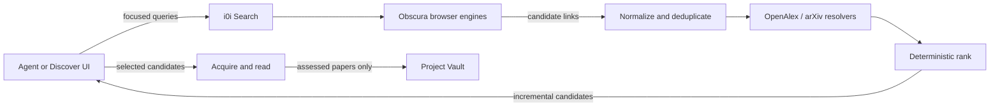

# RFC 0153: Agent-Neutral Resilient Scholarly Search

- Status: Implemented and verified
- Date: 2026-09-09
- Implemented: 2026-09-09
- Extends: RFC 0133
- Integrates with: RFC 0142
- Motivated by: RFC 0152

## Problem

Project Research currently depends on browser-first search through one Brave
Search page. Obscura can load the page, but Brave may return a bot challenge
instead of results. i0i then has no candidates even though the query itself is
valid. OpenAlex and arXiv are useful scholarly indexes, but their broad keyword
ranking has repeatedly produced weak candidates for nuanced research tasks.

Using a model runtime's private web-search feature would avoid some browser
failures, but it would make research behavior depend on Codex. A future local
Ollama runtime must be able to perform the same search loop even when the model
has no native web access.

Search therefore needs to be an i0i capability, not an incidental feature of a
particular agent runtime.

## Outcome

The existing `search_start`, `search_get`, and `search_cancel` tools continue to
be the agent-facing contract. Behind them, i0i runs several focused queries
through a health-aware set of free browser-search sources, normalizes and
deduplicates their candidates, resolves scholarly metadata, and returns a
bounded ranked stream.

The same contract works whether the caller is Codex, Claude, Ollama, another
model, or the native Discover UI. Native model web search may later be added as
an optional provider, but it is never required for correct operation.



## Boundaries

This RFC changes candidate discovery and ranking only.

- RFC 0133 continues to own search IDs, budgets, concurrency, cancellation,
  persistence, pagination, and incremental candidate delivery.
- RFC 0142 continues to own acquisition, reading, disposition, and the rule
  that a Research Run must assess a paper before retaining it in the Vault.
- Source acquisition continues to own opening candidate URLs and recovering
  PDF or HTML documents.
- This RFC does not introduce a general agent-runtime abstraction. It ensures
  that the Search capability itself has no dependency on Codex.

## Search Contract

The public MCP tools remain unchanged. One `search_start` request may contain
the existing instructions and filters plus several explicit focused queries.
If only instructions are supplied, the research agent first proposes three to
five queries and then calls the same tool.

Query planning belongs to the caller because it needs the current Research
State and research purpose. Search execution belongs to i0i because provider
selection, rate control, normalization, and failure handling must be consistent
across model runtimes.

The first implementation preserves the existing filters:

- result limit;
- inclusive year range;
- venue;
- seed paper IDs;
- open-access preference where supported.

Filters unsupported by a browser source are applied after metadata resolution.
An unknown year or venue does not silently satisfy an explicit required filter.

## Provider Strategy

### Broad discovery

Obscura remains the default broad-search transport. Add small browser-engine
adapters for:

1. DuckDuckGo;
2. Ecosia;
3. Brave Search.

Each adapter owns only its URL construction, result selectors, pagination, and
challenge detection. It emits the existing normalized `PaperCandidate` type.
No engine-specific HTML escapes that adapter.

Focused queries may execute concurrently within RFC 0133's shared budget. Calls
to the same browser engine are serialized and rate-limited. Different queries
start with different healthy engines so normal operation gathers varied results
without querying every engine unnecessarily.

For one query, i0i tries the next healthy engine when the current attempt is
challenged, rate-limited, unavailable, fails to parse, or returns no usable
links. It stops when the query reaches its candidate target or all configured
engines have been attempted.

### Scholarly resolution

OpenAlex and arXiv remain identity and metadata resolvers. They are queried by
DOI, arXiv identifier, or exact candidate title after broad discovery. Their
broad keyword ranking is not mixed into the normal result set.

A later provider may be added only through the same normalized candidate and
attempt contracts. This RFC adds no paid API, SearXNG service, embedding model,
or new long-running process beyond the existing Obscura service.

### Optional model-native search

Codex-native web search remains disabled for the core Research Run. A later RFC
may adapt structured results from a model runtime into the same candidate
pipeline. Such an adapter must be optional, visible in provenance, and unable
to change behavior required by runtimes without native search.

## Health and Failure Semantics

Each provider attempt records:

| Field | Meaning |
| --- | --- |
| `query_id` | Focused query being executed |
| `provider` | Browser engine or scholarly resolver |
| `status` | Terminal classification for this attempt |
| `candidate_count` | Usable candidates emitted by the attempt |
| `elapsed_ms` | Attempt duration |
| `reason` | Short actionable failure detail when applicable |

Attempt status is one of `succeeded`, `empty`, `challenged`, `rate_limited`,
`unavailable`, or `parse_failed`. A challenge is never reported as an empty
scholarly result.

Provider health is process-local. A challenge or rate limit places that engine
on a bounded cooldown; transport and parser failures affect only that attempt.
Restarting i0i clears this health state. The implementation does not add a new
provider-health database.

A Search succeeds with partial results when at least one query yields
candidates. It fails as infrastructure-empty when every query exhausts its
providers without a usable candidate. The final error summarizes attempt
classifications instead of claiming that no relevant scholarship exists.

## Candidate Processing and Ranking

Candidates are merged before they are exposed as final ranked results.
Deduplication uses, in order:

1. DOI;
2. arXiv or OpenAlex identity;
3. canonical destination URL;
4. normalized title plus publication year.

The first ranking pass is deterministic and local. It considers:

- title and snippet overlap with the focused query;
- support from more than one focused query or browser engine;
- presence of an actionable source URL;
- resolved scholarly identity and metadata completeness;
- year and venue constraints;
- novelty relative to papers already in the Project Vault.

This ranking creates a stable shortlist; it does not pretend to judge final
scientific relevance. The calling research agent selects papers from that
shortlist using the research instructions and current Research State. This
keeps model judgment useful without requiring a particular hosted model or an
embedding service.

The candidate lifecycle remains explicit:

```text
discovered -> resolved -> ranked -> acquisition attempted -> read -> disposed
```

Only `evidence_used`, `background`, or `contradictory` dispositions may remain
in the Vault under RFC 0142. Search itself never adds papers to a Vault.

## Configuration and UI

Operational defaults live in the existing global configuration file and are
read by the backend. Configuration covers:

- ordered browser engines;
- maximum concurrent focused queries;
- minimum interval between calls to one engine;
- challenge/rate-limit cooldown;
- per-query candidate target.

These are not added to the everyday Discover or Research UI. Existing year,
venue, result-count, and query controls remain the user-facing search settings.

Research Activity shows concise live stages such as `Searching DuckDuckGo`,
`DuckDuckGo challenged; trying Ecosia`, `Resolving 8 candidates`, and `6 ranked`.
Detailed attempt records remain progressively disclosed in the right panel.

## Implementation Sequence

1. Preserve `CandidateSource`, `SearchManager`, and the MCP tool signatures.
2. Split the current Brave-specific browser code into a shared executor and
   three small engine adapters.
3. Add explicit challenge and attempt classifications.
4. Add process-local provider cooldown and health-aware rotation.
5. Merge, deduplicate, and deterministically rank candidates across focused
   queries while preserving incremental RFC 0133 events.
6. Surface provider progress and the terminal failure summary through existing
   Search Activity.
7. Keep exact-title OpenAlex/arXiv resolution after browser discovery and verify
   RFC 0142's read-before-retain boundary remains unchanged.

## Acceptance Criteria

- The same MCP search request works without invoking Codex-native web search.
- Three focused queries can overlap within the existing concurrency and budget
  limits while requests to one browser engine remain rate-limited.
- A Brave challenge is classified as `challenged`, places Brave on cooldown,
  and causes the query to try another configured engine.
- One provider failure does not discard candidates from another provider or
  another focused query.
- Duplicate links and scholarly identities collapse into one stable candidate
  without losing provider/query provenance.
- Repeating the same fixture input produces the same candidate ordering.
- Explicit year and venue filters apply after resolution when the browser
  source cannot apply them itself.
- Search streams candidates but never creates a Vault membership.
- Research Activity distinguishes legitimate empty results from provider
  challenge, rate limit, transport, and parser failures.
- Default operation requires no paid search API key and no service other than
  the already managed Obscura process.

## Verification

Use deterministic HTML fixtures for each browser engine and focused tests for
challenge detection, fallback order, cooldown, partial success, deduplication,
ranking, filters, and provenance. Use a fake clock for rate and cooldown tests.

Add one ignored, explicitly invoked Obscura smoke test that runs a fixed query
and verifies either usable candidates or an honestly classified provider
failure. Routine verification must not depend on live search pages or a live
model. Run the costly Research Loop evaluation only after this behavior changes
the production loop end to end.

Implementation verification completed with deterministic provider fixtures and
the full Rust library suite: 651 tests passed, 0 failed, and 11 explicitly
ignored live or environment-dependent tests. Frontend type checking also
passes. The opt-in Obscura smoke test is present but was not run during routine
verification.

## Implementation Notes

- Quick Find and Project Research now share one process-local provider-health
  state, so an engine challenged in one path is not immediately retried by the
  other.
- DuckDuckGo, Ecosia, and Brave are the default ordered browser engines. The
  existing custom browser-search URL remains supported through global config.
- Broad OpenAlex and arXiv keyword fanout was removed from Quick Find. Those
  providers remain exact identity and metadata resolvers for browser results.
- Browser candidate ranking is deterministic. The existing downstream semantic
  reranker remains unchanged and optional; this RFC added no model or embedding
  dependency.
- When all focused queries exhaust every provider, Project Research now fails
  with the provider attempt summary instead of reporting a successful empty
  scholarly result.

## Non-Goals

- Guaranteeing that a public search page never presents a challenge.
- Solving interactive CAPTCHAs.
- Adding a paid search API or self-hosted metasearch service.
- Making OpenAlex or arXiv broad ranking the primary discovery path.
- Requiring Codex, Claude, or another hosted runtime.
- Adding embeddings, a vector database, or an LLM reranker.
- Changing document acquisition, Reader evidence extraction, or Research State
  validation.
