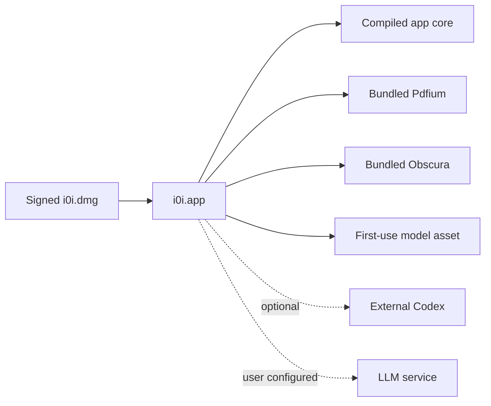

# RFC 0154: macOS ARM64 Release Packaging and Runtime Readiness

- Status: Implemented; signing, notarization, and clean-machine acceptance pending
- Date: 2026-09-10
- Product: i0i
- Target: Tauri v2 on Apple Silicon macOS
- Builds on: RFC 0040, RFC 0100, RFC 0127, RFC 0153

## Problem

i0i runs as a Tauri application during development, but a clean checkout cannot
yet produce a dependable public release. Pdfium, Obscura, and the Obscura worker
are named as Tauri resources while their binaries are intentionally ignored by
Git. The copies on the current development machine are ARM64-only and are not
recreated by a pinned, checksum-verified release step.

Codex has a different lifecycle. i0i currently finds a `codex` executable on
the user's `PATH`, or at `research.codex_executable`, and starts its app-server.
Bundling Codex would also make i0i responsible for its authentication, updates,
compatibility, and redistribution. That is not necessary for the first release.

The product needs a clear distinction between:

- code compiled into i0i;
- native components shipped inside the application;
- assets downloaded on first use;
- optional external runtimes; and
- remote services that require user configuration.

Without that distinction, missing runtime components become late feature
failures, and another developer cannot reproduce the package that happened to
work on the original machine.

## Outcome

The first distributable version of i0i is a signed and notarized Apple Silicon
macOS application delivered in a DMG. A user installs it by dragging `i0i.app`
to Applications. Running the Reader and browser-backed discovery requires no
Rust, Node, Python, Docker, Homebrew, or terminal setup.

Autonomous Project Research remains an optional capability backed by an
external Codex installation. i0i detects and explains that requirement at the
point of use. The rest of the application continues to work when Codex is not
installed.



## Release Scope

Version 0.1 supports Apple Silicon macOS only. The release pipeline produces one
`aarch64-apple-darwin` application and DMG. The minimum supported macOS version
must be declared in Tauri configuration before the first release candidate and
validated on that version.

Intel and universal macOS packages are deferred until compatible x86_64 Pdfium
and Obscura artifacts are available and tested. Windows, Linux, the Tauri
updater, Homebrew distribution, and App Store distribution are non-goals.

## Dependency Classification

| Component | Kind | Capability | Release treatment |
| --- | --- | --- | --- |
| Svelte, PDF.js | compiled frontend | workspace and PDF Reader | bundled by the frontend build |
| Rust application | compiled backend | all local product behavior | compiled into `i0i.app` |
| SQLite | linked library | durable local state | bundled through `rusqlite` |
| Pdfium | native dynamic library | PDF text and evidence extraction | pinned and bundled |
| Obscura | managed native process | browser search and acquisition | pinned and bundled |
| Obscura worker | managed native process | Obscura browser execution | pinned and bundled beside Obscura |
| Embedding model | downloaded asset | semantic reranking | fetched on first use with visible progress |
| Codex CLI | optional external runtime | autonomous Project Research | detected, never silently installed |
| LLM provider | remote service | chat and model-backed synthesis | configured by the user |

Pdfium and Obscura are required contents of a release artifact, but they are not
allowed to prevent the main window from opening. Their absence in an installed
release is a packaging defect surfaced as an unavailable capability, not an
instruction asking the user to install developer tooling.

Remote APIs and account credentials are configuration, not packaged software
dependencies. Secrets remain in the existing settings storage and are never
written to the dependency manifest or release logs.

## Runtime Dependency Manifest

Add a small, repository-tracked manifest at:

```text
src-tauri/runtime-dependencies.toml
```

It is the source of truth for native artifacts that cannot live in Git. Each
bundled artifact records only information required to reproduce and audit it:

```toml
[pdfium]
version = "<tested build>"
target = "aarch64-apple-darwin"
url = "<release artifact URL>"
sha256 = "<expected digest>"
destination = "resources/pdfium/libpdfium.dylib"
license = "<SPDX identifier>"

[obscura]
version = "<tested release>"
target = "aarch64-apple-darwin"
url = "<release artifact URL>"
sha256 = "<expected digest>"
destination = "resources/obscura/obscura"
license = "<SPDX identifier>"
```

The Obscura worker may be a second artifact in the same component section. The
manifest must not contain API keys, signing identities, credentials, mutable
`latest` URLs, or machine-local paths.

Codex is declared separately as an external requirement with a tested minimum
version and its official installation URL. It has no download checksum because
i0i does not acquire or install it.

## Reproducible Native Artifact Preparation

Add one release preparation command that:

1. Reads `runtime-dependencies.toml`.
2. Downloads missing artifacts into their declared destinations.
3. Verifies every SHA-256 digest before replacing an existing artifact.
4. Verifies that each Mach-O artifact contains the ARM64 architecture.
5. Verifies executable permissions for Obscura and its worker.
6. Verifies the Pdfium symbols required by the pinned `pdfium-render` binding.
7. Fails when a version, URL, digest, destination, or required artifact is
   missing.
8. Produces no untracked lockfile containing machine-specific state.

Local development and CI use the same command. Existing manual setup scripts
may delegate to it, but they must not remain an independent source of versions
or artifact selection.

The binaries may remain ignored by Git. Their versions, origins, checksums,
destinations, and licenses must be tracked.

## Tauri Bundle Layout

Retain the current simple process ownership:

- Pdfium remains a Tauri resource loaded dynamically by Rust.
- Obscura and its worker remain bundled application resources started and
  stopped by `ObscuraManager`.
- The release build resolves only packaged resource paths. Repository and
  environment overrides remain development conveniences.

This RFC does not require adopting the Tauri shell plugin or changing Obscura
to `bundle.externalBin`. The existing Rust process manager already contributes
meaningful lifecycle behavior. A packaging validation test is more valuable
than replacing that code merely to use Tauri's sidecar vocabulary.

The final application must contain the equivalent of:

```text
i0i.app/Contents/MacOS/i0i
i0i.app/Contents/Resources/pdfium/libpdfium.dylib
i0i.app/Contents/Resources/obscura/obscura
i0i.app/Contents/Resources/obscura/obscura-worker
```

The exact resource prefix is determined from the built application rather than
assumed by production code.

## Codex Contract

Codex remains optional and external for version 0.1. i0i must not download it,
run a package manager, collect its credentials, or claim that it is part of the
signed i0i application.

At the Project Research boundary, i0i performs a bounded readiness check:

1. Resolve the configured executable, then `codex` on `PATH`.
2. Report the detected version and whether it satisfies the tested minimum.
3. Start and initialize the app-server using the existing timeout.
4. Treat successful initialization as the authoritative runtime readiness
   check, including authentication and protocol compatibility.

When unavailable, the UI shows one concise setup state with actions to open the
official installation instructions or select an executable. Other i0i
capabilities remain enabled. Raw spawn or protocol errors remain available in
progressive detail.

Codex's own sign-in flow owns authentication. The first release does not
introduce an `AgentRuntime` trait solely for packaging, but the readiness model
must use the neutral capability name `autonomous_research`, not expose Codex as
a product-wide requirement.

## Capability Readiness

The backend exposes a small runtime readiness projection for settings and
feature gates:

| Capability | Typical state source | Setup action |
| --- | --- | --- |
| `pdf_reader` | compiled frontend | none |
| `pdf_evidence` | Pdfium load check | report packaging failure |
| `web_discovery` | Obscura health check | retry or report packaging failure |
| `chat` | configured provider check | open model settings |
| `autonomous_research` | Codex app-server check | install or select Codex |

States are `ready`, `starting`, `setup_required`, or `unavailable`. Each entry
contains a short user-facing message and optional action identifier. It does not
become a general dependency graph or persist transient health to SQLite.

Routine startup checks only inspect bundled files and existing configuration.
Obscura may continue its existing eager managed startup. Codex and remote LLM
providers are checked when their capability is opened or explicitly tested, so
launching i0i never triggers authentication or a paid request.

The UI presents readiness in Settings and at the affected feature boundary.
There is no mandatory first-run wizard when the Reader is usable. Technical
users may inspect versions and diagnostics, but ordinary feature surfaces use
capability language such as `Research agent setup required`.

## Signing, Notarization, and Distribution

The release pipeline must:

1. Build from a clean checkout and a lockfile-frozen dependency installation.
2. Prepare and verify the pinned native artifacts.
3. Build `i0i.app` for `aarch64-apple-darwin`.
4. Sign every nested executable and dynamic library with hardened runtime
   settings before signing the outer application.
5. Submit the application for Apple notarization.
6. Staple the accepted notarization ticket.
7. Package the signed application in a DMG.
8. Publish the DMG and its SHA-256 digest.

Signing identities, notarization credentials, and provider credentials live in
CI secrets. Pull requests run build and bundle-layout checks without access to
release credentials. Only protected release jobs may sign and publish.

Add a generated third-party notices document to the application bundle or
About surface. It names the shipped native components, pinned versions,
projects, and licenses. License compatibility must be reviewed before the first
public release candidate; the manifest records the result but does not replace
that review.

## Failure Semantics

- A missing or checksum-invalid artifact fails preparation before compilation.
- A missing artifact inside a built `.app` fails bundle verification.
- A missing bundled component at runtime disables only its capability and is
  labeled as an application packaging error.
- Missing Codex produces `setup_required`, not an application error.
- An unsupported Codex version or failed app-server initialization produces an
  actionable autonomous-research error and preserves the underlying diagnostic.
- An unavailable LLM service never prevents local papers and notes from opening.

No dependency failure should instruct an ordinary user to edit environment
variables, copy a dylib, run `npm`, or start a server manually.

## Implementation Sequence

1. Add and document `runtime-dependencies.toml` with pinned ARM64 artifacts.
2. Add the shared fetch, checksum, architecture, permission, and Pdfium-symbol
   preparation command.
3. Make clean development and release builds invoke or validate preparation at
   the appropriate boundary.
4. Add bundle-layout verification against the built `.app`.
5. Add the backend capability-readiness projection using existing Pdfium,
   Obscura, provider, and Codex checks.
6. Add the compact Settings and feature-boundary readiness UI.
7. Add third-party notices generation.
8. Add protected signing, notarization, DMG, and publication automation.
9. Run the clean-machine release acceptance procedure once for the release
   candidate.

## Acceptance Criteria

- A clean checkout can prepare all required native artifacts without relying on
  a developer's spike environments or manually copied files.
- Artifact preparation rejects a wrong digest, wrong architecture, missing
  executable permission, and incompatible Pdfium build.
- `pnpm tauri build --target aarch64-apple-darwin` produces an application that
  contains the declared Pdfium and Obscura artifacts.
- The installed application opens and provides local workspace, PDF viewing,
  notes, and Vault behavior without developer tooling.
- Browser discovery starts the packaged Obscura process without a user-managed
  server.
- PDF evidence extraction loads packaged Pdfium without an environment
  variable.
- With Codex absent, Project Research shows setup required while the rest of
  i0i remains usable.
- With a supported authenticated Codex installation, the existing app-server
  readiness check succeeds and Project Research can start.
- No first-use embedding download or remote provider check blocks application
  startup; any download displays progress and failure recovery.
- Every nested native artifact and the outer application pass code-signature
  verification.
- The DMG passes Apple notarization and Gatekeeper assessment.
- The release includes dependency provenance and third-party license notices.

## Verification

### Implementation record

Implemented on 2026-09-10:

- pinned ARM64 Pdfium and Obscura artifacts, checksums, origins, versions, and
  licenses in `src-tauri/runtime-dependencies.toml`;
- one Node-based prepare/verify command shared by local builds, CI, and the
  existing setup scripts;
- checksum, Mach-O architecture, permission, and Pdfium-symbol rejection tests;
- Tauri packaging for macOS 11+ with bundled native runtimes, third-party
  notices, and the canonical `assets/logo.png` application icon;
- actual-bundle verification across both supported Tauri resource layouts;
- lazy embedding-model initialization outside the Tauri setup thread;
- backend capability readiness with Settings/System and Project Research UI;
- an optional external Codex executable setting and tested minimum version;
- a protected GitHub Actions release job and local release script for nested
  signing, DMG creation, notarization, stapling, Gatekeeper assessment, and
  SHA-256 publication.

Local verification passed for the native-artifact tests, Svelte checks, UI
tests, 654 deterministic Rust tests, an unsigned ARM64 `.app`, packaged-app
startup, bundled Obscura startup, bundle layout, and unsigned DMG integrity.
The signed/notarized release and clean macOS account acceptance run require the
release credentials and therefore remain the only open acceptance work.

Routine deterministic checks cover:

- manifest parsing;
- checksum and architecture rejection fixtures;
- destination and permission validation;
- capability-state mapping;
- Codex missing, unsupported, and initialized states through fake executables;
- packaged-resource resolution; and
- bundle-layout inspection.

The release-candidate acceptance run starts from a clean checkout and uses a
clean macOS user account with no development toolchain. It installs the DMG,
opens a local PDF, extracts evidence, starts browser discovery, confirms the
Codex-missing setup state, and then repeats Project Research with a separately
installed and authenticated Codex runtime.

The acceptance run may use one bounded live browser query and one bounded
Research Run. It is not part of routine unit-test execution.

## Non-Goals

- Bundling or automatically installing Codex.
- Handling Codex or LLM-provider credentials inside the release pipeline.
- Supporting Intel macOS, Windows, or Linux in version 0.1.
- Shipping through the Mac App Store or Homebrew.
- Implementing automatic updates.
- Building a general package manager or runtime dependency solver.
- Replacing the existing Obscura process manager without an observed need.
- Guaranteeing that external websites or model services are available.

## Sources

- [Tauri macOS distribution](https://v2.tauri.app/distribute/macos-application-bundle/)
- [Tauri code signing](https://v2.tauri.app/distribute/sign/macos/)
- [Tauri sidecars](https://v2.tauri.app/develop/sidecar/)
- [OpenAI Codex CLI](https://developers.openai.com/codex/cli/)
- [Obscura repository](https://github.com/h4ckf0r0day/obscura)
