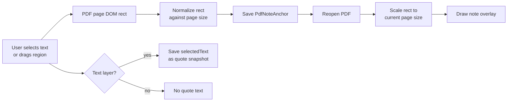

# RFC 0026: PDF-First Reader Notes

Status: Draft
Date: 2026-05-31
Product: i0i
Target: Tauri v2 + Svelte, macOS first

## Summary

i0i's next Reader milestone is an acceptable PDF reader with note-taking on top of the PDF.

The product path is:

```text
save paper to Vault
  -> persist paper metadata
  -> download/cache PDF in the background
  -> click saved paper
  -> open cached PDF immediately when available
  -> create notes attached to PDF locations
```

Structured text mode and MinerU extraction are deferred. They remain useful later, but they should not block the main reading experience.

## Decision

Make PDF mode the primary Reader surface.

For this slice, notes anchor to the PDF source, page, and location. A note should store:

- the note body written by the user
- the selected or referenced text, when available
- the page index
- one or more rectangles on that page
- the PDF `DocumentSource` the rectangles refer to

Do not revert the RFC 0023 document/extraction schema. Keep it as future infrastructure, but stop making the active Reader UI depend on extraction output.

## Why

The user need is reading a paper and attaching thoughts to specific evidence.

The fastest trustworthy document representation is the original PDF. It preserves figures, equations, tables, layout, and publisher formatting without waiting for a one-minute extraction job.

Text/structured mode may become valuable later for search, summarization, reflow, AI workflows, accessibility, and cross-document synthesis. For now, it is not required for a useful Reader.

## Goals

- Open the cached PDF as the default Reader view.
- Keep PDF download tied to save/import, as defined in RFC 0024.
- Allow notes to be created from the PDF view.
- Store PDF note anchors durably.
- Reopen a paper and show its saved PDF notes in the correct PDF locations.
- Keep the Inspector as the writing/editing surface for note bodies.
- Keep MinerU/extraction optional and on demand.
- Hide or defer text mode until there is real extracted text worth showing.

## Non-Goals

- No production MinerU integration in this slice.
- No structured text Reader mode in this slice.
- No cross-mode PDF/text anchor reconciliation.
- No figure/table/equation semantic note model yet.
- No markdown rendering as the main Reader surface.
- No full PDF editing.
- No collaborative annotations.
- No OCR fallback for scanned PDFs.

## Reader Behavior

If the paper has a cached active PDF source:

```text
Reader opens PDF mode immediately.
```

If the paper has a remote PDF source that is still downloading:

```text
Reader shows download state and updates when document_source_updated arrives.
```

If PDF download failed:

```text
Reader shows a retry/open-source action and the stored error.
```

If the paper has no PDF source:

```text
Reader shows a missing-document state with import/open-source actions.
```

Do not use the saved abstract as a fake reading body. The abstract can appear as metadata, but it is not the document.

## PDF Rendering Requirement

The current embedded PDF approach is acceptable for view-only reading, but location-anchored notes require control over pages and overlays.

The implementation should move toward a controlled PDF renderer, likely PDF.js, because it gives the frontend:

- page-level rendering
- a text layer when available
- page geometry
- annotation overlays
- click/drag region capture
- stable mapping between viewport coordinates and PDF page coordinates

If the first implementation keeps the current `<object>` PDF embed, it should be treated as a temporary view-only bridge. It will not be enough for high-quality PDF notes because the app cannot reliably own selection, page coordinates, or annotation overlays inside the embedded viewer.

## Note Anchor Model

PDF notes should be anchored to a `DocumentSource`, not to a `DocumentExtraction`.

For v1, the PDF note anchor is visual and positional:

```text
source_id + page_index + normalized_rects
```

That is the source of truth for where the note belongs. The referenced text is stored as a helpful snapshot when the PDF renderer can provide it, but text is not required to place the note back on the PDF.

Conceptual shape:

```ts
type PdfNoteAnchor = {
  noteId: string;
  paperId: string;
  sourceId: string;
  pageIndex: number;
  rects: PdfRect[];
  selectedText?: string;
  quoteContext?: string;
};

type PdfRect = {
  x: number;
  y: number;
  width: number;
  height: number;
  pageWidth: number;
  pageHeight: number;
};
```

Coordinates should be stored in PDF page coordinate space or normalized page space, not screen pixels.

Recommended v1:

```text
normalized page coordinates
x/y/width/height are values from 0.0 to 1.0
origin is top-left of the rendered page
```

This makes anchors resilient to zoom, window size, and device scale factor.

## Do We Need Position?

Yes, if the note should appear on the PDF again.

A paper-level note only needs:

```text
paper_id + note_body
```

A PDF-attached note needs more:

```text
paper_id + source_id + page_index + rects_json + note_body
```

The rectangle is what lets i0i:

- draw the note highlight on the PDF
- scroll back to the note
- keep the note aligned after zoom/resize
- distinguish two notes on the same page

Without position data, the app can still store a note about the paper, but it cannot show what part of the PDF the note refers to.

## How Position Is Captured

The PDF viewer should own each rendered page as a DOM element:

```text
page container
  -> canvas or SVG PDF rendering
  -> optional text layer
  -> i0i annotation overlay
```

When the user selects text or drags a region, the frontend captures screen rectangles from the interaction and converts them into page-local normalized rectangles:

```text
x = (selection.left - page.left) / page.width
y = (selection.top - page.top) / page.height
width = selection.width / page.width
height = selection.height / page.height
```

Store those normalized values, not raw pixels.

On render:

```text
left = x * current_page_width
top = y * current_page_height
width = width * current_page_width
height = height * current_page_height
```

This is why notes survive zooming, resizing, and different device scale factors.

If a text selection spans multiple lines, store multiple rectangles in `rects`.

If a note is created by dragging over a figure, table, equation, or blank region, store one rectangle and leave `selectedText` empty.

## How Referenced Text Is Known

Referenced text is best-effort in PDF mode.

With PDF.js or another controlled renderer, selectable PDFs expose a text layer. When the user selects text, the browser selection can provide:

```text
selectedText = window.getSelection().toString()
```

That selected text should be saved on the note as a quote snapshot.

Important rule:

```text
normalized_rects place the note
selectedText explains the note
```

Do not use regex or string matching as the v1 source of truth for PDF note placement. It is fragile because:

- PDFs can repeat the same phrase many times
- ligatures and hyphenation can change extracted text
- equations and symbols may not map cleanly to Unicode
- scanned or image-heavy PDFs may have no selectable text

Later, MinerU or another extractor may reconcile a PDF anchor to structured text spans. That should be an enrichment step, not a requirement for saving or reopening the note.

## Anchor Flow



## Note Creation

Preferred interaction:

```text
select text or drag region in PDF
  -> small comment icon appears near the selection
  -> click icon
  -> Inspector opens note draft
  -> Save persists note body + PDF anchor
```

If text selection is available through the PDF renderer:

```text
store selectedText
store one or more selection rectangles
```

If text selection is not available yet:

```text
store a region anchor
selectedText can be empty
note still attaches to the visual location
```

This allows the first usable PDF-note slice to ship before perfect text extraction exists.

## Note Display

The PDF viewer should render saved note anchors as an overlay on top of the page.

Minimum behavior:

- subtle highlight rectangle for saved note anchors
- active note has stronger styling
- clicking a note in the Inspector scrolls to its page/location
- clicking a PDF note highlight activates the note in the Inspector

The note body remains in the Inspector. The PDF surface should stay focused on reading.

## Storage

Existing text-offset note fields from RFC 0015 and RFC 0019 can remain for old text-mode notes.

For PDF notes, add a durable PDF anchor representation. Two acceptable implementation options:

Option A: extend `paper_notes`:

```text
anchor_kind: "text_offset" | "pdf_rect"
source_id
page_index
rects_json
selected_text
quote_context
```

Option B: add `paper_note_anchors`:

```text
id
note_id
anchor_kind
source_id
page_index
rects_json
selected_text
quote_context
created_at
```

Prefer Option B if the existing `paper_notes` table is already carrying text-offset assumptions that would make PDF anchors awkward. Prefer Option A only if it keeps the implementation clearly smaller.

## Relationship to RFC 0023 and RFC 0025

RFC 0023 remains the future document model for extracted structured documents.

RFC 0025 remains the extractor evaluation and optional enrichment plan. MinerU is still the leading candidate from the spike, but it is not part of the critical path for opening a paper or writing PDF notes.

The active Reader contract for this slice should be smaller than the full extracted document model:

```ts
type PdfReaderDocument = {
  paperId: string;
  title: string;
  authors: string[];
  sourceId?: string;
  pdfLocalPath?: string;
  pdfSourceUrl?: string;
  pdfStatus?: "remote_available" | "downloading" | "cached" | "failed";
  pdfError?: string;
  notes: PaperNote[];
};
```

The backend may still have `ReaderDocument` fields for extraction, but the UI should not require `blocks`, `spans`, `assets`, or `sourceText` to render the primary PDF Reader.

## Files Likely Affected

Frontend:

- `src/lib/features/reader/ReaderView.svelte`
- `src/lib/features/reader/PdfPage.svelte`
- `src/lib/features/reader/ReaderInspector.svelte`
- `src/lib/domain/reader.ts`
- `src/lib/domain/library.ts`
- `src/lib/bridge/library.ts`

Backend:

- `src-tauri/src/domain/reader.rs`
- `src-tauri/src/domain/library.rs`
- `src-tauri/src/storage/library_store.rs`
- `src-tauri/src/services/reader_service.rs`
- `src-tauri/src/commands/reader.rs`
- `src-tauri/src/commands/library.rs`

Optional:

- `package.json` if PDF.js is added.
- Tauri capabilities if local PDF asset loading changes.

## Risks

- PDF.js integration is more work than the current `<object>` embed.
- Text selection may be hard to make polished in the first pass.
- Region notes without selected text are less semantically rich.
- Existing text-offset note UI may assume a text source is always present.
- Coordinate bugs can appear across zoom, resize, rotation, and high-DPI displays.
- Some PDFs may download successfully but render poorly or slowly.

## Validation Plan

- Save a Discover paper with a PDF URL.
- Verify the PDF downloads and becomes the active cached source.
- Click the paper in the Vault and verify the Reader opens the PDF immediately.
- Create a PDF note on a visible page.
- Verify the note stores body, source id, page index, and normalized rectangle data.
- Reopen the app and verify the note appears in the same PDF location.
- Resize/zoom the Reader and verify the note overlay stays aligned.
- Click a note in the Inspector and verify the PDF scrolls to the anchor.
- Click a PDF highlight and verify the Inspector activates the note.
- Run `pnpm check`.
- Run `pnpm build`.
- Run `cargo test`.
