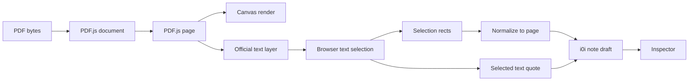

# RFC 0027: PDF Text Selection and Note Creation

Status: Draft
Date: 2026-06-03
Product: i0i
Target: Tauri v2 + Svelte, macOS first

## Summary

Improve PDF text note creation by replacing i0i's manual PDF text-layer approximation with PDF.js's official text-layer machinery.

The Reader should use this focused architecture:

```text
PDF.js renders page pixels
PDF.js renders selectable text layer
i0i renders note overlays and Inspector workflows
```

This RFC is about selection quality and note creation ergonomics. It is self-contained and supersedes older reader RFC wording for PDF text-selection note creation.

Region-based notes, structured text mode, and MinerU extraction remain deferred.

## Problem

The current PDF Reader can render PDFs and create notes, but text selection is not geometrically accurate enough.

Observed issue:

```text
selection highlights start correctly but stop before the visual end of some lines
```

The likely cause is that i0i manually creates invisible/selectable text spans over the PDF canvas. That manual layer estimates glyph widths and transforms, so it can drift from the rendered page. PDF layout is more complicated than plain HTML text because it depends on embedded fonts, glyph metrics, transforms, kerning, ligatures, rotation, and per-fragment positioning.

When the invisible text layer is narrower than the rendered text, browser selection and note rectangles become too short.

## Decision

Use PDF.js's official text layer for selectable text.

Keep custom i0i ownership of:

- Reader shell
- PDF page stack
- zoom controls
- note overlay
- note creation affordance
- Inspector note editing
- PDF note anchor storage

Do not adopt the full PDF.js viewer yet. Use only the PDF.js pieces needed for accurate page rendering and selection.

For v1, support only notes created from text selections on a single PDF page.

## Why

PDF pages rendered to canvas are pixels. Browser selection cannot select pixels.

All serious browser-based PDF readers need two aligned layers:

```text
canvas layer: visible PDF page
text layer: invisible/selectable DOM text
```

The text layer must match the PDF's own text geometry. PDF.js already ships mature text-layer code for this purpose. i0i should not build its own PDF text layout engine.

## Goals

- Make text selection visually match the rendered PDF lines.
- Create text-selection notes with accurate multi-line rectangles.
- Store selected text as a quote snapshot when the PDF exposes selectable text.
- Keep note anchors based on `source_id + page_index + normalized_rects + selected_text`.
- Prevent UI/error text from being selectable as PDF note content.
- Keep the Reader UI custom to i0i.

## Non-Goals

- No full PDF.js viewer integration.
- No PDF.js default toolbar.
- No PDF.js find/search feature in this slice.
- No PDF.js history/navigation system.
- No built-in PDF annotation editing.
- No cross-mode PDF/text reconciliation.
- No MinerU integration.
- No OCR fallback for scanned PDFs.
- No semantic equation/table/figure anchoring.
- No region-note creation in this slice.
- No multi-page text-selection notes in v1.

## Architecture

Use a layered PDF page:

```text
page container
  -> canvas layer from PDF.js page.render(...)
  -> official PDF.js text layer
  -> i0i text-note overlay
  -> i0i transient selection affordance
```

The canvas and text layer must use the same `PageViewport`.

The i0i overlay should never influence PDF text selection. It should be visually above the page but interaction-aware:

- normal text selection should reach the PDF text layer
- saved note highlights should be clickable
- selections outside the PDF text layer should be ignored

## PDF.js Integration Level

i0i should use PDF.js at the helper-layer level:

Use:

- `getDocument`
- `PDFDocumentProxy`
- `PDFPageProxy`
- `page.render(...)`
- official PDF.js text layer

Avoid for now:

- `PDFViewer`
- `PDFPageView`
- PDF.js toolbar
- PDF.js history
- PDF.js find controller
- PDF.js annotation editor

This keeps i0i in control of the product experience while using PDF.js for the part it is good at: PDF page geometry.

Implementation preference:

```text
try TextLayer from the PDF.js display/core API first
  -> if it is insufficient or unstable, use TextLayerBuilder from the viewer package
```

Prefer `TextLayer` first because it should be the smaller dependency surface for a custom reader.

## Text Selection Flow



## Note Creation Behavior

Text-selection note:

```text
user selects PDF text
  -> i0i verifies the selection belongs to the PDF text layer
  -> i0i reads selectedText from window.getSelection()
  -> i0i converts Range client rects to normalized page rects
  -> small note affordance appears near the selection
  -> click affordance opens a draft in the Inspector
```

The note affordance should remain explicit. Selecting text alone should not immediately create a note.

```text
select text
  -> show floating note affordance
  -> user clicks affordance
  -> create note draft
```

Important rule:

```text
rects place the note highlight
selectedText records the quote snapshot
```

Selected text is not the anchor source of truth.

For v1, if a selection crosses page boundaries, i0i should not create a note. The app may clear the affordance or show no action. Multi-page note creation can be revisited later.

## Selection Boundaries

Only selections inside the official PDF text layer may create text-selection notes.

The Reader must ignore selections from:

- error messages
- loading states
- toolbar text
- Inspector text
- note body inputs
- any UI outside the PDF text layer

This avoids treating app UI text as paper content.

## Stored Anchor Shape

This RFC defines the minimal v1 PDF text anchor contract:

```ts
type PdfTextAnchor = {
  sourceId: string;
  pageIndex: number;
  rects: PdfRect[];
  selectedText: string;
  quoteContext?: string;
};

type PdfRect = {
  x: number;
  y: number;
  width: number;
  height: number;
  pageWidth: number;
  pageHeight: number;
};
```

Coordinates should remain normalized page coordinates, resilient to zoom and resize.

`selectedText` is required for a PDF text-selection note. Empty-text region anchors are out of scope for this RFC.

## Compatibility

PDF.js in Tauri's WebKit runtime may require browser compatibility shims.

Known issue:

```text
TypeError: undefined is not a function (near '...value of readableStream...')
```

This is likely caused by PDF.js expecting `ReadableStream` async iteration support when extracting text content. The Reader may keep a small compatibility helper that adds `ReadableStream.prototype.values` and `ReadableStream.prototype[Symbol.asyncIterator]` when WebKit does not provide them.

That shim should be treated as PDF.js runtime compatibility, not as application business logic.

## Implementation Plan

1. Keep the existing PDF bytes bridge and cached PDF loading.
2. Replace the manual text span renderer in `PdfRenderedPage.svelte`.
3. Render the official PDF.js text layer with the same viewport as the canvas.
4. Keep i0i's note overlay above the text layer.
5. Restrict text-selection note creation to the text-layer DOM subtree.
6. Reject or ignore selections that span more than one PDF page.
7. Validate note highlights across zoom, resize, and multi-line selections.

## Files Likely Affected

- `src/lib/features/reader/PdfPage.svelte`
- `src/lib/features/reader/PdfRenderedPage.svelte`
- `src/lib/features/reader/pdfjs-compat.ts`
- `src/lib/domain/reader.ts`
- `src/lib/domain/library.ts`

Optional:

- `package.json` if PDF.js version changes.
- `src/app.css` or reader CSS if PDF.js text-layer CSS needs to be imported/adapted.

## Risks

- PDF.js text-layer APIs may differ between package versions.
- Viewer-layer imports may pull more code than desired.
- CSS from PDF.js may conflict with i0i styles if imported globally.
- Text selection can still be imperfect on unusual PDFs.
- Multi-page selections are disallowed in v1 and need explicit future handling.
- Highlight rectangles may still need normalization cleanup around whitespace and line endings.

## Validation Plan

- Open a cached PDF in the Reader.
- Select a multi-line paragraph and verify selection reaches visual line ends.
- Create a note from that selection.
- Verify the saved highlight matches the selected text across all selected lines.
- Zoom in and out and verify highlight alignment.
- Resize the Reader and verify highlight alignment.
- Select visible UI/error text and verify no PDF note affordance appears.
- Select across two pages and verify no note affordance appears.
- Reopen the paper and verify saved notes appear in the same locations.
- Run `pnpm check`.
- Run `pnpm build`.

## Resolved Decisions

- Region-note creation is out of scope for this RFC.
- RFC 0027 is self-contained for PDF text-selection note creation.
- Multi-page text-selection notes are not supported in v1.
- Note creation uses an explicit floating affordance after text selection.
- Try PDF.js `TextLayer` first; use `TextLayerBuilder` only if needed.

## Open Questions

- Should note quote snapshots include only `selectedText`, or also short surrounding context?
