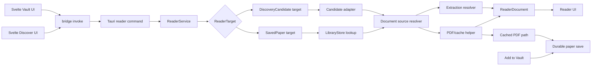

# RFC 0029: Open Discovery Candidates In Reader

Status: Stale
Date: 2026-06-09
Product: i0i
Target: Tauri v2 + Svelte, macOS first

## Summary

Let users open a discovery candidate in Reader immediately, without first adding it to a Vault.

The key design constraint is elegance through reuse:

- keep one Reader UI
- keep one `ReaderDocument` output model
- keep one core `ReaderService`
- reuse existing PDF/cache behavior where possible
- add only the smallest new abstraction needed at the input boundary

The backend should stop assuming that every readable paper is already a durable library row.

## Context

Today Reader opens a durable library paper:

```text
paper_id
  -> ReaderService::get_reader_document(paper_id)
  -> LibraryStore lookup
  -> ReaderDocument
```

That works for Vault papers, but not for discovery candidates. A discovery candidate is transient frontend state until the user explicitly saves it.

Current failure:

```text
openalex:W...
  -> get_reader_document(paper_id)
  -> ReaderService searches durable LibraryStore snapshot
  -> "Paper not found"
```

This creates an awkward product rule:

```text
Discover candidate
  -> Add to Vault
  -> then Open in Reader
```

That is functionally valid but conceptually wrong. Opening from discovery is an inspection action, not a commitment to save.

## Product Decision

Open from Discover should always work.

Save to Vault remains a separate decision.

Do not silently create a durable library paper just because the user opened something in Reader.

## Core Design

Do not build a second Reader system for discovery.

Instead:

- keep one Reader frontend
- keep one `ReaderDocument`
- extend `ReaderService` so it can resolve more than one kind of input

The new abstraction should be the input target, not a parallel temporary reader subsystem.

Conceptually:

```text
ReaderTarget
  -> SavedPaper
  -> DiscoveryCandidate
```

`ReaderService` should accept a target and produce the same `ReaderDocument` regardless of where the target came from.

## Goals

- Let any discovery candidate open in Reader immediately.
- Reuse `ReaderDocument` as the single Reader response shape.
- Reuse `ReaderService` as the main Reader orchestration layer.
- Reuse existing PDF download/cache primitives where possible.
- Keep unsaved discovery viewing separate from durable library persistence.
- Reuse an already downloaded PDF when the user later saves the paper to a Vault.
- Keep the first implementation small and understandable.

## Non-Goals

- No second Reader UI.
- No second Reader document model.
- No automatic saving of every opened discovery candidate.
- No temporary notes or annotations in the first increment.
- No new durable database tables unless they become clearly necessary.
- No full general document-source redesign in this RFC.

## User Flow

```text
User runs Discover
  -> sees candidate rows
  -> clicks or double-clicks Open
  -> Reader opens immediately

If PDF URL exists:
  -> app may download/cache PDF in app cache
  -> Reader can render PDF when available

If user later clicks Add to Vault:
  -> create durable paper metadata
  -> create/attach durable document source
  -> reuse the already cached PDF when identities match
```

## Architecture



## Product Rules

### Opening from Discover

Opening from Discover should not require:

- a Vault membership
- a durable `papers` row
- a durable `document_sources` row

It should only require enough candidate metadata to construct the same `ReaderDocument` shell the Reader already knows how to render.

Minimum useful candidate inputs:

- stable candidate id such as `openalex:W...`
- title
- authors
- venue/year when present
- external URL
- PDF URL when present
- abstract and match metadata already returned by discovery

### Notes and annotations

For the first increment, notes remain a saved-library feature.

Rule:

```text
unsaved discovery reader target
  -> readable
  -> note creation disabled
```

This keeps the first implementation focused on reading, not on inventing a second note lifecycle.

### Save after open

Yes: if Reader already downloaded the paper while it was opened from Discover, saving to a Vault should reuse that downloaded file whenever possible.

That is the preferred behavior because it:

- avoids a redundant second download
- makes save/import feel faster
- preserves useful work the app already did

The durable save path should promote or relink the cached file into the existing durable document-source flow rather than starting over.

## Proposed Abstractions

### `ReaderTarget`

Introduce one small input abstraction for `ReaderService`.

Conceptual shape:

```ts
type ReaderTarget =
  | {
      kind: "saved_paper";
      paperId: string;
      extractionId?: string;
    }
  | {
      kind: "discovery_candidate";
      candidate: DiscoverCandidate;
    };
```

This is the new abstraction in this RFC. It is justified because the current method signature hardcodes one assumption that is no longer true:

```text
every readable paper already exists in the durable library
```

### `ReaderDocument`

Do not create a new Reader response model.

Both saved papers and discovery candidates should be adapted into the existing `ReaderDocument` shape.

That keeps the Reader frontend simple and prevents divergence between two near-identical rendering paths.

### `ReaderService`

Keep one `ReaderService`.

Expand it from:

```text
saved paper id -> ReaderDocument
```

to:

```text
ReaderTarget -> ReaderDocument
```

Internally it can still branch, but the important design rule is:

```text
one reader orchestration service
```

### PDF/cache helper

Do not invent a discovery-only downloader if the existing saved-paper flow already has useful primitives.

Instead, factor PDF resolution/caching so both targets can use the same low-level behavior:

- resolve source URL
- check for cached local file
- download when needed
- validate PDF

The difference should be ownership and persistence, not the byte-handling logic itself.

## Storage Decision

Use app cache storage for unsaved discovery-reader assets.

Prefer app cache over an arbitrary raw temp folder:

- still disposable
- easier to namespace by candidate/source identity
- easier to inspect and clean up

Conceptual path:

```text
~/Library/Caches/i0i/reader/discovery/{candidate_id}/source.pdf
```

The exact path should use Tauri app-cache APIs, but the product rule is:

```text
unsaved reader artifacts live in app cache, not in the durable library store
```

## Promotion Rule

When the user saves a discovery-opened paper to a Vault:

1. Create the durable `Paper`.
2. Create or attach the durable `DocumentSource`.
3. If a cached PDF already exists for the same source identity, reuse it.
4. Set `active_source_id` as usual.
5. Continue with the normal durable Reader behavior after save.

Preferred identity match:

```text
paper id + source url
```

If reuse fails safely, fall back to the normal durable download path.

## Proposed Backend Shape

Smallest honest change:

1. Add a new Reader command that accepts a discovery candidate, or evolve the current command to accept a `ReaderTarget`.
2. Teach `ReaderService` to resolve either:
   - a saved library paper
   - a discovery candidate
3. Reuse the same `ReaderDocument` output shape.
4. Reuse or extract PDF/cache helpers so both cases rely on the same low-level logic.
5. Keep note creation disabled when the target is unsaved.

## Alternatives Considered

### 1. Require save before open

Rejected because it turns inspection into commitment.

### 2. Automatically insert opened candidates into the durable library

Rejected because it pollutes the durable library with papers the user may only be skimming.

### 3. Build a separate temporary reader subsystem

Rejected for the first increment because it duplicates concepts we already have:

- second service shape
- second reader lifecycle
- higher risk of drift from the durable Reader path

This RFC prefers one reader service plus one small target abstraction.

### 4. Add durable temp tables now

Possible later, but premature for the first increment.

The first version should prove the user flow using:

- transient candidate input
- app-cache-backed files
- reuse of existing Reader structures

## Risks

- If `ReaderService` grows too many conditionals, the target branching could get messy.
- Reusing cache/download code may require some refactoring before it feels truly shared.
- Unsaved targets must not accidentally appear as saved papers in Vault/library UI.
- Cleanup policy for cache files will still need a follow-up decision.

## Open Questions

- Should the command boundary use one evolved `get_reader_document(target)` command, or a new sibling command such as `open_discovery_candidate_in_reader(candidate)` that still funnels into the same `ReaderService`?
- Should PDF download start immediately on open, or only when the user enters PDF mode?
- When promoting cached PDF on save, should we move the file into the durable location or copy it?
- Should unsaved discovery reader targets survive app restart, or stay session-only in v0.1?

## Recommendation

Implement this with:

- one Reader frontend
- one `ReaderDocument`
- one `ReaderService`
- one small new `ReaderTarget` abstraction
- app-cache-backed temporary PDF storage
- reuse of cached PDFs on later save when identities match

This gives the right product behavior with the leanest architecture.
