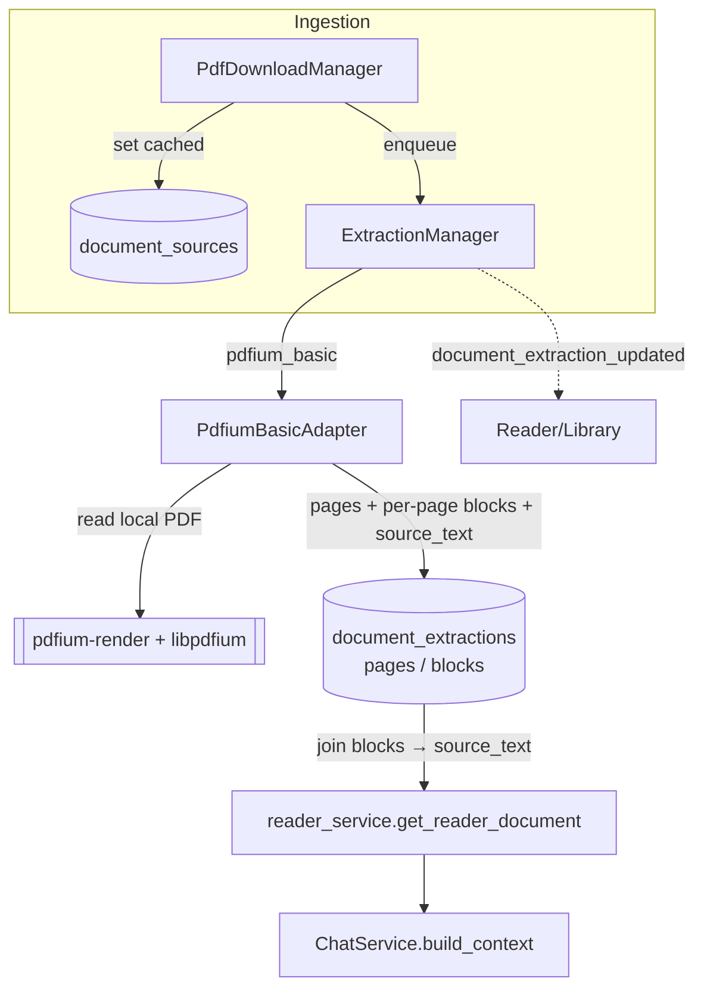

# RFC 0035: Background Text Extraction

Status: Draft
Date: 2026-06-15
Product: i0i
Target: Tauri v2 + Svelte, macOS first
Builds on: RFC 0024 (PDF ingestion + cache), RFC 0025 (extractor evaluation), RFC 0033/0034 (anchored chat threads)
Related: RFC 0036 (thread-title generation)

## Summary

Chat has no paper body to ground on. The reader/extraction data model
(`document_extractions` / `document_pages` / `document_blocks` / …) exists, but
**nothing populates it** — so `source_text` is empty for every saved paper and
the chat context is metadata + the highlighted passage only.

This RFC implements RFC 0025's lightweight first adapter: a **background
`pdfium_basic` text extractor** that runs right after a PDF is cached, reads the
local file with `pdfium-render`, and writes one text block per page into the
existing model. That fills `source_text`, so chat (and later, search) get the
real paper text. The richer **MinerU** structured pipeline stays deferred —
RFC 0025's "PDF mode is the fast path; MinerU is optional enrichment" still
holds; this is the `PdfiumBasicAdapter` it named.

## Decisions (settled before drafting)

1. **Scope = text only, to feed chat.** A `pdfium_basic` adapter that produces
   `source_text` + per-page blocks. No spans, no assets, no structured-reader
   work. MinerU is a later RFC. (Chosen: "for now just A".)
2. **Run in the background after a PDF is cached.** Chat is warm the moment a
   paper opens, even before the reader renders. Reuses the existing
   `PdfDownloadManager` queue/worker/event pattern. (Chosen: "A1".)

## Goals

- Populate `source_text` for cached PDFs via a background `pdfium_basic`
  extraction, with `document_extractions` lifecycle + events (RFC 0025).
- Pre-warm extraction off the download-complete hook; recover on startup;
  expose a manual re-extract command.
- Chat's existing `build_context` immediately benefits — no chat changes needed
  beyond what RFC 0034 already does.

## Non-Goals

- No MinerU / Docling / Marker; no spans, assets, figures, tables, equations.
- No structured-reader UI work — **PDF mode stays the only reader view**. We
  populate the DB; we do not change how the reader renders.
- No re-anchoring of existing notes/threads onto extracted spans.
- No Windows/Linux Pdfium packaging yet (macOS-first; note the seam).
- No multi-extractor selection UI (single `pdfium_basic` adapter for now).

## Design — Extraction

### Adapter: `pdfium_basic`

A pure-Rust adapter using the `pdfium-render` crate over a bundled Pdfium
native library. Given a cached `DocumentSource`, it produces the RFC 0023
`ExtractedDocument` shape, text-only:

```text
for each page p:
  page_size  -> DocumentPage { page_index, width, height }
  page_text  -> DocumentBlock { page_index, block_index: 0, reading_order: p,
                                kind: "paragraph", text,
                                source_start, source_end }   # offsets into source_text
spans  = []        # text-only: no span geometry yet
assets = []
source_text = blocks.text joined with "\n\n"   # canonical, matches reader_service today
```

One block per page keeps the adapter trivial and is enough for chat: the reader
service already builds `source_text` by joining block text, so no read-path
change is needed. `source_start/source_end` are recorded per block so a future
adapter (or note re-anchoring) can map offsets without a migration.

`extractor = "pdfium_basic"`, `extractor_version` = adapter version string,
`annotation_source_id = "pdfium_basic:{source_id}"` (stable, unique).

### Runner + lifecycle

A new `ExtractionManager`, modeled on `PdfDownloadManager` (bounded worker, a
`queued_or_active` guard, `AppHandle` for events). `DocumentExtraction.status`
follows RFC 0025: `queued → extracting → ready | failed`.

Triggers:
- **After cache:** in `pdf_ingestion.rs`, right after `set_document_source_cached`
  (the `cached source_id=…` path, ~`:352`), enqueue extraction for that source.
- **Startup recovery:** requeue sources that are `cached` but have no `ready`
  `pdfium_basic` extraction, and reset stale `extracting` rows — mirroring
  `recover_and_queue_startup_downloads`.
- **Manual:** `extract_paper_document(paper_id, source_id?, force?)` for
  re-extraction; without `source_id`, use `papers.active_source_id` or the first
  cached PDF source.

On the first `ready` extraction for a paper, set
`papers.active_extraction_id` (do not overwrite an existing one — RFC 0025).
Idempotent: skip if a `ready` `pdfium_basic` extraction already exists for the
source unless `force`; `force` **replaces** it — delete the prior extraction's
rows first (it cascades pages/blocks) so the re-insert does not collide with the
unique `annotation_source_id`. Emits `document_extraction_updated` (RFC 0025
payload) on every status change.

### Safety / limits (RFC 0025)

- Reuse `max_pdf_bytes`; add an extraction **page cap** and a **time budget**
  (extraction runs on the worker thread; cancel/abort best-effort, mark
  `failed` on overrun).
- Work in a temp dir under app data; clean partial rows on failure; **no network**.
- A crashing/oversized extraction marks `DocumentExtraction = failed` and leaves
  the cached PDF (and PDF mode) untouched.

### Native library

`pdfium-render` needs a native Pdfium (`libpdfium.dylib` on macOS). The loader
tries, in order:

1. `I0I_PDFIUM_LIBRARY_PATH`
2. `[pdf_extraction].pdfium_library_path` in `i0i.config.toml`
3. Tauri resource paths (`libpdfium.dylib`, `pdfium/libpdfium.dylib`)
4. local extractor-spike virtualenv paths, as a developer convenience
5. the system library path

Packaging should still bundle Pdfium as a Tauri resource. Windows/Linux binaries
are a packaging follow-up, not a Reader data-model change.

## Architecture



## Data Model

No new tables. Reuse `document_extractions` / `document_pages` /
`document_blocks` (FK `paper_id` cascade already covers deletes). `pdfium_basic`
writes pages + one block/page; `document_spans` / `document_assets` stay empty.
No schema migration.

## Backend Changes

- **New** `pdf_extraction.rs`: `PdfiumBasicAdapter`
  (PDF → `ExtractedDocument`, text-only) + `ExtractionManager` (queue, worker,
  status, events, startup recovery).
- **`pdf_ingestion.rs`:** enqueue extraction after a source is cached.
- **`library_store.rs`:** `insert_extraction` (extraction + pages + blocks in one
  transaction), `set_extraction_status`, set `active_extraction_id` on first
  `ready`, and a "cached sources lacking a ready extraction" query for recovery.
- **`commands/`:** `extract_paper_document`; register it + manage
  `ExtractionManager` in `lib.rs`; recover on startup.
- **`Cargo.toml`:** add `pdfium-render`; bundle `libpdfium.dylib` via Tauri
  resources.

## Frontend Changes

- Optionally listen for `document_extraction_updated` in `ReaderView` to show an
  "extracting…/ready" hint; not required for chat to work.
- No reader-render changes; no required inspector changes.

## Risks

- **Native-lib bundling.** Getting `libpdfium.dylib` resolved in dev *and* in the
  packaged `.app` is the main integration risk; isolate it behind the adapter's
  loader and verify both paths early.
- **Text quality on two-column PDFs.** `pdfium` text is plain reading-order and
  can interleave columns. Acceptable for chat grounding now; MinerU is the
  quality path later. (`source_start/end` are stored so re-anchoring stays open.)
- **In-process extraction stalls the worker.** A pathological PDF could hang the
  extraction thread; mitigate with the page cap + time budget and `failed` on
  overrun.

## Validation Plan

```bash
cargo fmt --check && cargo clippy && cargo test
pnpm check && pnpm build
```

Unit tests (TDD):
- adapter normalization on a tiny fixture PDF → expected pages/blocks/`source_text`
  (joined order, per-block offsets).
- `insert_extraction` persists extraction + pages + blocks; `get_reader_document`
  then returns non-empty `source_text`.
- first `ready` sets `active_extraction_id`; second extraction does not overwrite.
- idempotency: re-running without `force` is a no-op; `force` replaces.

Integration (manual):
- Add a paper → PDF downloads → shortly after, open it → chat footnote shows
  `Context: N chars` (not "selected passage only").
- Delete the paper → its extraction rows are gone.

## Open Questions

- **Pdfium bundling location** for the packaged app (Tauri `resources` vs.
  sidecar). Proposal: Tauri resource, resolved via the resource dir.
- **Reading order for multi-column.** Accept `pdfium` order now; revisit with
  MinerU.
