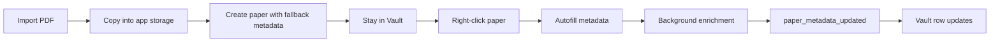

# RFC 0047: Manual Local PDF Metadata Autofill

Status: Deferred / Not Implemented
Date: 2026-07-17
Product: i0i
Target: Tauri v2 + Svelte, macOS first
Builds on: RFC 0046 (Local PDF Import With Metadata Autofill)

## Deferral Note

This RFC is deferred.

The UI trigger and backend queue path were prototyped, but the actual metadata
autofill capability is not good enough to count as implemented. In the observed
case, the worker reached the PDF and then produced:

```text
[metadata-enrichment ...] skip paper_id=... no metadata evidence
```

That means the manual command can start the worker, but the worker cannot
reliably recover title/authors/year/venue from local PDFs yet. Keeping this RFC
as "implemented" would be misleading.

Before reviving this RFC, i0i needs a stronger metadata strategy, likely one or
more of:

- better first-page/front-matter text extraction,
- DOI/arXiv/title detection from more pages,
- PDF filename plus visible text heuristics,
- LLM-assisted cleanup over extracted evidence,
- external metadata lookup from DOI/arXiv/title candidates,
- a review UI for low-confidence suggestions.

## Summary

Local PDF import should be immediate and calm:

- importing a PDF adds it to the active Vault,
- importing does not automatically open a Reader tab,
- metadata autofill is not automatic,
- the user explicitly starts metadata autofill from the paper row context menu.

This makes import feel like a stable file operation rather than a hidden agent
workflow.

## Problem

Automatic metadata enrichment has two UX problems:

1. It can silently change visible paper metadata after import.
2. It is hard to debug because the user did not explicitly start the operation.

Opening a just-imported PDF automatically has a separate problem: it steals the
workspace focus. Importing is often a collection action; reading is a separate
action.

## Decision

Metadata autofill becomes an explicit command.

The paper list context menu gains:

```text
Autofill metadata
```

The command should appear for papers that still carry the `needs-review` tag.
Clicking it queues the existing metadata enrichment worker for that paper. The
worker keeps using the same evidence-first strategy:

```text
PDF metadata / first-page text
  -> DOI lookup
  -> arXiv lookup
  -> title lookup
  -> best-effort fallback
```

When enrichment completes, the existing `paper_metadata_updated` event refreshes
the frontend library snapshot.

## Product Flow



## UX Rules

- Importing one PDF and importing many PDFs behave the same: stay in the Vault.
- Double-clicking a paper row remains the way to open the Reader.
- Right-clicking a `needs-review` paper offers `Autofill metadata`.
- While autofill is queued from the UI, the menu item can read `Autofilling...`.
- If autofill fails, keep the current fallback metadata and surface the error
  through logs / existing bridge error handling.

## Backend Shape

Add a small Tauri command:

```text
autofill_paper_metadata(paper_id)
```

The command should queue the existing `MetadataEnrichmentService` for that
paper. It should not run metadata extraction synchronously on the command path.

Remove automatic queueing from:

- local PDF import,
- app startup recovery.

## Frontend Shape

Add a bridge helper:

```text
autofillPaperMetadata(paperId)
```

Thread it through:

```text
+page.svelte
  -> VaultHome
  -> PaperList context menu
```

The UI owns only the transient "I clicked autofill" affordance. The durable
source of truth remains the paper metadata stored in SQLite.

## Risks

- Users may miss the context-menu action. This is acceptable for the first
  slice because metadata repair is optional and secondary.
- If a paper lacks a cached local PDF, the worker will fail. The command should
  preserve current metadata and log the failure.
- Later batch commands may be needed for large imports.

## Validation

- Importing a single PDF keeps the active tab on the Vault.
- Imported local PDFs still appear in the Vault with fallback metadata and
  `needs-review`.
- Right-clicking a `needs-review` paper shows `Autofill metadata`.
- Clicking it produces `[metadata-enrichment ...] queued` and `start` logs.
- Successful enrichment updates title/authors/year/venue in the Vault row.
- `cargo test`, `pnpm check`, and `git diff --check` pass.
