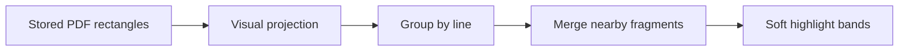

# RFC 0096: Fluid PDF Highlight Rendering

Status: Implemented (focused tests pass; manual visual verification pending)
Date: 2026-08-24
Product: i0i
Target: Tauri v2 + SvelteKit (Svelte 5), macOS first
Builds on: RFC 0027 (PDF text selection), RFC 0058 (highlight primitive),
RFC 0079 (annotation lifecycle)

## Summary

PDF highlights currently look like a stack of outlined rectangles. The anchor
is correct: browser selections naturally produce several rectangles, often one
per line or PDF text fragment. The presentation is the problem. i0i renders
every stored rectangle as a separate bordered button.

Keep the precise stored rectangles, but project them into softer visual bands
at render time. One highlight remains one logical annotation and one action
target.

## Problem

`Range.getClientRects()` describes selection geometry, not desired visual
styling. A multiline passage therefore contains multiple rectangles. This is
useful durable geometry for reopening, zooming, quote resolution, and note
navigation.

`PdfRenderedPage.svelte` currently renders each rectangle as its own button.
The resulting borders and individual corner radii expose the implementation
detail, and one annotation may create several keyboard focus stops.

## Decision

### 1. Preserve anchor geometry

`Locator::PdfRect` and `rectsJson` remain unchanged. Rendering must never
rewrite, simplify, or persist the projected geometry.

### 2. Add one visual projection

A small pure frontend function converts stored rectangles into display bands:

1. Reject malformed or empty rectangles.
2. Sort by vertical position, then horizontal position.
3. Group rectangles whose vertical spans substantially overlap.
4. Merge horizontally adjacent fragments within the same line.
5. Keep large gaps, columns, disconnected regions, and different pages apart.

Tolerances must be relative to line height. Fixed page-space tolerances behave
differently at different zoom levels and font sizes.

Rotated or otherwise unusual rectangles may pass through unchanged when they
cannot be grouped safely.

### 3. Render a passage, not boxes

Projected bands use:

- translucent fill;
- no visible border;
- a subtle `1-2px` corner radius;
- enough vertical coverage to read as marker ink without hiding glyphs.

The first implementation uses merged CSS bands. An SVG union path is deferred:
it adds geometry, hit-testing, rotation, and accessibility complexity before we
know merged bands are insufficient.

### 4. One logical interaction target

One annotation produces one keyboard focus stop and one semantic action target.
Its visual bands are presentation children. Pointer interaction anywhere in a
band opens the same annotation.

The overlay must continue to allow ordinary PDF text selection. Overlapping
annotations use the existing deterministic ordering.

### 5. Share the projection

Persisted highlights, note drafts, and citation flashes use the same geometry
projection. Color and animation may differ; the represented passage must not.

## Scope

### In scope

- PDF highlight geometry projection.
- Persisted marks, selection drafts, and citation flashes.
- One logical action target per highlight.
- Pure geometry tests and visual verification.

### Out of scope

- Changing database or locator formats.
- Reconstructing DOM ranges when reopening a PDF.
- Changing PDF.js selection behavior.
- Cross-page annotations.
- Joining columns or disconnected selections.
- Redesigning HTML-reader highlights.
- Semantic PDF extraction.

## Relevant Code

- `src/lib/features/reader/PdfRenderedPage.svelte`
- `src/lib/features/reader/highlight-colors.ts`
- `src/lib/domain/highlight.ts`
- `src-tauri/src/domain/highlight.rs`

## Risks

- Aggressive merging can bridge columns or unrelated fragments.
- Overlay hit targets can interfere with selecting text.
- Rotated text may not fit ordinary line grouping.
- Visual smoothing can hide anchoring defects if stored geometry is malformed.

The projection therefore stays pure, conservative, and reversible.

## Acceptance Criteria

- [x] A multiline highlight reads as one soft passage rather than outlined
  boxes.
- [x] Fragments on the same line merge only across normal glyph spacing.
- [x] Columns, paragraphs, large gaps, and pages remain separate.
- [x] Rendering, reopening, and recoloring never change `rectsJson`.
- [x] Highlights remain aligned at every supported zoom level.
- [x] One highlight creates one keyboard focus stop and one logical action.
- [x] Draft, persisted, and citation highlights use the same projection.
- [x] Geometry tests cover fragments, multiple lines, columns, large gaps,
  malformed rectangles, rotation fallback, and zoom independence.
- [ ] Manual visual checks cover short selections, long passages, overlapping
  marks, and two-column papers.

## Implementation Notes

Implemented on 2026-08-24. `pdf-highlight-geometry.ts` projects stored PDF
rectangles into display-only bands. `PdfRenderedPage.svelte` uses that single
projection for persisted highlights, note drafts, and citation flashes, while
retaining one semantic button per persisted highlight. Stored `rectsJson` is
never rewritten.

Focused geometry tests and the full frontend checks pass. Manual PDF visual
verification remains open.
