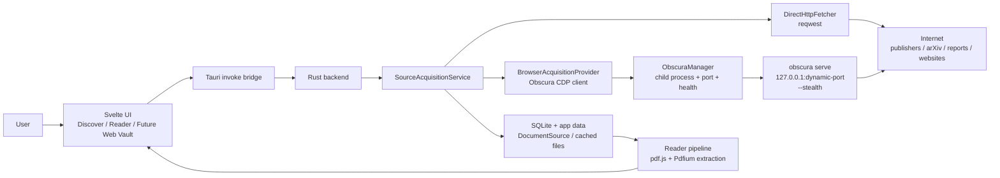
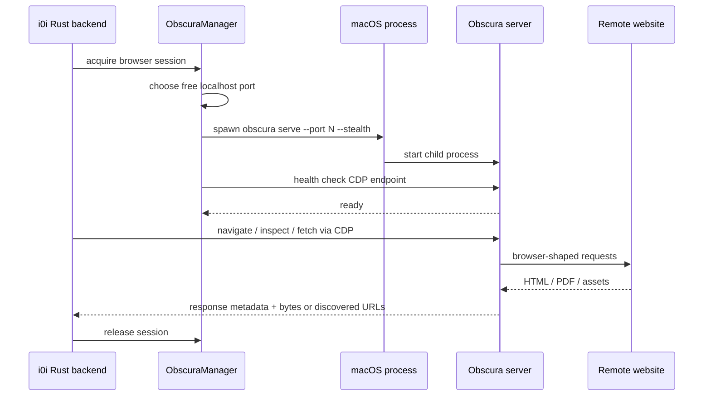
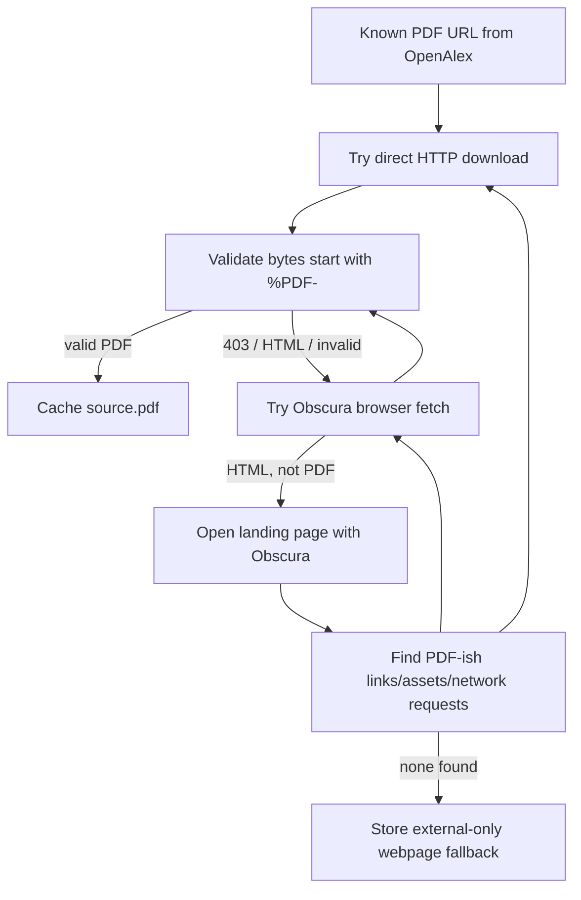

# RFC 0041: Obscura-Backed Source Acquisition

Status: Implemented baseline
Date: 2026-07-07
Product: i0i
Target: Tauri v2 + Svelte, macOS first
Builds on: RFC 0024 (PDF ingestion), RFC 0037 (deep research), RFC 0040 (Pdfium)

## Summary

Commit to **Obscura** as i0i's browser automation engine for acquiring sources
from the open web.

The immediate reason is practical: many OpenAlex PDF URLs fail through plain
HTTP because publishers block non-browser clients, redirect through landing
pages, or require JavaScript/cookies before exposing the real PDF. The larger
reason is product direction: i0i should become a knowledge IDE that can collect,
inspect, and import internet content beyond academic papers.

The decision is:

- Use **Obscura server mode** as the primary architecture.
- Run Obscura as a local **sidecar child process** owned by the Tauri backend.
- Talk to it over local Chrome DevTools Protocol (CDP) on `127.0.0.1`.
- Default browser fallback to `stealth = true`.
- Use Obscura first for blocked PDF acquisition, then expand it to general web
  content, programmable browsing, and research-agent navigation.

Plain English version: i0i starts a small local browser helper, asks it to open
pages like a browser would, watches what it loads, and saves useful sources into
the vault.

## Why Obscura

Obscura is an open-source Rust headless browser for scraping and AI-agent
automation. Its README describes a CLI, CDP server mode, Puppeteer/Playwright
compatibility, binary downloads for macOS, and `--stealth` support:

- https://github.com/h4ckf0r0day/obscura
- https://github.com/h4ckf0r0day/obscura/blob/main/LICENSE

The parts that matter to i0i:

- It can render JavaScript-backed pages.
- It can run as a CDP server.
- It can be driven by automation clients.
- It can dump HTML, text, markdown, links, assets, or original response bytes.
- It is Apache-2.0 licensed.
- It ships as a standalone binary, so i0i can manage it as a sidecar.

## Goals

- Make more OpenAlex results actually viewable by recovering PDFs that plain
  `reqwest` cannot download.
- Create a general **source acquisition** layer that is not paper-specific.
- Let future Scout/deep-research agents browse, inspect, and collect web
  content through one browser substrate.
- Keep the first implementation understandable for a Rust beginner.
- Avoid Docker or extra infrastructure for the desktop app.
- Keep Obscura replaceable behind a narrow internal interface.

## Non-Goals

- No Docker Compose requirement for the desktop app.
- No full browser UI inside i0i in this RFC.
- No user-login/session-management system yet.
- No long-term web archive format yet.
- No replacement of pdf.js, Pdfium, or MinerU.
- No attempt to solve all publisher access failures in v1.

## Key Terms

**Source acquisition**

The backend job of turning a remote URL into something i0i can store or open:
a PDF, HTML page, markdown document, dataset, or external-only link.

**Obscura sidecar**

An `obscura` executable that runs next to i0i as a separate child process. i0i
starts it, talks to it, and stops it.

**Server mode**

Obscura runs continuously:

```bash
obscura serve --port 48321 --stealth
```

i0i then sends browser automation commands to `127.0.0.1:48321`.

**CLI mode**

i0i runs one command per fetch:

```bash
obscura fetch https://example.com --dump original --stealth
```

This is simpler, but weaker for sessions, multi-step navigation, and future
agents.

## Decision: Server Mode, With CLI As Debug Fallback

Use **server mode** as the architecture.

CLI mode is allowed for:

- local debugging,
- manual spikes,
- a short-lived fallback if a CDP operation is not implemented yet.

But new product features should depend on the server-mode abstraction, not on
shelling out to `obscura fetch` everywhere.

Why server mode wins:

| Need | CLI mode | Server mode |
|---|---|---|
| Download one simple URL | Good | Good |
| Keep cookies/session | Weak | Good |
| Inspect network requests | Weak | Good |
| Click through landing pages | Awkward | Natural |
| Agentic browsing | Awkward | Natural |
| Future Playwright/Puppeteer use | No | Yes |
| Long-running research workflow | Weak | Good |
| Implementation simplicity | Best | Medium |

The tradeoff is lifecycle complexity. i0i must start, monitor, and stop the
Obscura process. That is acceptable because it creates the right foundation for
the web-acquisition vision.

## Overall Architecture



Plain English:

1. The user asks i0i to open or save something.
2. The Rust backend first tries the simple downloader.
3. If that fails, the backend asks Obscura to behave like a browser.
4. i0i saves the result as a document source.
5. The Reader opens the cached source.

## Runtime Lifecycle



`ObscuraManager` owns the process lifecycle:

- Resolve the Obscura binary path.
- Pick a free localhost port.
- Spawn `obscura serve --port <port> --stealth`.
- Wait until the server is healthy.
- Restart it if it exits unexpectedly.
- Kill it when i0i exits.
- Hide all of this from normal feature code.

## What We Need To Build

The first real implementation needs five small pieces:

| Piece | Purpose | Beginner explanation |
|---|---|---|
| `ObscuraConfig` | Reads config values | "Where is Obscura? Should stealth be on? How long do we wait?" |
| `ObscuraManager` | Owns the child process | "Start the helper browser, keep its port, stop it later." |
| `ObscuraClient` | Talks to the server | "Send browser commands to the local Obscura server." |
| `BrowserAcquisitionProvider` | Uses the browser to fetch/inspect URLs | "Turn browser work into i0i source results." |
| `SourceAcquisitionService` | Chooses HTTP vs browser fallback | "Try the cheap path first, then the browser path if needed." |

This keeps the code easy to reason about. PDF ingestion should not know how to
start Obscura. Deep research should not know where the Obscura binary lives.
They both ask `SourceAcquisitionService` for sources.

## Why Not Docker Compose

Docker Compose is the wrong default for a native desktop app.

It would require users to install Docker, keep a daemon running, and think about
ports/containers before they can read a paper. That is too much friction.

Docker may still be useful for:

- development experiments,
- CI smoke tests,
- a future cloud/server version of i0i.

For desktop i0i, Obscura is a local child process, not a container.

## Backend Module Shape

Recommended first layout:

```text
src-tauri/src/services/source_acquisition/
  mod.rs
  service.rs
  types.rs
  http.rs
  obscura/
    mod.rs
    manager.rs
    client.rs
    provider.rs
```

Beginner mental model:

- `service.rs` decides the fallback order.
- `http.rs` is the boring direct downloader.
- `obscura/manager.rs` starts and watches Obscura.
- `obscura/client.rs` knows how to ask Obscura for page/source data. The
  implemented baseline uses Obscura's documented `fetch --dump ...` commands;
  true CDP WebSocket navigation is the next deepening step.
- `obscura/provider.rs` turns browser actions into i0i source results.
- `types.rs` defines small shared structs so the rest of the app does not care
  whether bytes came from HTTP or a browser.

Sketch:

```rust
pub struct SourceAcquisitionService {
    http: DirectHttpFetcher,
    browser: BrowserAcquisitionProvider,
}

pub struct AcquiredSource {
    pub bytes: Vec<u8>,
    pub final_url: String,
    pub content_type: Option<String>,
    pub method: AcquisitionMethod,
}

pub enum AcquisitionMethod {
    DirectHttp,
    ObscuraBrowser,
    ObscuraBrowserStealth,
}
```

Keep this interface boring. The browser machinery can be complex internally,
but callers should see one simple question:

```text
Can you acquire this source for me?
```

## ObscuraManager

`ObscuraManager` should be stored in Tauri managed state, similar in spirit to
the existing background managers.

Responsibilities:

- Load config.
- Resolve binary path from config or Tauri resources.
- Start the child process lazily on first use.
- Keep the selected port and process id in memory.
- Provide the local CDP endpoint URL.
- Stop the process on app shutdown.
- Restart if the child died before a request.

Suggested fields:

```rust
pub struct ObscuraManager {
    config: ObscuraConfig,
    state: Mutex<Option<ObscuraProcess>>,
}

pub struct ObscuraProcess {
    port: u16,
    endpoint_url: String,
    child: tokio::process::Child,
}
```

This state should stay in memory. We do not need to persist "interrupted
browser state" to SQLite yet. If i0i restarts, Obscura restarts fresh.

## Config

Suggested config block:

```toml
[source_acquisition]
browser_fallback = "obscura"
prefer_browser_for_blocked_sources = true

[obscura]
enabled = true
path = ""
stealth = true
startup_timeout_ms = 10000
request_timeout_ms = 45000
port = 0
```

Meanings:

- `enabled`: allow i0i to use Obscura.
- `path`: optional explicit path to the `obscura` binary in development.
- `stealth`: pass `--stealth` when starting the server.
- `startup_timeout_ms`: how long to wait for the local server to become ready.
- `request_timeout_ms`: max time for one browser acquisition attempt.
- `port = 0`: choose a free random localhost port.

Default:

```toml
stealth = true
```

## Binary Packaging

Development:

```text
i0i.config.toml -> [obscura].path = "/Users/.../obscura"
```

Production:

```text
src-tauri/resources/obscura/obscura
```

The Obscura binary should be treated like Pdfium:

- install via setup script,
- do not commit large binaries to git,
- bundle it as a Tauri resource for app builds,
- keep the path configurable.

Setup script:

```text
scripts/setup_obscura.sh
```

## Where Obscura Is Used

### 1. Blocked PDF Acquisition

First concrete use.



Fallback order:

1. Try direct HTTP.
2. If blocked, try Obscura on the PDF URL.
3. If that returns HTML, use Obscura on the landing page.
4. Inspect links/assets/network requests for likely PDF URLs.
5. Retry direct HTTP or Obscura on discovered URLs.
6. If no PDF works, store an external webpage fallback.

Success still requires byte validation:

```text
bytes start with "%PDF-"
```

Do not trust the URL extension or content type alone.

### 2. Open Discovery Candidates Inside i0i

If a candidate has no usable PDF but has a landing page, i0i should still be
able to open a browser-acquired representation later:

- cached HTML,
- extracted readable text,
- markdown,
- screenshot/preview,
- external URL.

This is future work, but the acquisition layer should not assume everything is a
PDF.

### 3. Deep Research / Scout

Scout can use Obscura for:

- opening web search results,
- reading reports,
- collecting citations from landing pages,
- checking publisher pages,
- importing non-paper sources,
- verifying that a discovered URL actually contains relevant content.

### 4. General Web Content

Later i0i journeys need more than papers:

- lyrics and song explanations,
- financial reports and filings,
- news/social posts,
- tutorials and video pages,
- cultural history articles,
- product or dataset pages.

Obscura should be the browser substrate for all of those.

## Making It Expandable

Do not let PDF ingestion call Obscura directly.

Instead:

```text
PDF ingestion
  -> SourceAcquisitionService
      -> DirectHttpFetcher
      -> BrowserAcquisitionProvider
          -> ObscuraManager
          -> ObscuraClient
```

That gives us room to add:

- a future Chrome provider,
- a future WebKit provider,
- a cloud browser provider,
- Playwright/Puppeteer-driven sessions,
- user-visible browsing workflows,
- agent-controlled browsing.

Suggested trait:

```rust
pub trait BrowserRuntime {
    async fn ensure_ready(&self) -> Result<BrowserEndpoint>;
    async fn fetch_original(&self, url: &str) -> Result<BrowserFetchResult>;
    async fn inspect_page(&self, url: &str) -> Result<PageInspection>;
}
```

`ObscuraRuntime` is the first implementation.

Future programmable browsing can attach to the same endpoint:

```text
ObscuraManager
  -> ws://127.0.0.1:<port>/devtools/browser
  -> CDP client
  -> future Playwright/Puppeteer-style control
```

We should not require Node.js just to use Obscura from Rust. But the CDP shape
keeps Playwright/Puppeteer possible for prototypes, tests, or agent scripts.

## Data We Should Store

For every acquisition attempt, store enough provenance to debug later:

```text
document_sources
  source_url
  final_url
  source_kind: pdf | html | markdown | external
  acquisition_method: direct_http | obscura_browser | obscura_browser_stealth
  status: remote_available | downloading | cached | failed | external_only
  error
```

Optional future table:

```text
source_acquisition_attempts
  id
  source_id
  attempted_url
  method
  status
  http_status
  content_type
  final_url
  error
  created_at
```

This table is not required for the first implementation, but it would make the
system much easier to debug.

## Error Model

Use precise errors. Avoid "PDF not available" for everything.

Examples:

```text
direct_http_forbidden
browser_returned_html
browser_timeout
browser_process_unavailable
no_pdf_link_found_on_landing_page
downloaded_bytes_not_pdf
```

User-facing text can stay simple, but backend logs and stored errors should be
specific.

## Security And Practical Boundaries

This RFC is about reliability and browser-shaped access. Obscura should help i0i
access content that a browser can reach, especially when simple HTTP is blocked.

Practical rules:

- Bind Obscura only to `127.0.0.1`, never public interfaces.
- Use random free ports by default.
- Kill the child process on app shutdown.
- Time out slow pages.
- Limit concurrent browser acquisitions.
- Store logs that make failures debuggable.
- Do not persist cookies or sessions until a later explicit design.

## Milestones

These milestones are ordered so each one proves exactly one new capability.

### Milestone 1: Obscura Starts Under i0i

Goal: i0i can start and stop Obscura as a child process.

Done when:

```text
pnpm tauri dev
  -> Rust starts obscura serve --port <random> --stealth
  -> health check passes
  -> app shutdown kills Obscura
```

No PDF fetching yet. This milestone only proves lifecycle management.

### Milestone 2: Browser Fetch One URL

Goal: Rust can ask Obscura to open one URL and return basic page information.

Expected debug response:

```text
url
final_url
title
content_type
html/text snapshot
```

Done when a temporary/debug command can fetch `https://example.com` through
Obscura and show the result in logs or a small debug UI.

### Milestone 3: Recover One Blocked PDF

Goal: take one known OpenAlex PDF URL that fails through direct HTTP and make
Obscura acquire it.

Flow:

```text
reqwest fails
  -> Obscura opens URL
  -> i0i gets PDF bytes or discovers final PDF URL
  -> validate %PDF-
  -> cache source.pdf
  -> Reader opens it
```

This is the first real product win.

### Milestone 4: Landing Page PDF Discovery

Goal: if the OpenAlex `pdf_url` fails, open the `landing_page_url`, inspect the
page, and find PDF candidates.

Inputs to inspect:

```text
links
assets
network requests
final redirected URL
```

Done when a publisher landing page with a discoverable PDF link can become a
cached PDF source.

### Milestone 5: Store Acquisition Provenance

Goal: every source records how it was acquired.

Example:

```text
acquisition_method = direct_http | obscura_browser | obscura_browser_stealth
final_url = ...
error = ...
```

Done when the Reader/debug logs can explain why a source is cached, failed, or
external-only without guessing.

### Milestone 6: General Web Source Spike

Goal: prove Obscura is not just a PDF patch.

Import one normal webpage as:

```text
source_kind = html or markdown
title
url
text/html snapshot
```

The Reader does not need perfect web rendering yet. This milestone proves that
i0i can collect general web knowledge.

Recommended order:

```text
1. Managed Obscura process
2. Debug fetch command
3. One blocked PDF end-to-end
4. Landing-page PDF discovery
5. Provenance storage
6. General webpage import spike
```

## Implementation Plan

## Baseline Implementation Notes

The implemented baseline follows the server-mode architecture while keeping
browser operations intentionally small:

- `ObscuraManager` owns `obscura serve --host 127.0.0.1 --port <free> --stealth`.
- `ObscuraBrowserRuntime` implements i0i's `BrowserRuntime` boundary.
- `ObscuraClient` uses Obscura CLI `fetch --dump original/html/text/links/assets`
  as a bootstrap fallback until a full CDP WebSocket client is added.
- PDF ingestion now calls `SourceAcquisitionService`.
- Document sources persist `landing_url`, `final_url`, and
  `acquisition_method`.
- Debug commands exist for `debug_obscura_start` and `debug_obscura_fetch`.

Next deepening step: replace the CLI bootstrap inside `ObscuraClient` with true
CDP navigation and network-response capture.

### Phase 1: Managed Obscura Process

- Add `ObscuraConfig`.
- Add `ObscuraManager`.
- Resolve binary path from config or bundled resource.
- Start `obscura serve --port <free> --stealth`.
- Health-check local CDP endpoint.
- Stop process on app shutdown.

Validation:

```text
i0i can start Obscura, get an endpoint, and stop it cleanly.
```

### Phase 2: Browser PDF Fallback

- Add `SourceAcquisitionService`.
- Move direct PDF download behind `DirectHttpFetcher`.
- Add `ObscuraBrowserFetcher`.
- Use Obscura only after direct HTTP fails or returns non-PDF bytes.
- Validate `%PDF-` before caching.

Validation:

```text
Known blocked OpenAlex URLs either cache a PDF or store a precise fallback error.
```

### Phase 3: Landing Page Inspection

- When PDF URL fails, open the landing page.
- Collect links, assets, and network requests.
- Score likely PDF URLs.
- Retry acquisition on likely PDF URLs.

Validation:

```text
Publisher landing pages with discoverable PDF links can become cached PDFs.
```

### Phase 4: General Web Content

- Add non-PDF source kinds.
- Cache HTML/markdown/text from Obscura.
- Let Reader or a future Web Reader open them.

Validation:

```text
i0i can import a normal webpage as a vault source.
```

### Phase 5: Agentic Browsing

- Expose safe browser primitives to Scout:
  `navigate`, `snapshot`, `links`, `assets`, `network_requests`, `extract_text`.
- Keep the browser endpoint internal to Rust unless a later RFC chooses otherwise.

Validation:

```text
Scout can inspect web pages without hardcoding Obscura details.
```

## Open Questions

- Should we bundle Obscura immediately, or first require `[obscura].path` in dev?
- Should browser sessions share cookies during one app session?
- Should failed PDF acquisition automatically store an HTML source, or only an
  external link?
- Which CDP client crate should we use from Rust?
- Do we need a visible "browser acquisition in progress" UI state, or is the
  existing document source status enough for v1?

## Recommended First Slice

Build the smallest server-mode slice:

```text
ObscuraManager starts server
  -> SourceAcquisitionService asks it to fetch one URL
  -> result is validated as PDF or rejected with precise error
```

Do not implement the full agentic browsing stack first. The first win should be
blocked OpenAlex PDFs becoming readable.

## References

- Obscura repository: https://github.com/h4ckf0r0day/obscura
- Obscura license: https://github.com/h4ckf0r0day/obscura/blob/main/LICENSE
- RFC 0024: `docs/rfcs/reader/0024-pdf-ingestion-and-cache.md`
- RFC 0037: `docs/rfcs/discovery/0037-deep-research-scout-agent.md`
- RFC 0040: `docs/rfcs/reader/0040-bundle-pdfium-resource.md`
