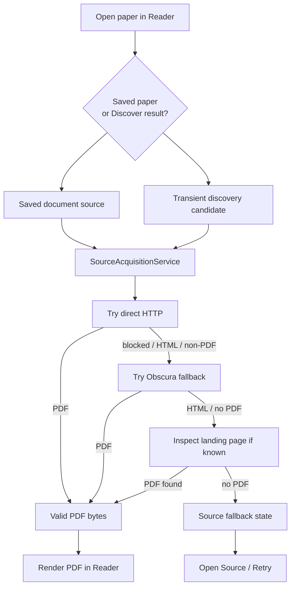

# RFC 0042: Unified PDF Acquisition And Source Fallback

Status: Draft
Date: 2026-07-08
Product: i0i
Target: Tauri v2 + Svelte, macOS first
Builds on: RFC 0029 (Open Discovery Candidates In Reader), RFC 0041 (Obscura-Backed Source Acquisition)

## Summary

Make every PDF opening path in i0i use the same backend acquisition pipeline.

Right now saved vault papers use `SourceAcquisitionService`, which can fall back
from direct HTTP to Obscura. Transient Discover previews still use a direct
`reqwest` download inside `ReaderService`, so publisher blocks still surface as
old `403 Forbidden` errors.

The decision is:

- Any PDF opened in the Reader must go through `SourceAcquisitionService`.
- This includes transient Discover results, not only saved vault papers.
- If i0i cannot acquire PDF bytes, the Reader should still open a simple source
  fallback state with an "Open Source" action.
- Keep failure UX simple for now. Do not introduce a detailed failure taxonomy
  until real usage proves it is needed.

Plain English version: i0i should try hard to open the PDF automatically. If it
cannot, it should help the user visit the publisher page manually.

## Problem

There are currently two PDF acquisition paths:

```text
Saved vault paper
  -> PdfDownloadManager
  -> SourceAcquisitionService
  -> direct HTTP
  -> Obscura fallback

Transient Discover preview
  -> ReaderService::cache_discovery_pdf
  -> direct HTTP only
```

This creates confusing behavior. A paper may fail when opened from Discover,
but work after being saved to a vault because only the saved-paper path uses
Obscura.

That violates the product expectation:

```text
If i0i shows a paper result, the user should be able to open it in i0i.
```

## Goals

- Use one PDF acquisition pipeline everywhere.
- Make transient Discover results benefit from Obscura fallback.
- Keep temporary discovery PDFs in the temporary Reader cache, not durable vault
  storage.
- If automatic acquisition fails, show a useful fallback with the source link.
- Keep the user-facing failure explanation short.
- Keep exact technical errors available in logs and `pdf_error` for debugging.

## Non-Goals

- No complex failure taxonomy yet.
- No browser-login/session-management feature yet.
- No guarantee that every publisher PDF can be downloaded automatically.
- No full webpage Reader in this RFC.
- No persistent HTML/archive fallback yet.
- No change to pdf.js rendering or note anchoring.

## Product Rule

Every paper opened from Discover or the vault should resolve to one of two
Reader states:

```text
1. PDF view
   i0i acquired valid PDF bytes and cached them.

2. Source fallback
   i0i could not acquire PDF bytes automatically, so it opens a simple
   fallback state with a source link.
```

The fallback is intentionally modest:

```text
PDF could not be opened automatically.

The publisher may require login, browser verification, or manual access.

[Open Source] [Retry]
```

The source link should prefer:

```text
landing page / external URL
  -> PDF URL
  -> no link
```

## Proposed Backend Change

Inject `SourceAcquisitionService` into `ReaderService`.

Current shape:

```rust
pub struct ReaderService {
    app: AppHandle,
    store: LibraryStore,
    client: reqwest::Client,
}
```

New shape:

```rust
pub struct ReaderService {
    app: AppHandle,
    store: LibraryStore,
    source_acquisition: SourceAcquisitionService,
}
```

Then change transient discovery PDF caching from:

```text
cache_discovery_pdf(source_id, pdf_url)
  -> direct reqwest download
```

to:

```text
cache_discovery_pdf(source_id, pdf_url, landing_url)
  -> SourceAcquisitionService::acquire_pdf(pdf_url, landing_url, max_bytes)
```

The resulting bytes are still written to the existing temporary discovery cache:

```text
app_cache_dir/reader/discovery/<source_id>/source.pdf
```

## Flow



## Reader Document Contract

Keep the existing `ReaderDocument` surface mostly intact.

Immediate fields:

```text
pdf_local_path: Some(...) when PDF acquisition succeeds
pdf_error: Some(...) when acquisition fails
pdf_source_url: original PDF URL when known
```

If the current `DiscoveryReaderCandidate` already carries a landing/external
URL, `ReaderService` should pass it to `SourceAcquisitionService`. If that field
is not currently present in the Rust Reader candidate type, add it.

Suggested small addition if needed:

```rust
pub struct DiscoveryReaderCandidate {
    pub pdf_url: Option<String>,
    pub external_url: Option<String>,
    ...
}
```

The UI can derive the fallback link from:

```text
external_url / landing URL
  else pdf_source_url
```

If a dedicated field is clearer later, add it then. Do not expand the model
more than needed for this slice.

## UI Behavior

When `pdf_local_path` exists:

```text
show PDF viewer
```

When `pdf_local_path` is missing and `pdf_error` exists:

```text
show compact source fallback
```

User-facing copy should be short:

```text
PDF could not be opened automatically.
The publisher may require login, browser verification, or manual access.
```

Actions:

```text
Open Source
Retry
```

`Open Source` opens the landing/source URL externally. `Retry` calls the same
Reader document load again, so it re-runs acquisition unless a cached PDF now
exists.

The exact backend error can be shown in a subdued debug/detail area later, but
it should not dominate the normal Reader UI.

## Files Likely Affected

- `src-tauri/src/services/reader_service.rs`
- `src-tauri/src/lib.rs`
- `src-tauri/src/domain/reader.rs`
- `src-tauri/src/commands/reader.rs`
- `src/lib/domain/reader.ts`
- Reader UI component that currently renders `pdf_error`

## Risks

- Discover previews may feel slower when Obscura fallback runs.
- Obscura may start more often, so logs must make acquisition attempts visible.
- Passing only a PDF URL is less effective than passing both PDF URL and landing
  URL.
- Retrying can repeatedly hit blocked publishers if we do not cache failure
  state. For this slice, that is acceptable.

## Validation

Add backend tests for transient discovery acquisition:

```text
Discovery direct PDF succeeds
  -> temp PDF is cached

Discovery direct HTTP returns 403
  -> SourceAcquisitionService browser fallback is used
  -> temp PDF is cached when browser returns PDF

Discovery direct HTTP returns HTML
  -> SourceAcquisitionService browser fallback is used
  -> temp PDF is cached when browser returns PDF

Discovery PDF and landing-page recovery fail
  -> ReaderDocument has no pdf_local_path
  -> ReaderDocument keeps pdf_error and source URL
```

Manual validation:

```text
1. Run pnpm tauri dev.
2. Search Discover for a paper whose OpenAlex PDF URL returns a publisher block.
3. Open it directly from Discover.
4. Confirm Obscura starts when direct HTTP fails.
5. Confirm recovered PDFs render in Reader.
6. Confirm unrecovered PDFs show Open Source / Retry instead of raw 403 noise.
```

Commands:

```bash
cargo test source_acquisition
cargo test reader_service
cargo test
pnpm check
```

## Open Questions

- Should `Retry` always bypass an existing failure, or should it first clear a
  temporary error state?
- Should "Open Source" open the system browser, an i0i browser tab, or both
  later?
- Should failed discovery preview attempts be cached briefly to avoid repeated
  Obscura runs while scrolling results?

## Implementation Order

1. Pass `SourceAcquisitionService` into `ReaderService`.
2. Add landing/external URL to `DiscoveryReaderCandidate` if missing.
3. Replace direct discovery PDF download with `SourceAcquisitionService`.
4. Preserve temporary cache semantics.
5. Simplify Reader PDF failure UI to show `Open Source` and `Retry`.
6. Add regression tests for transient Discover PDFs.

