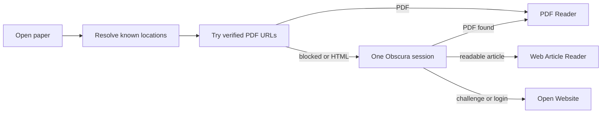

# RFC 0052: Reliable Obscura Sessions And Web Reader Fallback

- Status: Superseded
- Date: 2026-07-18
- Area: Source acquisition / Reader
- Builds on: RFC 0041, RFC 0042, RFC 0051
- Extended by: RFC 0097 (research-connected chat), RFC 0098 (browser-first
  scholarly discovery)
- Superseded by: RFC 0056, RFC 0065, RFC 0100, RFC 0102, RFC 0103, RFC 0105,
  and RFC 0106

## Supersession Note

Superseded on 2026-08-28. Its managed Obscura session, lifecycle, stealth
packaging, and diagnostics were delivered by RFCs 0100–0106. Its HTML
acquisition, durable snapshots, Reader rendering, annotations, chat, and
external-source handoff were delivered by RFCs 0056 and 0065.

The original umbrella RFC is no longer an active implementation unit. Any
remaining ideas—structured acquisition traces, deterministic Reader challenge
classification, broader OpenAlex `locations[]` coverage, automatic HTML
fallback, and a protected-PDF cookie integration test—require separate focused
RFCs before implementation.

## Summary

i0i currently treats "open this paper" as "obtain PDF bytes." That is too
narrow. A publisher may expose a readable HTML article while blocking its PDF,
and a browser challenge may require the user's normal browser session.

The proposed Reader resolution order is:

1. Open a verified PDF in the PDF Reader.
2. Otherwise, show a captured readable web article in i0i.
3. Otherwise, show a compact fallback that opens the source website.

Keep Obscura, but replace the current one-shot CLI adapter with a real,
session-backed integration. The managed Obscura server must be the browser we
actually use.

## Diagnosis

### Reproduction: OpenAlex W4409589274

Paper:

```text
LIBERTOPIA: An Intellectual Stroll in Berlin's Tempelhof Park
DOI: 10.1111/1468-2427.13346
```

OpenAlex returns:

```text
landing page: https://doi.org/10.1111/1468-2427.13346
PDF: https://onlinelibrary.wiley.com/doi/pdfdirect/10.1111/1468-2427.13346
OA status: hybrid
repository full text: none
```

The PDF URL currently returns `403`, `content-type: text/html`, and
`cf-mitigated: challenge`. A live run with the bundled Obscura 0.1.9 binary
produced only Cloudflare links for the landing page. Running the same URL with
`--dump original` returned the Cloudflare "Just a moment" HTML, not PDF bytes.

This reproduces the user-visible failure. It is not an incorrect OpenAlex URL:
the publisher is challenging automated requests to a real PDF endpoint.

### Root Cause 1: The Managed Obscura Server Is Not Used

`ObscuraManager::ensure_ready()` starts:

```text
obscura serve --host 127.0.0.1 --port <port> --stealth
```

But `ObscuraClient` does not connect to that server. Every operation launches a
new child process:

```text
obscura fetch <url> --dump <kind> --stealth
```

The server is therefore only health-checked. It contributes no browser state
to acquisition.

Consequences:

- no shared cookies between attempts;
- no shared browser context between page inspection and PDF fetch;
- no useful session for login or browser verification;
- no live network-event history from the managed browser;
- extra startup work without the reliability benefit server mode promised.

### Root Cause 2: "Original" Is Not A Browser Download

The bundled Obscura help describes `--dump original` as a raw HTTP response
that bypasses the browser and JavaScript layer. Our method named
`browser_fetch_original()` therefore does not perform the browser-shaped fetch
its name suggests.

For a JavaScript challenge, it predictably receives challenge HTML just like a
normal backend HTTP client.

### Root Cause 3: Page Inspection Is Fragmented And Incomplete

`inspect_page()` runs four independent Obscura processes for HTML, text, links,
and assets. A session that receives or passes a cookie cannot help the next
command. `PageInspection.network_urls` is always empty even though the
acquisition algorithm ranks network-observed URLs first.

PDF discovery then accepts only URLs containing `.pdf` or `/pdf`, capped at
five. It can miss:

- download buttons backed by JavaScript;
- URLs without a PDF-looking path;
- form submissions;
- relative links;
- responses discovered only from browser network events.

### Root Cause 4: HTML Success Is Classified As Failure

`SourceAcquisitionService` only succeeds when response bytes start with
`%PDF-`. `BrowserPageSnapshot` and `acquire_web_page()` already exist, but the
Reader does not consume them.

As a result, these two cases look the same to the user:

```text
The publisher article loaded successfully as HTML.
The browser loaded only a challenge or login page.
```

Both become "PDF could not be opened automatically."

### Root Cause 5: Provider Coverage Is Still Narrow

OpenAlex search normalization keeps only `best_oa_location` and
`primary_location`. It does not request or retain `locations[]`. RFC 0051 adds
Unpaywall resolution, but alternate OpenAlex locations remain deferred.

This is not the cause for W4409589274 because OpenAlex reports no repository
full text for that paper. It is still a general source-recovery gap.

### Reliability Verdict

The current Obscura path is a useful prototype, not a reliable browser
fallback. Unit tests prove orchestration against fakes, but no test exercises
the real Obscura adapter, shared session state, a challenge page, or HTML Reader
fallback.

## Product Decision

Paper viewing is content negotiation, not PDF-only acquisition.



The UI should use these states:

| State | Reader behavior |
| --- | --- |
| PDF ready | Open the existing PDF Reader. |
| Web article ready | Open a readable web snapshot inside i0i. |
| Acquiring | Show progress and keep `Open Website` available. |
| User action required | Show `Open Website` and `Retry`. |

Do not show raw publisher HTML errors as the main UI. Keep the technical trace
in logs/details.

## Proposed Backend Design

### 1. Use One Real Obscura Session

Connect `ObscuraClient` to the WebSocket endpoint returned by
`ObscuraManager::ensure_ready()` and use the same browser context for one
acquisition attempt.

The session should:

1. enable page and network observation;
2. navigate to the best landing page;
3. wait within the existing overall deadline;
4. collect final URL, title, DOM links, network response URLs, cookies, HTML,
   readable text/Markdown, and response content types;
5. try PDF candidates using the same session cookies, user agent, and referrer;
6. close the page/context when the attempt finishes.

If Obscura's CDP subset cannot return a binary response body, replay the PDF
request through `reqwest` with the session cookies, user agent, and referrer.
Do not use `--dump original` as the browser fallback.

The initial implementation should use either CDP server mode or one-shot CLI
mode, not both. Server mode is preferred because i0i already owns its lifecycle
and future login/session features need it.

### 2. Return A Reader Acquisition Outcome

Keep existing PDF-only ingestion APIs for durable PDF jobs. Add a Reader-facing
method that can return more than one usable source:

```rust
enum ReaderAcquisitionOutcome {
    Pdf(AcquiredSource),
    Web(ReadableWebSource),
    UserActionRequired {
        source_url: String,
        reason: UserActionReason,
    },
}
```

`UserActionReason` is primarily for behavior and logs. The initial UI may keep
one simple message rather than exposing a detailed taxonomy.

Suggested web source:

```rust
struct ReadableWebSource {
    canonical_url: String,
    title: Option<String>,
    markdown: String,
    plain_text: String,
    content_hash: String,
    acquired_at: String,
    acquisition_method: AcquisitionMethod,
}
```

### 3. Classify Browser Pages

Classify a snapshot before accepting it as an article:

```text
Readable article
  sufficient body text
  meaningful title
  article/main content or equivalent semantic structure
  not a known challenge/login/error page

User action required
  Cloudflare/Turnstile/CAPTCHA markers
  login/subscription form without article body
  access-denied/error page
  insufficient content
```

This classifier must be deterministic and testable. Do not ask an LLM whether
a page is a challenge.

### 4. Preserve An Acquisition Trace

Today the last error can overwrite more useful earlier evidence. Record one
structured trace per acquisition:

```text
attempt id
stage and method
URL and final URL
host
duration
status/content type
bytes
classification
error code
```

Emit concise progress to the Reader, and log the complete trace with one shared
attempt id. This lets us answer whether direct HTTP, a resolver, Obscura, or
page classification failed.

### 5. Retain More Locations

Request and normalize OpenAlex `locations[]`, then pass all unique PDF and
landing URLs into the existing location plan. Keep Unpaywall and arXiv ahead of
publisher copies.

This improves general hit rate but must remain separate from HTML fallback: a
paper with no alternate copy should still be readable from its article page.

## Proposed Reader Design

Add an optional web document to `ReaderDocument` rather than replacing the
existing PDF model:

```text
ReaderDocument
  pdfLocalPath?: string
  webDocument?: ReaderWebDocument
  sourceUrl?: string
```

Render in this order:

```text
cached PDF
  -> readable web document
  -> acquiring state
  -> website handoff
```

Create a focused `WebArticlePage.svelte` that renders sanitized Markdown or
sanitized HTML. Do not iframe the publisher page inside the Svelte webview:

- many publishers set `X-Frame-Options` or restrictive CSP;
- arbitrary publisher scripts would run inside the Reader surface;
- layout, navigation, and note anchoring would be unstable;
- challenge and login state would still not be shared with Obscura.

The first web Reader should preserve headings, paragraphs, lists, links, code,
tables, and images when they can be cached safely. Pixel-identical publisher
layout is not a goal.

When the browser classifies a challenge or login page, keep the current compact
fallback:

```text
This source needs to be opened on its website.

[Open Website] [Retry]
```

An interactive in-app browser with user login and "capture this source" is a
valuable follow-up, but not part of this RFC. The system browser remains the
reliable human escape hatch.

## Caching And Save Behavior

Transient discovery web snapshots belong in:

```text
app_cache_dir/reader/discovery/<source-id>/source.md
app_cache_dir/reader/discovery/<source-id>/metadata.json
```

When a candidate is saved to a vault, promote a usable web snapshot to a
durable `document_source` with `source_kind = "web"`, just as cached discovery
PDFs are promoted today. Keep the canonical source URL and content hash.

Annotations on web snapshots are deferred to a follow-up. When added, anchor
them to the snapshot's content hash plus text quote/prefix/suffix; do not reuse
PDF rectangle anchors.

## Files Likely Affected

- `src-tauri/src/services/source_acquisition/obscura/manager.rs`
- `src-tauri/src/services/source_acquisition/obscura/client.rs`
- `src-tauri/src/services/source_acquisition/obscura/provider.rs`
- `src-tauri/src/services/source_acquisition/types.rs`
- `src-tauri/src/services/source_acquisition/service.rs`
- `src-tauri/src/services/source_acquisition/locations.rs`
- `src-tauri/src/commands/discovery/providers/openalex/remote.rs`
- `src-tauri/src/commands/discovery/providers/openalex/normalize.rs`
- `src-tauri/src/services/reader_service.rs`
- `src-tauri/src/domain/reader.rs`
- `src/lib/domain/reader.ts`
- `src/lib/features/reader/ReaderView.svelte`
- new `src/lib/features/reader/WebArticlePage.svelte`
- storage files if durable web-source promotion is included in the same slice

## Milestones

### Milestone 1: Honest Obscura Adapter

- Connect to the managed server instead of spawning disconnected fetches.
- Use one context per acquisition attempt.
- Populate real final URL and network URLs.
- Record structured acquisition traces.
- Remove or rename misleading `browser_fetch_original()` behavior.

Exit criterion: an integration test proves that a cookie set during landing
navigation is used for a discovered PDF request.

### Milestone 2: Typed Reader Outcomes

- Add `ReaderAcquisitionOutcome`.
- Distinguish PDF, readable article, and user-action-required states.
- Add deterministic challenge/article fixtures.

Exit criterion: valid article HTML is no longer reported as a PDF failure.

### Milestone 3: Web Article Reader

- Cache readable Markdown/HTML snapshots.
- Render them inside the Reader.
- Preserve the source URL and `Open Website` action.
- Promote snapshots when a discovery candidate is saved.

Exit criterion: a paper with no obtainable PDF but a readable article opens in
i0i without leaving the workspace.

### Milestone 4: Wider Location Coverage

- Retain OpenAlex `locations[]`.
- Merge and deduplicate all landing/PDF locations.
- Add host and location provenance to traces.

Exit criterion: repository copies are tried before browser automation whenever
OpenAlex or Unpaywall knows them.

## Risks

- Obscura 0.1.9 may not implement enough CDP response-body functionality for
  binary downloads. Cookie-aware replay through `reqwest` is the fallback.
- A stealth browser cannot guarantee passage through Cloudflare, CAPTCHA, or
  authentication. The product must retain a human website handoff.
- Rendering raw remote HTML is unsafe. Only sanitized, script-free content may
  enter the Reader DOM.
- Article extraction may omit publisher-specific interactive figures. Keep the
  original source one click away and test common publishers before broadening
  claims.
- Web snapshots can become stale. Store acquisition time and content hash.

## Validation Plan

Backend fixtures:

```text
direct PDF -> Pdf outcome
landing page + PDF link -> Pdf outcome
landing sets cookie + protected PDF -> Pdf outcome using same session
readable HTML with no PDF -> Web outcome
Cloudflare-like challenge HTML -> UserActionRequired
login page -> UserActionRequired
multiple OpenAlex locations -> repository copy ranked before publisher
```

Real-adapter smoke tests, kept separate from deterministic CI:

```text
simple JavaScript article
public PDF discovered from a landing page
Wiley DOI 10.1111/1468-2427.13346
one known Cloudflare-protected publisher
```

The Wiley smoke test passes if it produces either a PDF/Web outcome or an
honest `UserActionRequired` outcome within the time budget. It must never claim
that Cloudflare challenge HTML is a readable article.

Frontend checks:

```text
PDF opens exactly as today
web article opens automatically when PDF acquisition fails
challenge/login shows Open Website without raw error noise
Retry reruns acquisition
source URL is always visible/actionable
```

Commands:

```bash
cargo test source_acquisition
cargo test reader_service
cargo test
pnpm check
```

## References

- Obscura: https://github.com/h4ckf0r0day/obscura
- OpenAlex work: https://api.openalex.org/works/W4409589274
- Wiley article: https://onlinelibrary.wiley.com/doi/10.1111/1468-2427.13346
