# RFC 0100: Eager Obscura Startup And Discovery Gate

- Status: Implemented (automated verification passes; live UI verification pending)
- Date: 2026-08-24
- Area: Source acquisition / Discovery
- Builds on: RFC 0052, RFC 0098

## Summary

Start the managed Obscura browser as soon as i0i starts. Discover remains
visible while it boots, but Find is disabled and the result area clearly shows
that the browser is starting. Every backend caller shares the same startup
attempt instead of launching competing Obscura processes.

The rest of i0i must remain usable while the browser starts.

```mermaid
stateDiagram-v2
  [*] --> Starting: app starts
  Starting --> Ready: CDP health check succeeds
  Starting --> Failed: process exits or times out
  Failed --> Starting: Retry
  Ready --> Starting: process died; restart on demand
```



## Problem

Browser-first discovery can currently fail with:

```text
browser_process_unavailable: Obscura did not become healthy within 10000 ms
```

The application starts Obscura only when the first browser operation arrives.
The user therefore pays browser startup latency after pressing Find and sees no
useful readiness state beforehand.

There is also a startup race in `ObscuraManager::ensure_ready()`. It checks the
shared process state while holding a mutex, releases that mutex, and only then
spawns and health-checks the process. Concurrent Quick Search expansions, Deep
Research lanes, chat web search, or source acquisition can all observe an empty
state and begin separate startup attempts. The existing integration test covers
one caller and passes; it does not cover concurrent first callers.

Finally, child-process output and early exit are not reflected in the reported
failure. A crashed process is therefore presented as a generic ten-second
timeout.

## Decision

### 1. Start Obscura during application setup

After Tauri has initialized shared services, spawn one asynchronous browser
startup task. Do not block the main window or vault/reader initialization.

Starting i0i does not guarantee that browser-backed features are immediately
ready. It guarantees that startup has already begun before the user reaches
Discover.

### 2. Make startup single-flight

Only one caller may spawn and health-check Obscura at a time. Other callers
await that same startup result and then reuse the managed process.

Use a small explicit lifecycle:

```text
stopped -> starting -> ready
                    -> failed
```

The implementation may use a dedicated startup mutex plus shared status. It
must not hold unrelated application locks while waiting for browser startup.
After a ready process exits, the next startup request moves the lifecycle back
to `starting` and performs one new attempt.

### 3. Expose browser readiness to the frontend

Add a narrow Tauri command returning:

```text
state: starting | ready | failed
message?: string
```

The Discover surface reads the current state when it mounts and follows status
changes. Prefer one lifecycle event over frequent polling. The event and the
snapshot command use the same payload.

### 4. Gate Find, not the whole application

While `starting`:

- keep the Discover query and settings editable;
- disable Find;
- retain the button's stable dimensions and show a progress spinner;
- show `Starting browser...` in the empty result area;
- show the same stage in the right-hand Discover inspector.

When `ready`, enable Find without requiring another user action.

When `failed`, keep Find disabled and show one compact failure state with a
Retry command. The technical process error belongs in logs or expandable
details; the primary UI should say that the browser could not start.

This is not a global loading screen. Reading papers, managing vaults, notes,
and local search remain available.

### 5. Preserve backend correctness

The frontend gate improves timing and clarity but is not a correctness
boundary. Any backend browser operation may still call `ensure_ready()` and
must await the shared startup attempt. Calls from chat, Deep Research, or
source acquisition cannot bypass the lifecycle.

### 6. Report the actual startup failure

Capture enough child-process information to distinguish:

- process could not be spawned;
- process exited before becoming healthy;
- health endpoint timed out;
- health response lacked a CDP WebSocket URL.

Log the selected executable, port, elapsed startup time, exit status, and a
bounded stderr tail. Do not put an unbounded child log in UI errors.

Keep `startup_timeout_ms` configurable. A timeout increase alone is not the
fix for concurrent startup.

## Scope

### In scope

- Eager asynchronous Obscura startup.
- Single-flight startup and restart behavior.
- Readiness snapshot and lifecycle event.
- Discover loading, disabled Find, failure, and Retry states.
- Focused concurrency, lifecycle, command serialization, and UI tests.

### Out of scope

- Blocking the entire application on Obscura.
- Automatically running a search when readiness changes.
- Redesigning Discover results or query settings.
- Solving search-engine challenges, authentication, or paywalls.
- Running more than one managed browser profile.

## Acceptance Criteria

- [x] i0i begins one Obscura startup attempt during application setup.
- [x] Discover displays browser startup without hiding the query controls.
- [x] Find is disabled while starting and enables automatically when ready.
- [x] Ten concurrent first callers produce one Obscura process and share one
  result.
- [x] Chat, Quick Search, Deep Research, and acquisition all use the same
  managed process.
- [x] An early process exit reports its exit status and bounded stderr instead
  of waiting for the generic timeout.
- [x] A timeout reports the configured duration, executable, and endpoint.
- [x] Failure presents Retry while the rest of i0i remains usable.
- [x] Retry performs one fresh startup attempt and updates every Discover
  surface.
- [x] Tests cover ready, concurrent startup, early exit, timeout, process death,
  and retry.

## Verification Plan

1. Add a deterministic fake-process/health seam around `ObscuraManager` and
   reproduce concurrent first callers spawning more than once.
2. Make that test pass with single-flight startup.
3. Run the real managed-CDP integration test.
4. Run the full Rust library suite and frontend checks.
5. Manually open Discover immediately after app launch and verify Starting,
   Ready, Failed, and Retry behavior without blocking the vault or Reader.

## Implementation Notes

Implemented on 2026-08-24. `ObscuraManager` now owns one shared startup lock,
runtime status, bounded stderr capture, and restart behavior. Tauri begins
startup asynchronously and exposes snapshot, event, and Retry contracts. The
Discover controls and inspector consume that status without blocking the rest
of the application.

The manager lifecycle tests, full Rust library suite, `pnpm check`, and the
production frontend build pass. A second live development instance could not
complete the final visual smoke test because port `1420` was already occupied;
the manual Starting/Failed/Retry UI pass therefore remains open.
