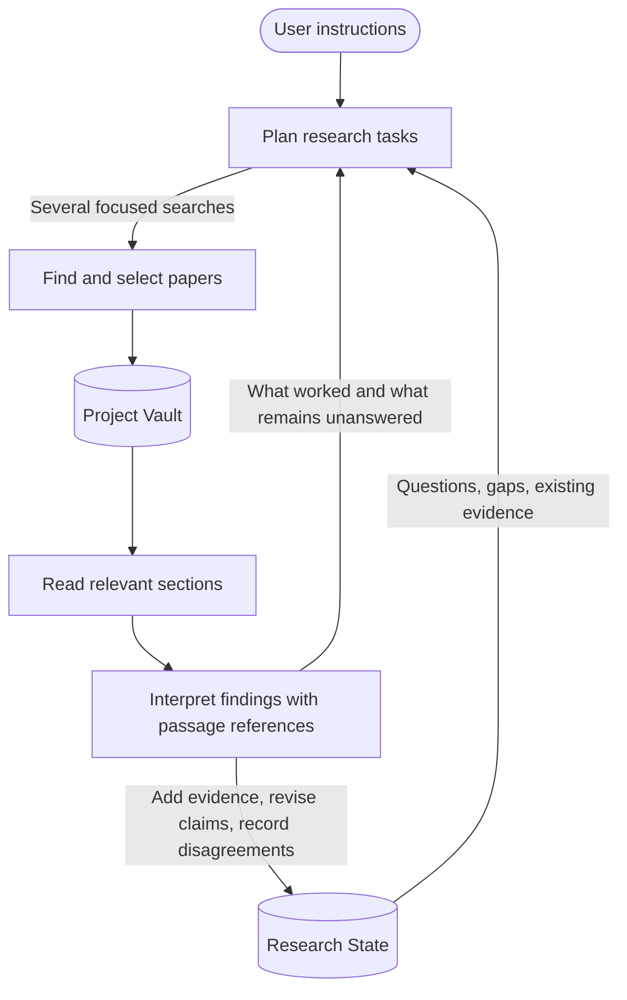
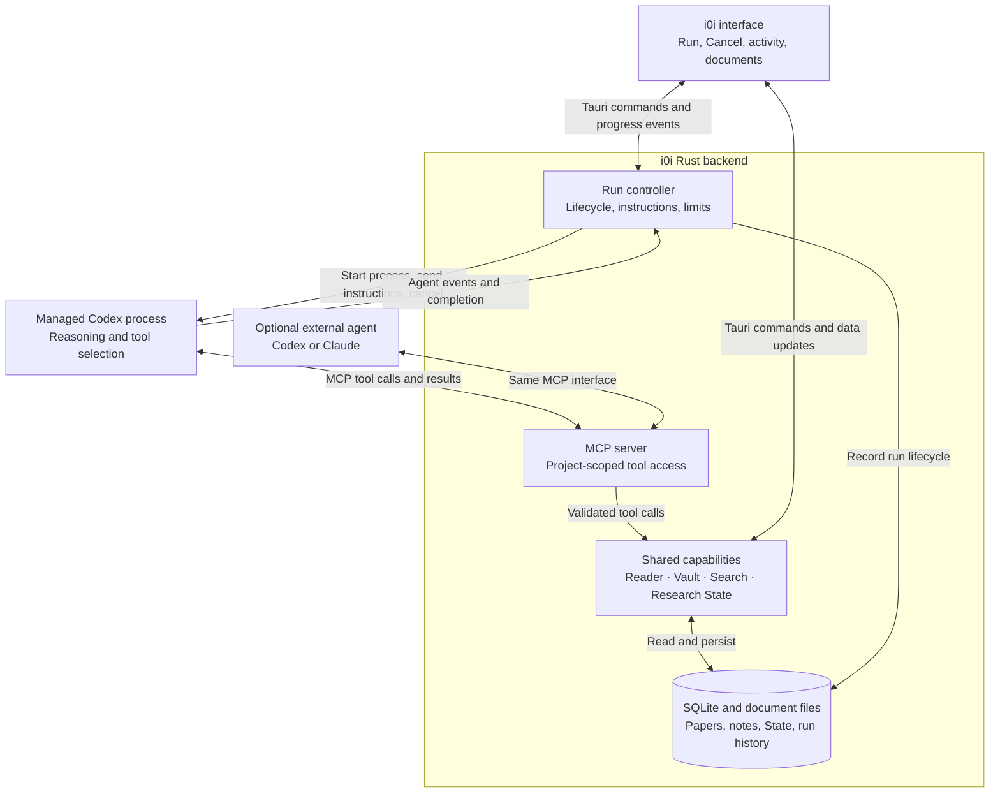
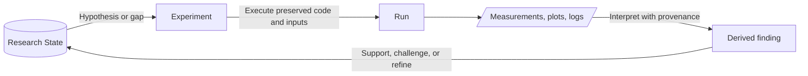
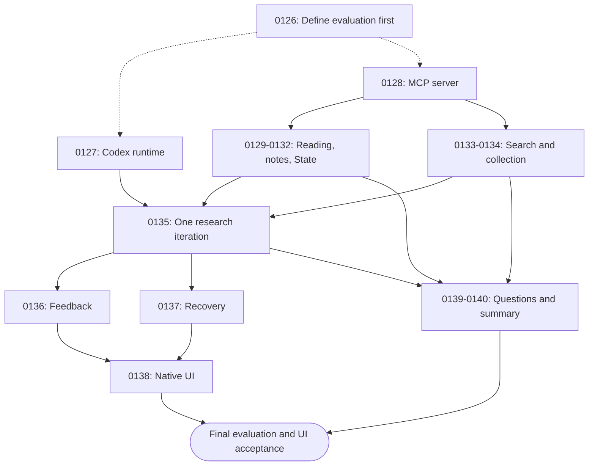

# Milestone 00: Research That Builds on What It Learns

- Status: Design; implementation approval is per RFC
- Date: 2026-09-06
- Immediate focus: the search, reading, and Research State loop
- Later extension: coding and experiments that contribute evidence to the same State

Milestone 00 completion covers the literature research loop and its native agent
integration. Coding and experiments below record the longer-term direction;
they are deferred to a later milestone and do not block Milestone 00 acceptance.

## Intended Outcome

i0i helps a researcher build an evolving understanding of a topic. The user gives
research instructions, agents investigate several useful directions, relevant
papers enter the Project Vault, and evidence from those papers improves Research
State. The next run uses what was learned to decide what to investigate next.

Research State is the durable shared memory of the project. Search and experiment
workers perform bounded tasks against that memory and contribute traceable
updates. The researcher can inspect the evidence, correct interpretations, and
redirect the work from inside i0i.

The immediate goal is a complete and useful literature research loop. Experiments
extend this design later; they are not a prerequisite for the first phase.

## Search and Reading Loop



Existing Vault papers are also available for reading. A useful run may improve
understanding without discovering any new paper.

### How State Improves Search

Each research task has a purpose and relevant State references. Queries are ways
to carry out that task, rather than the task itself.

Targeted tasks include:

- Find evidence supporting or contradicting a hypothesis.
- Investigate a particular research gap.
- Find more papers about a specific method or topic.
- Check whether a proposed idea or experiment has already been attempted.

Broader tasks include:

- Map the current state of a research field.
- Identify active or emerging methods, distinguishing popularity from evidence
  of effectiveness.
- Identify the benchmarks, datasets, and evaluation practices currently used.

A task can produce several lightweight queries that run concurrently within a
shared run budget. Different queries preserve different angles of investigation;
one broad combined query can lose those nuances. Workers can share one
implementation rather than requiring a separate agent type for every purpose.

Planning considers the user's instructions, existing papers, unresolved State
entries, and earlier search outcomes. It should avoid repeating unproductive
searches without a reason and should actively seek conflicting evidence.

### How Papers Improve State

Finding or saving a paper is only the beginning. The agent must:

1. Read the sections relevant to the research task.
2. Identify passages, methods, results, limitations, and relevant tables or figures.
3. Explain what the paper establishes and under which conditions.
4. Relate that evidence to existing findings, questions, gaps, or hypotheses.
5. Propose and apply validated State changes with references to the evidence.

Abstracts help select papers and can support limited assessments. Record whether
an assessment used only an abstract or relevant full text. Unavailable text must
remain an explicit limitation; it cannot silently count as a paper being read.

State should become more accurate and connected as it grows. Several papers
supporting one finding should normally add evidence to that finding. Conflicting
results should remain visible with their conditions, rather than being flattened
into a single confident statement. Inferences must be distinguishable from claims
made directly by a source.

### Feedback Between Runs

Retain a concise record of each task: its purpose, searches attempted, evidence
found, what was learned, and what remains unanswered. Use that record to propose
the next direction. Failure to find evidence does not establish that an idea has
never been tried.

The default interaction stays simple: research instructions, Run, visible
progress, and an inspectable account of what changed. Internal worker and query
details can be expanded when useful. Avoid restoring a large configuration form.

## Research State and Evidence

Research State is the project's current understanding: what we think we know,
what remains uncertain, and the evidence behind both.

The minimal conceptual model is a collection of entries:

```text
Entry
  id
  kind: finding | hypothesis | question
  statement
  evidence[]: reference + relationship + explanation
  related_entries[]
```

New evidence relationships are `supports`, `contradicts`, or `context`; legacy
unclassified links remain explicitly `unspecified` until reviewed. A reference
identifies a source passage or, later, an experiment result. The explanation
records how the evidence relates to the statement, including reasoning behind a
derived finding. Related entries connect, for example, a hypothesis with its
unanswered questions.

Initially, a research gap can be a question and a derived fact can be a finding
with explicit reasoning and references. Papers, notes, figures, experiment
plans, and run artifacts remain separate records that State can reference.
Questions and untested hypotheses need not already have supporting evidence.

For example, a hypothesis that Method A handles small datasets better than
Method B may have supporting evidence from Paper X, contradictory evidence under
different conditions from Paper Y, and a related question about pretraining.

This is the target conceptual interface, not approval to replace existing types
or migrate the database. The State RFC must map it onto the existing model while
preserving provenance and history.

Updates preserve history and provenance. New evidence can revise or challenge an
earlier interpretation; accumulating knowledge does not require keeping every
earlier claim as accepted.

A graph database or vector database is an implementation option, not a milestone
requirement. Start from the existing SQLite State and evidence model. Typed
relationships can support a future graph view; embeddings may help retrieve
related content. Decide on additional storage only when a concrete requirement
justifies it.

## Target Architecture

i0i starts and manages Codex as a separate local process. Codex follows the
research procedure and calls back into i0i through MCP. The researcher starts
research from the app; no manual terminal session is required.

This is the target design, not a description of the current implementation.



The arrows distinguish process control from capability access: i0i controls the
Codex process, while Codex uses the MCP server to work with i0i's data. An external
agent can use the same tools without being launched by i0i.

### Ownership of the Research Loop

| Component | Responsibility |
| --- | --- |
| Rust run controller | Start and manage the agent, supply research instructions and context, track progress, enforce lifecycle limits, propagate cancellation, and persist run history. |
| Codex agent runtime | Follow the research procedure, choose queries and papers, interpret passages, and select the next tool call. |
| Shared Rust capabilities | Execute searches and document operations, enforce scope and tool budgets, validate evidence, and apply State updates atomically. |
| Research State | Preserve the project's understanding and evidence across runs; it is separate from the current run's execution status. |

The research procedure is supplied as instructions: inspect State and the Vault,
investigate useful directions, read evidence, update State when justified, and
continue while useful work and budget remain. Rust enforces the contracts behind
those actions. The agent can read existing papers before searching and need not
create a finding on every iteration.

### Proposed Operational Defaults

- Integrate Codex first; an embedded Claude runtime can follow later.
- Start Codex on the first research run, reuse the process while i0i is open, and
  shut it down with the app. Use a separate agent thread for each research run.
- Give each new run current State, Vault context, and relevant previous outcomes.
- Use one authenticated loopback HTTP MCP endpoint with project-scoped access.
- Delegate bounded searches that return candidates; search workers do not start
  another top-level research run.
- Preserve validated incremental updates if a later step fails or is canceled.
  Mark interrupted runs explicitly after a crash.
- Start with an existing Codex installation for development. Decide release
  packaging and authentication in the integration RFC; model access is separate
  from distributing the executable.

Verify process startup, authentication, MCP configuration, streamed progress, and
cancellation in the integration RFC before treating these defaults as proven.
Codex's supported embedding interface is documented in
[Codex App Server](https://learn.chatgpt.com/docs/app-server).

## Design Validation

Reviewed against the current Rust research manager, Reader service, State types,
and RFC 0123 pipeline test on 2026-09-06. The architecture is coherent as a target;
the Codex/MCP integration has not been exercised. This is a design review, not a
runtime verification result.

| Finding | Design consequence | Owning planned RFC |
| --- | --- | --- |
| The existing SearchManager executes search and then reconciliation; it is not the proposed Codex-driven read/update/search loop. | Reuse it for bounded search tasks. Introduce the project run controller incrementally and route a project run through one orchestration path, avoiding duplicate final reconciliation. | M00-06, M00-07 |
| The RFC 0123 pipeline test uses `PipelinePlanner` and `EmptySource` below Tauri. | Keep it as regression coverage. Add real Codex and MCP evaluation; do not describe the existing test as evidence that papers are searched, read, or cited correctly. | M00-01 |
| ReaderService uses AppHandle and emits acquisition events. | Expose capabilities over the actual application services. The evaluation must bootstrap those services; do not implement an independent test-only reader or assume all services are already transport-independent. | M00-03, M00-04 |
| Existing State has epistemic status, entry lifecycle, typed relationships, and source/extraction/chunk references. | Preserve those fields and distinguish source evidence from notes and interpretations. The minimal model is a readable interface, not a lossy schema replacement. | M00-05 |
| A valid reference proves that a passage exists, not that it supports the claim. | Rust checks references and structural rules; an independent evaluation judge assesses entailment, contradictions, and interpretation quality. | M00-01, M00-05 |
| Prompt instructions cannot enforce run budgets or project boundaries. | Enforce limits and scope in the controller and tools. Validate cancellation propagation and prevent tool access after a run ends; account for delegated LLM work as well as searches. | M00-03, M00-06, M00-07 |
| A State commit or note write can succeed even if its response is lost. | Specify mutation request IDs for retry deduplication, alongside revision checks. A retry must not create another note or apply a State update twice. | M00-03, M00-04, M00-05 |
| Search and extraction are asynchronous; multiple searches can share a paper. | Define pending states, run-specific results, deduplication, and stable pagination. One consumer's cancellation must not remove a source another consumer is using. | M00-04, M00-06 |
| The previous RFC list omitted managed Codex startup, the new controller, and native UI integration. | Give each an explicit acceptance boundary. Installing an executable, authenticating model access, and shipping a release remain separate concerns. | M00-02, M00-07, M00-09 |

Start with one active top-level research run per project; its searches may run
concurrently. External State changes still use revision checks. The run identity,
author attribution, scope, and shared budgets are supplied by the application,
not trusted from arbitrary model arguments.

The runtime integration must establish the effective tools available to Codex.
The first phase exposes the agreed research tools; uncontrolled shell or other
tools must not bypass project scope or tool budgets. Exact runtime configuration
is a compatibility check in M00-02, not an assumed guarantee of MCP.

## Shared Capabilities and MCP Interface

Expose one i0i Model Context Protocol (MCP) server with four tool groups: Reader,
Vault, Search, and Research State. The UI continues to use Tauri commands over
the same Rust capabilities. MCP handles capability discovery and invocation;
the run controller and agent runtime together form the research harness.
Rust orchestration can call shared capabilities directly where needed, while
the managed Codex agent accesses them through MCP. See the
[MCP architecture overview](https://modelcontextprotocol.io/docs/learn/architecture).

ReaderService, ChatService, and SearchManager are existing starting points.
Refactor incrementally where a capability is coupled to Tauri; keep behavior in
the shared implementation rather than duplicating it in MCP handlers. Tool groups
do not require separate servers or processes.

The following tables define proposed application contracts, not existing method
signatures or finalized protocol schemas. Each row's behavior belongs to the Rust
capability; its MCP tool translates the input and output for agents.

### Reader

| Tool | Input | Returns | Contract |
| --- | --- | --- | --- |
| `reader_read` | `paper_id`, optional page range and cursor | Text passages, source version, coverage, next cursor | Each passage has a stable reference usable for notes and evidence. Reports unavailable or pending extraction explicitly. |
| `reader_add_note` | `paper_id`, optional passage anchor, `body`, `request_id` | Saved note | An anchored note stores referenced text and location. No anchor means a paper-level note. Record agent authorship. |
| `reader_list_notes` | `paper_id`, optional cursor | Notes with bodies, anchors, authors, next cursor | Returns the same annotations and notes visible in the reader. |
| `reader_ask` | `paper_id`, `question`, optional passage references | Answer, cited passages, coverage | Optional LLM interpretation; does not automatically create a saved note. |

A passage reference identifies the document version and location, not only quoted
text. Identical sentences can occur at different locations. An agent can read and
annotate without opening the PDF viewer. Asking another model is optional; its
agreement is another interpretation, not independent source evidence.

### Vault

| Tool | Input | Returns | Contract |
| --- | --- | --- | --- |
| `vault_list` | Optional cursor | Vault IDs and names, next cursor | Discovers vaults within the caller's authorized context. |
| `vault_list_papers` | `vault_id`, optional filters and cursor | Paper IDs and metadata, next cursor | Enumerates contents without requiring an LLM. |
| `vault_get_paper` | `vault_id`, `paper_id` | Metadata and document availability | Distinguishes metadata, available full text, and pending acquisition. |
| `vault_add_paper` | `vault_id`, `candidate_id`, `request_id` | Paper ID, membership and acquisition status | Repeated additions do not duplicate the paper. Acquisition may continue asynchronously. |
| `vault_ask` | `vault_id`, `question` | Answer, paper references, supporting passages | Searches within the vault and states which evidence was examined. |
| `vault_summary` | `vault_id` | Summary, supporting references, coverage, generation time | Describes the collection without implying every paper was fully read. |

### Search

| Tool | Input | Returns | Contract |
| --- | --- | --- | --- |
| `search_start` | `instructions`, `search_params`, optional `model_id`, `request_id` | Search ID, `run_id`, initial status | Starts a bounded background search and returns promptly; retries return the same run. |
| `search_get` | `run_id`, optional results cursor | Status, latest activity, candidates, next cursor, errors | Results can arrive incrementally. Candidate IDs work with `vault_add_paper`. |
| `search_cancel` | `run_id` | Current status | Requests cancellation; repeating it does not create duplicate lifecycle events. |

Start with a small `search_params` contract: result limit, optional year range,
optional venue filter, and optional seed paper IDs. The configured model is the
default. Search produces candidates; adding them to the Vault is an explicit
operation that the harness may perform automatically under its existing rules.

Run IDs let an agent start several searches and read existing papers while they
execute. Harness-launched searches share the parent run's remaining budget and
cancellation. Parent context comes from orchestration rather than an agent being
able to choose an unrelated run's identity. Exact parameter schemas and result
pagination semantics belong in the Search RFC.

### Research State

| Tool | Input | Returns | Contract |
| --- | --- | --- | --- |
| `state_read` | `project_id`, optional entry IDs and cursor | Revision, entries, next cursor | Returns current understanding with evidence links; paginated reads identify the revision being read. |
| `state_update` | `project_id`, `base_revision`, `request_id`, entry changes | New revision and changed entry IDs | Validates references and applies changes atomically. A stale revision returns a conflict instead of overwriting newer work. |

State updates use the existing evidence and epistemic validation rules. They
cannot turn an unsupported interpretation into an established finding merely
because an agent submitted it. The focused RFC will define the exact change
operations and their mapping to the existing reconciliation mechanism.

### Shared Contracts

| Concern | Rule |
| --- | --- |
| Identity and scope | Use stable IDs, not titles, as identifiers. Bind calls to an authorized project/vault context and enforce that scope in the shared capabilities. Caller/run identity is application-supplied. |
| Outputs | Return structured data and resolvable references; paginate large collections. |
| Failures | Distinguish pending work, unavailable content, invalid references, and failed execution, with a readable explanation. |
| Side effects | Reads and questions do not silently create notes or alter State. Successful mutations become visible in the app. |
| Mutation retries | Carry a request ID for each logical mutation. Repeating the same request returns its recorded result rather than duplicating writes; revision checks protect different concurrent updates. |
| Provenance | Record the agent and, when applicable, run responsible for notes and State updates. LLM answers remain interpretations linked to evidence. |
| Responsibility | MCP translates requests and responses. Rust capabilities own validation, persistence, and execution. |

The tool-driven loop is: read State, start searches, inspect candidates, save
papers, read passages, then update State. An initial integration slice should let
an external agent list a vault's papers, read one paper, and create an anchored
note that appears immediately in i0i.

## Later: Coding and Experiments



An experiment is a project item with a question, linked evidence, editable code,
and an environment definition. A run preserves the exact code, inputs,
environment information, logs, and outputs behind a result. A finding is an
interpretation linked to that run. Successful execution alone does not confirm a
hypothesis, and experimental support is limited to the tested conditions.

The proposed workspace opens experiments in normal tabs. Code and Results share
the main area; execution output appears below; the right panel holds the question,
evidence, agent conversation, and progress. Existing panel resizing and focus
behavior should carry across.

An initial implementation could use Python scripts, a project-local `uv`
environment, and Monaco for editing. These are proposals to evaluate in the
experiment RFCs. User-triggered and agent-triggered runs should use the same
execution path. Unattended execution needs an isolated runner with bounded
resources and filesystem access. Remote compute can follow through that same
execution boundary.

## Existing Foundations

These RFCs are starting points to inspect and extend, not proof that this entire
milestone is already implemented:

- [RFC 0112: Typed Research State and Evidence Links](../docs/rfcs/projects/0112-typed-research-state-and-evidence-links.md)
- [RFC 0117: Autonomous Run Reconciliation and Review](../docs/rfcs/projects/0117-autonomous-run-reconciliation-and-review.md)
- [RFC 0120: State-Informed Run Orientation](../docs/rfcs/projects/0120-state-informed-run-orientation.md)
- [RFC 0124: Simple Incremental Project Research](../docs/rfcs/projects/0124-simple-incremental-project-research.md)

## Ordered Feature and RFC Plan

Draft and implement the on-demand evaluation contract first. It defines the
observable destination and is exercised as capabilities become available. Until
the integration exists, it must report unmet prerequisites rather than fake a
successful loop. Its final live execution is mandatory after implementation.

All required RFCs are drafted in [the Milestone 00 RFC folder](../docs/rfcs/milestone_00).
Each is open and requires separate implementation approval. M00 identifiers
retain the previous feature grouping; suffixes identify narrower RFCs split from
an oversized group. References to M00-04, for example, mean both M00-04a and b.

The splits separate reading from note writes, State projection from transactions,
search execution from acquisition, recovery from UI, and questions from summaries.
Reuse existing behavior and avoid building a general agent framework before the
first research loop works.

| Order / ID | Focused RFC | Scope and completion evidence | Status |
| --- | --- | --- | --- |
| 1 / M00-01 | [0126: On-Demand Research Loop Evaluation](../docs/rfcs/milestone_00/0126-on-demand-research-loop-evaluation.md) | Fixed scenarios, real agent/MCP boundary, assertions, separate LLM judge, retained reports. Execute again after all features. | Implemented; final suite pending |
| 2 / M00-02 | [0127: Managed Codex Runtime](../docs/rfcs/milestone_00/0127-managed-codex-runtime.md) | Verify installed runtime, authentication, scoped MCP, streamed events, and interruption. | Implemented; controller smoke pending |
| 3 / M00-03 | [0128: Local MCP Server and Vault Listing](../docs/rfcs/milestone_00/0128-local-mcp-server.md) | Own the endpoint, caller scope, contracts, and real Vault/paper listing. | Complete |
| 4 / M00-04a | [0129: Reader Evidence Access](../docs/rfcs/milestone_00/0129-reader-evidence-access.md) | Metadata, pending acquisition, exact paginated passages, and stable references. | Complete |
| 5 / M00-04b | [0130: Agent Reader Notes](../docs/rfcs/milestone_00/0130-agent-reader-notes.md) | Persist anchored notes with authorship, retry deduplication, and Reader navigation. | Complete |
| 6 / M00-05a | [0131: Research State Read Contract](../docs/rfcs/milestone_00/0131-research-state-read-contract.md) | Minimal projection with lossless legacy provenance and consistent revision reads. | Complete |
| 7 / M00-05b | [0132: Validated Research State Updates](../docs/rfcs/milestone_00/0132-validated-research-state-updates.md) | Atomic entry changes, source validation, conflicts, and retry receipts. | Complete |
| 8 / M00-06a | [0133: Bounded Search Tools](../docs/rfcs/milestone_00/0133-bounded-search-tools.md) | Concurrent scoped searches, incremental results, shared limits, cancellation. | Complete |
| 9 / M00-06b | [0134: Vault Candidate Collection](../docs/rfcs/milestone_00/0134-vault-candidate-collection.md) | Save candidates once and acquire readable sources without opening tabs. | Complete |
| 10 / M00-07 | [0135: Codex-Driven Project Research Loop](../docs/rfcs/milestone_00/0135-codex-project-research-loop.md) | Integrate one real iteration through the production Run entry point. | Implemented; fixed-corpus acceptance pending |
| 11 / M00-08 | [0136: Research Feedback and Continuation](../docs/rfcs/milestone_00/0136-research-feedback-and-continuation.md) | Adapt searches after evidence and carry useful outcomes into a new thread. | Implemented; controlled evaluation pending |
| 12 / M00-09a | [0137: Research Cancellation and Recovery](../docs/rfcs/milestone_00/0137-research-cancellation-and-recovery.md) | Handle cancellation/commit races, crashes, and restart without losing results. | Open |
| 13 / M00-09b | [0138: Native Research Progress](../docs/rfcs/milestone_00/0138-native-research-progress.md) | Existing Run/Cancel UI, live changes, evidence navigation, and native acceptance. | Open |
| 14 / M00-10a | [0139: Evidence Question Tools](../docs/rfcs/milestone_00/0139-evidence-question-tools.md) | Optional paper/Vault answers with source references and no implicit note writes. | Open |
| 15 / M00-10b | [0140: Vault Evidence Summary](../docs/rfcs/milestone_00/0140-vault-evidence-summary.md) | Bounded collection overview with coverage and freshness. | Open |

### Dependency Order

RFC 0126 is first as an acceptance specification and runner foundation. Full
scenarios remain blocked until their production dependencies exist; evaluation
approval does not authorize implementing those dependencies. RFCs 0127 and 0128
can then progress independently. The runtime smoke may use a tiny test MCP server;
the real evaluation always uses RFC 0128's production adapter.



The figure groups related RFCs for readability; each document lists its exact
dependencies. Re-run RFC 0126's complete suite after all fifteen RFCs, and record
RFC 0138's separate native UI acceptance. The full suite remains on demand and
is not part of ordinary tests or default CI.

Release bundling/signing and embedded Claude support need separate future RFCs.
Milestone acceptance uses a documented installed Codex version and valid model
credentials; it does not claim a distributable installation-free release.

### Deferred Experiment Roadmap

| Order | Focused future RFC | Completion evidence |
| --- | --- | --- |
| 1 | Figures and Research Artifacts | Source-linked figures and tables remain inspectable from evidence. |
| 2 | Experiment Workspace and Recorded Runs | Execute a script and preserve exact code, inputs, environment, logs, and outputs. |
| 3 | Isolated Agent Code Execution | Verify bounded execution, isolation, cancellation, and resource limits. |
| 4 | Experimental Findings in Research State | Link interpretations to reproducible results without treating successful execution as confirmation. |
| 5 | Choosing Between Search and Experiment | Justify the next research action from State within a bounded budget. |

Graph visualization, notebooks, remote GPU execution, and autonomous scheduling
of experiments remain future ideas, outside the initial feature sequence's
required implementation. They can receive focused RFCs when needed.

## First Phase Acceptance

Use RFC 0126's explicit, on-demand evaluation. It must not run during ordinary
tests, app startup, builds, or default CI. Require at least one recorded passing
acceptance suite against the final implementation before closing this milestone.

The suite includes real Codex/MCP operation against a fixed corpus, one-iteration
and multiple-iteration scenarios, continuation in a new run, and a live discovery
and acquisition smoke run. A separate LLM judges research quality using the
actual inspected passages and State changes. Deterministic checks validate
execution, persistence, references, and iteration order; judge scores cannot
override a structural failure. Unavailable prerequisites or judge failures are
reported as blocked/inconclusive, never as passes.

The automated boundary is the production backend run entry point through Codex,
MCP, services, and persisted results. It is not a desktop UI test. RFC 0138 supplies
a separate native UI acceptance check that must also be recorded before closing
the milestone.

The first phase is complete when the user can start from a hypothesis, investigate
several relevant directions, read available evidence, and inspect an update to
that same hypothesis with passage references. A second run must use the updated
State and earlier outcomes to pursue a justified next question.

Verification must cover references resolving to their actual sources, duplicate
evidence, conflicting findings, unavailable full text, cancellation, partial
search failures, and visible progress through search, reading, and State update.
Also verify an external MCP client can perform the Reader/Vault integration slice,
that agent-created notes and State updates appear in the UI, that scope is
enforced, and that concurrent State updates cannot silently overwrite each other.
Do not mark this milestone or its features complete before the relevant RFC
acceptance criteria and tests pass.

## Compatibility Checks During Implementation

The drafted RFCs settle application contracts, evidence handling, history bounds,
pagination, and feature ownership. These concrete integration details still need
verification against the actual runtime and existing storage:

- RFC 0127: supported Codex version, authentication, effective tools, and isolation
  of MCP credentials across threads in a reused process.
- RFC 0128: Rust MCP SDK compatibility and lifecycle wiring into the Tauri app.
- RFCs 0129-0132: exact source-reference/anchor mapping and narrow schema additions
  for abstract evidence, agent authorship, and classified evidence relationships.
- RFC 0126: selecting and hashing the fixed corpus and recording its reference
  rubric before the first acceptance evaluation.

Resolve routine details within the owning RFC. Revise its design if evidence
requires changing a user-visible contract; do not silently broaden the milestone.

Approval of this milestone records the direction. Each RFC requires its own
implementation approval.
