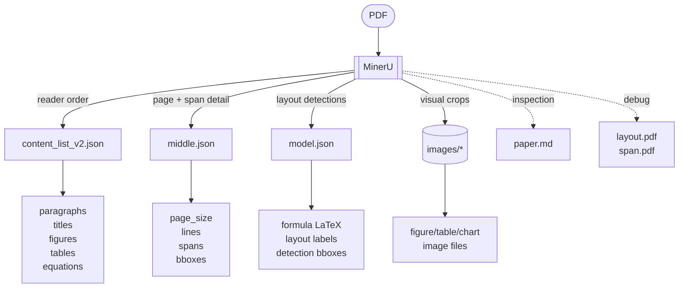
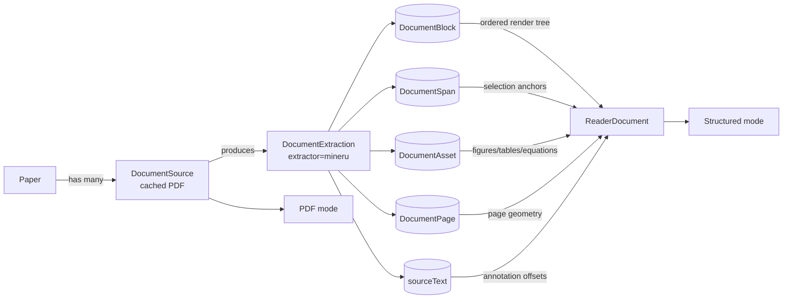

# Extractor Spike Report

Date: 2026-05-31
Scope: one-paper smoke spike using `attention-is-all-you-need` from the fixed corpus.

## Summary

MinerU is the strongest first production adapter candidate from this spike.

It produced the most Reader-shaped output: reading-order content lists, page indexes, bounding boxes, Markdown, layout/span debug PDFs, extracted images, table HTML, formula detections, and image assets. This maps well to i0i's `ExtractedDocument` model: `pages`, `blocks`, `spans`, `assets`, and canonical `sourceText`.

Docling is promising and much faster than Marker, but the first macOS run needed `--device cpu` to avoid an Apple MPS float64 failure. Marker produced JSON, but was much slower on this paper and emitted fewer immediately useful visual artifacts for our target Reader.

## Runtime

Measured on `attention-is-all-you-need` after setup/model download:

| Tool | Status | Time | Notes |
| --- | --- | ---: | --- |
| Docling | ok | ~29s | Needed CPU mode on macOS; exported JSON and referenced images. |
| Marker | ok | ~4m 6s | Produced JSON/meta JSON; slowest smoke result. |
| MinerU | ok | ~52s | Produced Markdown, content lists, model/middle JSON, layout/span PDFs, images. |

## MinerU Output Fit

Observed MinerU counts on the smoke paper:

| Output kind | Count |
| --- | ---: |
| Paragraphs | 78 |
| Titles | 25 |
| Inline formulas | 56 |
| Display equations | 5 |
| Tables | 4 |
| Images | 3 |
| Charts | 2 |
| Image assets | 14 |

MinerU satisfies the important RFC 0025 gates:

| Criterion | Result |
| --- | --- |
| Runs locally on macOS in development | yes |
| Produces page-level geometry | yes |
| Produces block-level reading order | yes |
| Produces span/text geometry | yes, via middle/model JSON |
| Detects figures/tables/equations | yes |
| Exports figures/page-region assets | yes |
| Handles tables | yes, HTML plus visual assets |
| Handles formulas | yes, recognized LaTeX plus geometry; keep image fallback |
| License | Apache 2.0, acceptable for i0i |

## MinerU Output Structure



`content_list_v2.json` is the best high-level reading-order source. `middle.json` is the best source for page geometry and span anchors. `model.json` is the best source for formula/table/figure detection metadata. `images/*` is the visual fallback and asset source. Markdown is useful for inspection, but it should not be the Reader source of truth.

## Reader Data Schema



The normalized i0i model should be the Reader source of truth. The app should render `DocumentBlock`, `DocumentSpan`, and `DocumentAsset` rows, with `sourceText` as the canonical annotation text layer.

## Formula Decision

PDFs do not contain trustworthy original LaTeX source. MinerU reconstructs LaTeX-like formulas from the PDF, which is useful but should be treated as best-effort recognition.

i0i should store formulas as:

```text
visual truth: equation image/table crop when available
semantic text: recognized LaTeX when available
anchor: page_idx + bbox
sourceText: recognized LaTeX or [Equation eq-id] placeholder
```

This gives the Reader faithful rendering, search/copy affordances, and stable annotation anchors without pretending the reconstructed LaTeX is authoritative.

## Recommendation

Use **MinerU** as the first production extraction adapter candidate.

Next implementation slice:

1. Build a `MinerUAdapter` normalizer from MinerU raw output to i0i `ExtractedDocument`.
2. Normalize one cached PDF into `pages`, `blocks`, `spans`, and `assets`.
3. Render structured Reader mode from normalized blocks/assets.
4. Keep the cached PDF viewer as the visual fallback.

Before locking it in fully, run the full fixed corpus through MinerU and check the same criteria across two-column papers, tables, equations, and vector-heavy figures.
